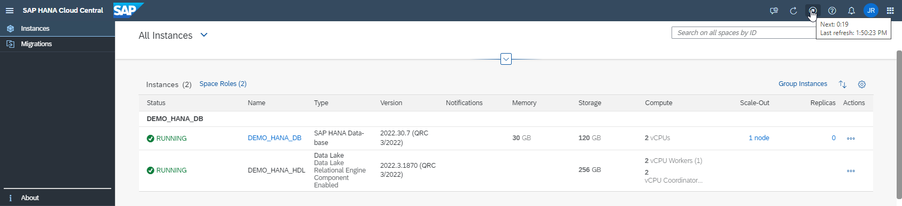

## Deprecation Notice

This public repository is read-only and no longer maintained.

---

# DA261 - SAP HANA Cloud Database Administration and Development

## Description

This repository contains the material for the SAP TechEd 2022 session called DA261 - SAP HANA Cloud Database Administration and Development.  

## Overview

This session introduces attendees to the operations required for end-to-end administration and development of SAP HANA Cloud database instances using the tools offered in the SAP Business Technology Platform (SAP BTP).  Attendees will learn how to accomplish administration tasks such as instance monitoring and security management, as well as development tasks such as creating native SAP HANA artifacts and analyzing their performance.  During this workshop, participants will use the tools to create and deploy some sample tables, a calculation view, a stored procedure, and will further administer these deployed artifacts.  

>Content appearing in this format is for additional information and does not need to be followed.

## Requirements

To complete this workshop, you need access to an SAP BTP account. You can access SAP HANA Cloud from within SAP BTP and you can use a trial, free tier,  or productive version of SAP HANA Cloud.  **This workshop assumes that you already have a SAP BTP account and a SAP HANA Cloud database.**  If not, you can register for free at https://www.sap.com/cmp/td/sap-hana-cloud-trial.html.  The exercises make use of a **trial account**, but a [free tier](https://developers.sap.com/tutorials/btp-free-tier-account.html) account can also be used.  A benefit of using free tier is that the account can be upgraded to a paid service plan without having to re-create the account.

In your SAP HANA Cloud account, perform the following steps:

1.  Open the [welcome page](https://account.hanatrial.ondemand.com/trial/#/home/trial) and go to your trial account.
    
2.	Enter the subaccount and then select the dev space.
3.	Click **SAP HANA Cloud** from the left navigation bar.
4.	Click the button **Create** in the top right and select SAP HANA Cloud, SAP HANA Database to invoke the Create Instance wizard.  
    > Only one instance of a HANA Cloud database can be created in trial or free tier accounts.  If you already have a SAP HANA Cloud database instance created, it can be used.
    
    
5.  Choose **SAP HANA Cloud, SAP HANA Database** and click the button **Next Step**.
6.  Use default values for the remainder of the wizard, with the following exceptions:
    * In Step 2 (General), enter **DEMO_HANA_DB** for the instance name. Enter and confirm your administrator password – ***PLEASE REMEMBER IT AND/OR WRITE IT DOWN!***.
    * In Step 6 (Data Lake), turn on the toggle switch to Create Data Lake. Enter **DEMO_HANA_HDL** for the instance name.

7.	Complete the wizard.

    The SAP HANA Cloud instances DEMO_HANA_DB and DEMO_HANA_HDL will be created, and this process may take  approx. 10 minutes.  The frequency of updates to the page can be set using the auto-refresh feature in the top right.  Once the instances are created, their status will change to RUNNING.

    

## SAP Business Technology Platform (SAP BTP) - 5 minutes
The SAP BTP brings together data and analytics, artificial intelligence, application development, automation, and integration in one, unified environment.

- [Exercise 1 - Overview of the SAP Business Technology Platform](exercises/sap_btp/ex1/)

## SAP HANA Cloud Central - 20 minutes

The SAP HANA Cloud Central tool provides database administrators (DBAs) with a simple and centralized overview of their SAP HANA Cloud databases and SAP HANA Cloud data lake instances. 

- [Exercise 1 - Overview of SAP HANA Cloud Central](exercises/hana_cloud_central/ex1/)
- [Exercise 2 - Create Instances](exercises/hana_cloud_central/ex2/)
- [Exercise 3 - Edit Instances](exercises/hana_cloud_central/ex3/)
- [Exercise 4 - Start, Stop, Upgrade Instances, and Other Actions](exercises/hana_cloud_central/ex4/)

## SAP Business Application Studio - 30 minutes

SAP Business Application Studio is a SAP BTP service that offers a modern development environment tailored for business application development.

- [Exercise 1 - Create a Development Workspace](exercises/business_app_studio/ex1/)
- [Exercise 2 - Create and Deploy Native Database Artifacts Using Guided Development](exercises/business_app_studio/ex2/)

## SAP HANA Database Explorer - 25 minutes

The SAP HANA database explorer is a web-based tool for browsing and working with  database schema objects such as tables, views, and stored procedures and executing SQL.

- [Exercise 1 - Launch the SAP HANA Database Explorer](exercises/database_explorer/ex1/)
- [Exercise 2 - Catalog Browser and Object Search](exercises/database_explorer/ex2/)
- [Exercise 3 - Using the SQL Console](exercises/database_explorer/ex3/)

## SAP HANA Cockpit - 35 minutes

The SAP HANA cockpit tool provides administration and monitoring of individual SAP HANA Cloud database instances. 

- [Exercise 1 - The Database Overview Page](exercises/hana_cockpit/ex1/)
- [Exercise 2 - Configuring Database Properties](exercises/hana_cockpit/ex2/)
- [Exercise 3 - Managing Alerts](exercises/hana_cockpit/ex3/)
- [Exercise 4 - Security Basics](exercises/hana_cockpit/ex4/)
- [Exercise 5 - Database Backups](exercises/hana_cockpit/ex5/)
- [Exercise 6 - HDI Administration](exercises/hana_cockpit/ex6/)
- [Exercise 7 - Performance Management](exercises/hana_cockpit/ex7/)

## Appendix
- [Appendix 1 - Multi-Environment SAP HANA Cloud Tools](exercises/multi-environment/ex1/)

Additional SAP Business Application Studio Exercises
- [Appendix 1 - Import and Deploy the Completed Project](exercises/business_app_studio/ex3/)
- [Appendix 2 - Additional HDI Container Details](exercises/business_app_studio/ex4/)

Additional SAP HANA Database Explorer Exercises:
- [Appendix 1 - SAP HANA Database Explorer Extension](exercises/database_explorer/ex4/)

Additional SAP HANA Cockpit Exercises:
- [Appendix 1 - Monitoring Memory Usage](exercises/hana_cockpit/appendix_ex8/)
- [Appendix 2 - Managing Services](exercises/hana_cockpit/appendix_ex9/)
- [Appendix 3 - Managing Workload Classes](exercises/hana_cockpit/appendix_ex10/)
- [Appendix 4 - Recent Activities and Frequently Used Apps](exercises/hana_cockpit/appendix_ex10/)

## How to obtain support

Support for the content in this repository is available during the actual time of the online session for which this content has been designed. Otherwise, you may request support via the [Issues](../../issues) tab.

## License
Copyright (c) 2022 SAP SE or an SAP affiliate company. All rights reserved. This project is licensed under the Apache Software License, version 2.0 except as noted otherwise in the [LICENSE](LICENSES/Apache-2.0.txt) file.
