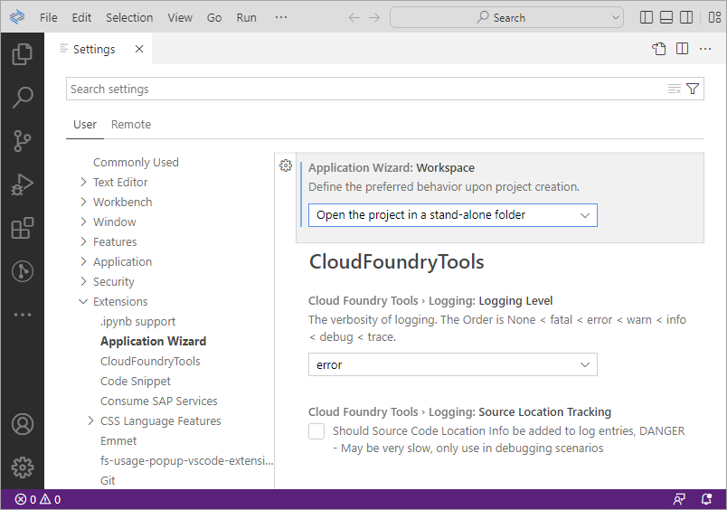
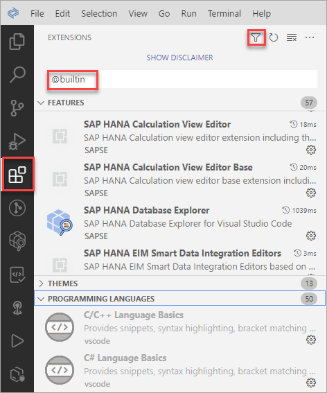
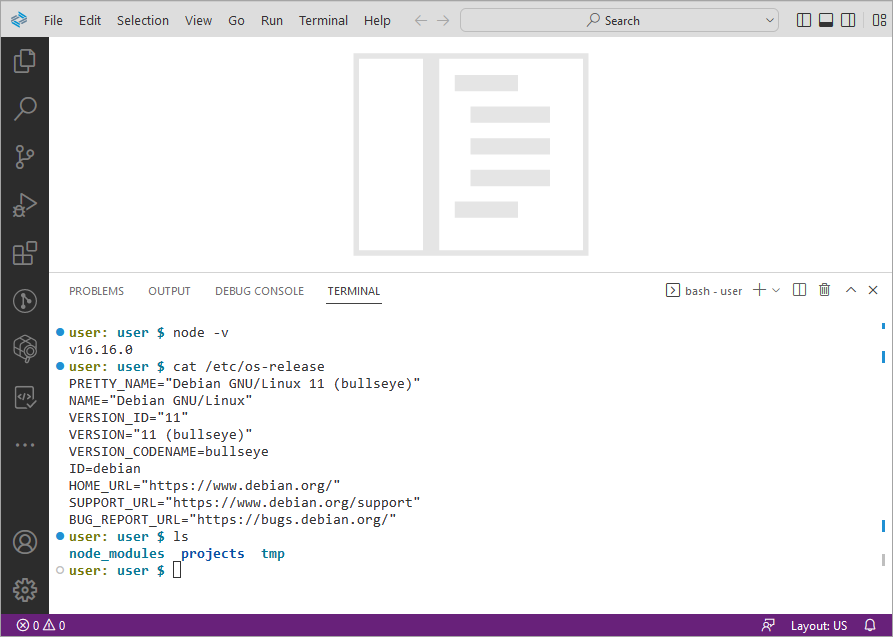

# Exercise 1 - Create a Development Workspace

This exercise will demonstrate how to open the SAP Business Application Studio (app studio) and create your first workspace for native SAP HANA development.  When the SAP HANA tool extensions are added, it can be used to build and deploy native SAP HANA database artifacts such as tables, calculation views, and stored procedures.  

## Exercise 1.1 Open the SAP Business Application Studio

1. In the [BTP Cockpit](https://account.hanatrial.ondemand.com/trial/#/home/trial):
   * Select **Go To Your Trial Account**
   * Select the **trial** subaccount

       

   * Expand **Services** and select **Service Marketplace** in the left nav bar
    
       

   * Search for SAP Business Application Studio
   * Launch SAP Business Application Studio by selecting **Go to Application** from the horizontal three-dot menu.  If you see a privacy statement, click OK to continue.
    
    

## Exercise 1.2 Create a Development Workspace

1. A welcome screen may appear.  If so, click on **Create Dev Space**.

    

2. Name this new dev space **TechEd2022**.  Select **SAP HANA Native Application Dev Space** and then click the button **Create Dev Space** to create a development workspace that is configured with the SAP HANA Native Application development extensions.  

    

## Exercise 1.3 Open and Configure the Development Workspace

1. Once the development space status has changed to running, it can be opened by clicking on the name of the development space.

    

2. The SAP Business Application Studio will open and display a Get Started page.  Optionally click on the **Learn More** link to learn more about the recent change to SAP Business Application Studio to make use of Visual Studio Code - Open Source (code-OSS).  The Get Started tab can be closed.

    

    The SAP Business Application Studio is a browser-based application, so there is no need to install or update software.  You can continue to work on your projects later from any computer.

3. Enable the menu bar by selecting the toolbar item in the top left, and then choose **View**, **Appearance**, **Menu Bar**.

    

3. Preference settings can be viewed or set via **File**, **Preferences**, **Settings**.  

    

    >The gear icon on the bottom left can also be used to quickly access the preferences.

4. A color theme can be set using **File**, **Preferences**, **Color Theme**.

    

5. SAP Business Application Studio has been configured with a selected set of extensions.  These can be seen by selecting the extensions icon and applying a filter such as @builtin.

    

    Selecting an extension will show additional details the icon of the extension.   

## Exercise 1.4 Open a Terminal

1. A terminal can be opened by selecting **Terminal**, **New Terminal**.

    

    Enter a few commands one by one into the terminal and execute them to see the version of Node.js installed, details of the operating system, and to see the contents of the file system.

    ```
    node -v
    cat /etc/os-release
    ls
    ```

2. Close the terminal.


## Summary

You have now created a development space that is configured for use with SAP HANA native artifact development.

Continue to - [Exercise 2 - Create and Deploy Native Database Artifacts Using Guided Development](../ex2/README.md)

