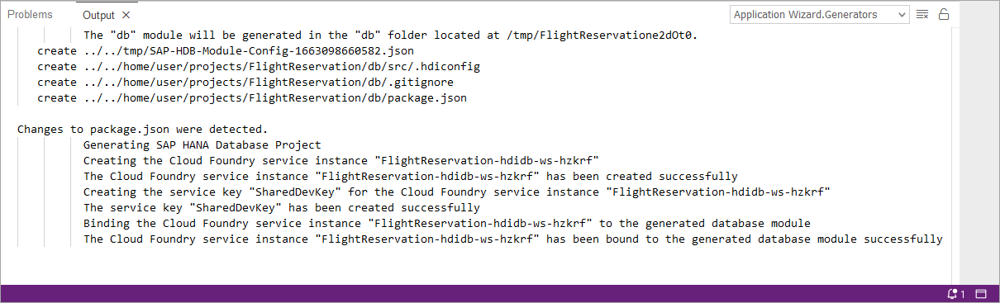

# Exercise 1 - Create a Development Workspace

This exercise will demonstrate how to open the SAP Business Application Studio (app studio) and create your first workspace for native SAP HANA development.  When the SAP HANA tool extensions are added, it can be used to build and deploy native SAP HANA database artifacts such as tables and calculation views.  

1. Open the SAP Business Application Studio
    
    

    TODO, role collections may need to be added.

2. Create a development workspace that is configured with the SAP HANA native application development extensions.

    

3. Once the development space status has changed to running, it can be opened by clicking on name of the development space.

    

4. Select the File, Preferences menu item and set the workspace preference as indicated below.

    

5. Select the View, Find Command menu (or Fn F1) to open the command pallette and search for SAP HANA and select the option shown below.

    

6. Select the option indicated below and follow the prompts to create SAP HANA native database artifacts.

    

    Press Next multiple times to accept the defaults.

    When asked for provide your Cloud Foundry user id and password and select login.

    

    

## Summary

You now have TODO

Continue to - [Exercise 2 - Create and deploy a project using the SAP HANA Getting Started Wizard](../ex2/README.md)

