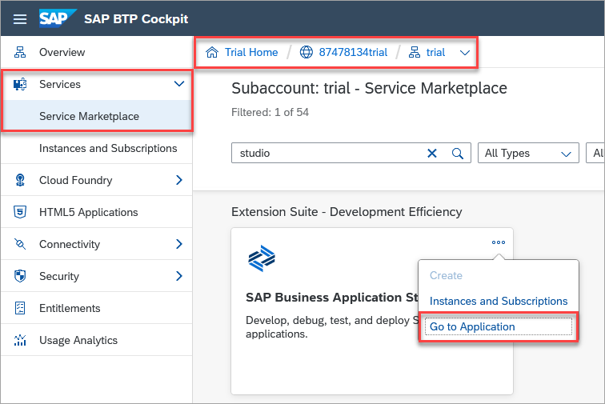
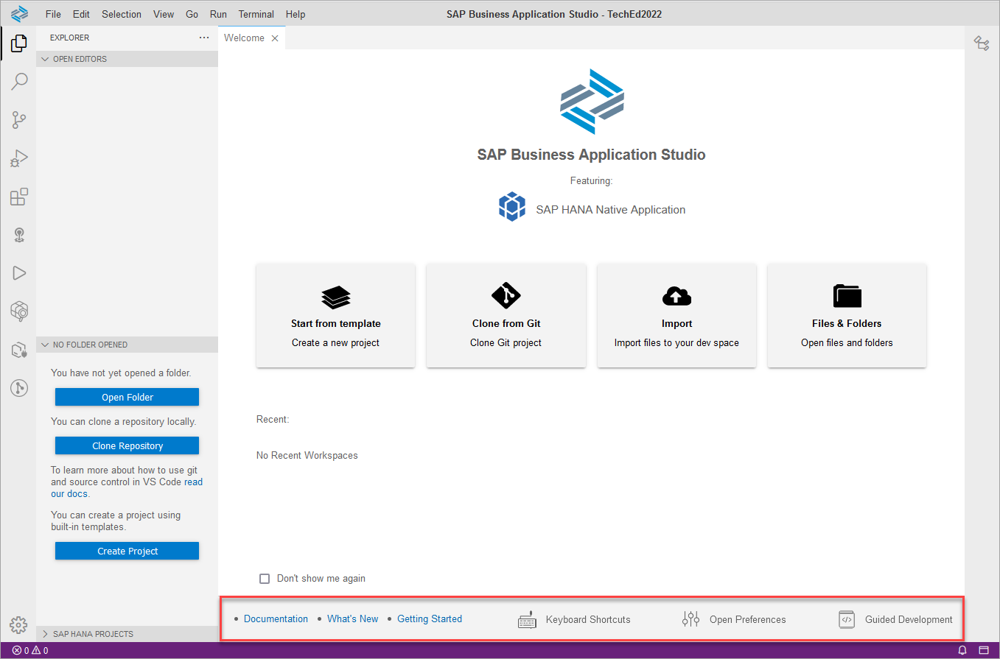
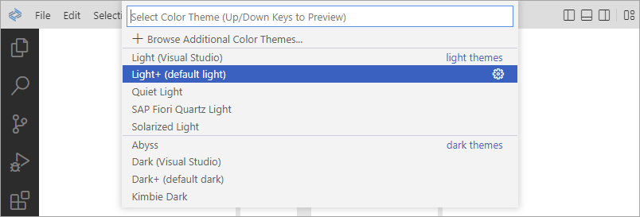

# Exercise 1 - Create a Development Workspace

This exercise will demonstrate how to open the SAP Business Application Studio (app studio) and create your first workspace for native SAP HANA development.  When the SAP HANA tool extensions are added, it can be used to build and deploy native SAP HANA database artifacts such as tables, calculation views, and stored procedures.  

1. In the [BTP Cockpit](https://account.hanatrial.ondemand.com/trial/#/home/trial):
   * Select **Go To Your Trial Account**
   * Select the **trial** subaccount

       

   * Expand **Services** and select **Service Marketplace** in the left nav bar
    
       

   * Search for SAP Business Application Studio
   * Launch SAP Business Application Studio by selecting **Go to Application** from the horizontal three-dot menu.  If you see a privacy statement, click OK to continue.
    
    

2. A welcome screen may appear.  If so, click on **Create Dev Space**.

    

3. Click the button **Create Dev Space** and then create a development workspace that is configured with the *SAP HANA Native Application* development extensions.  Make sure to name this new dev space "TechEd2022" (in top left).

    

4. Once the development space status has changed to running, it can be opened by clicking on the name of the development space.

    

5. The SAP Business Application Studio will open and display the Welcome page that contains various helpful links along the bottom including the documentation and a Guided Development wizard that will be used in the next exercise.

    

    >Should you wish to re-open the Welcome page, it can be opened via a command palette command.  To open the command palette, select **View**, **Find Command** and then search for **Welcome**.
    >
    >

    The SAP Business Application Studio is a browser-based application, so there is no need to install or update software.  You can continue to work on your project later from any computer.

6. The preferences can be viewed or set via **File**, **Preferences** or the gear icon in the bottom left.  Set the workspace project creation behavior preference to open in a stand-alone folder as shown below.

    

7. Your color theme of choice can be set using **File**, **Preferences**, **Color Theme**.

    

8. SAP Business Application Studio has been configured with a selected set of extensions.  These can be seen by selecting the extensions icon.  

    

    Selecting the icon of the extension will show its related panel.   

    

9. A terminal can be opened by selecting **Terminal**, **New Terminal**.

    

## Summary

You have now created a development space that is configured for use with SAP HANA native artifact development.

Continue to - [Exercise 2 - Create and deploy a project using the SAP HANA Getting Started Wizard](../ex2/README.md)

