# Exercise 2 - Create and deploy a project containing database artifacts using the SAP HANA Getting Started Wizard

This exercise will demonstrate how to create a project containing tables, a calculation view, and a stored procedure using the Getting Started wizard.  Further details on some of the concepts shown here can be found at [SAP HANA Cloud, SAP HANA Database Developer Guide for Cloud Foundry Multitarget Applications](https://help.sap.com/docs/HANA_CLOUD_DATABASE/c2b99f19e9264c4d9ae9221b22f6f589/f8e431e3cdc14516b4ba8c9932afd1f4.html?version=latest&locale=en-US).

## Exercise 2.1 Create a New SAP HANA Database Project from a Template

1. In the SAP Business Application Studio, start the **Guided Development** wizard by selecting it from the bottom of the Welcome screen.

    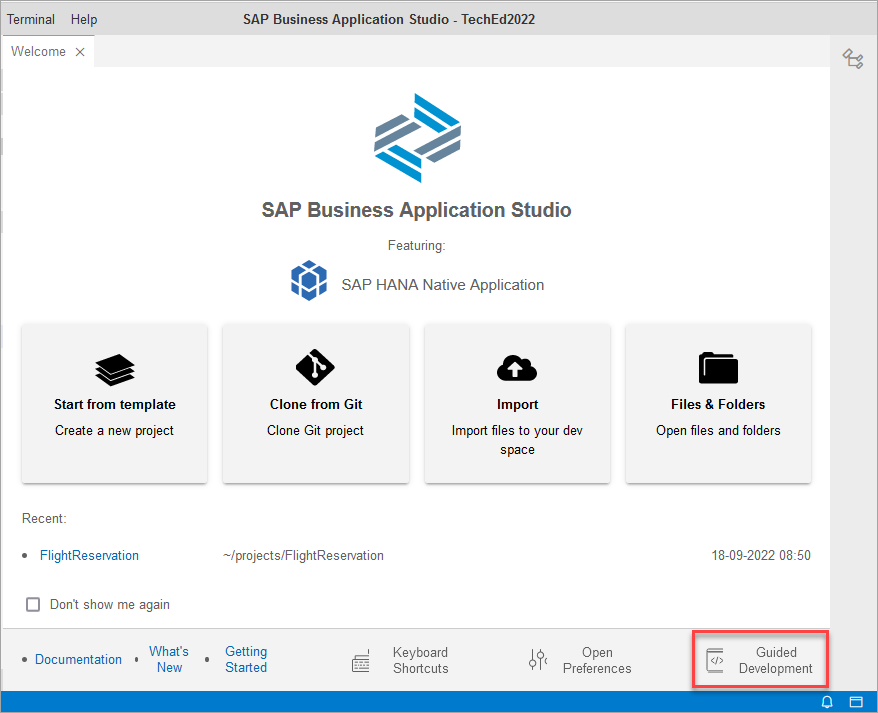

    > Alternatively, select the View, Find Command menu (or Fn F1) to open the command palette and search for SAP HANA and select the option SAP HANA: Getting Started.
    >
    >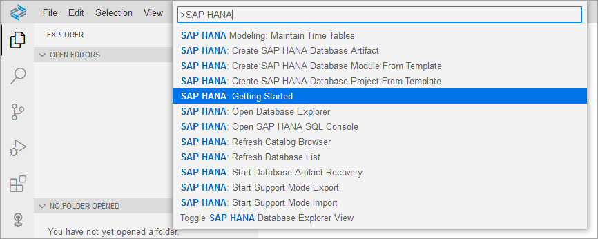

    It may take a moment or two for the contents of the Guided Develpment wizard to appear.  If it does not appear, try reloading the page.

2. Select **Get Started with SAP HANA Cloud**.

    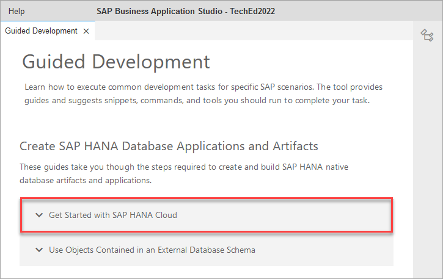

    Select the first sub option **Create a New SAP HANA Database Project from a Template**.

    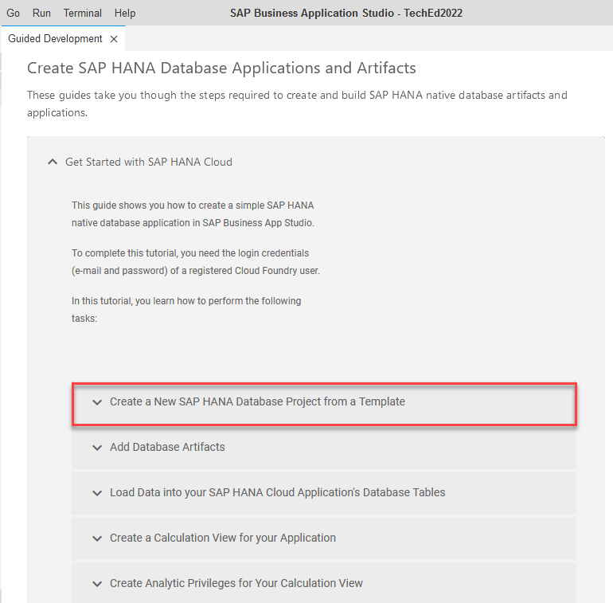

    Press the **Create SAP HANA Database Project** button to open the project creation wizard and then press **Next** multiple times to accept the defaults.

    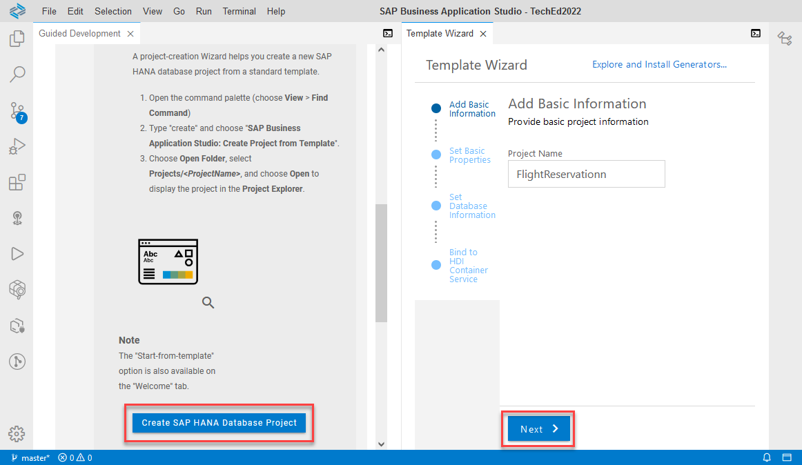

    When asked to, provide your **Cloud Foundry API endpoint**, **email address** used for the trial account, **password**, and select **login**.  The API endpoint value can be obtained from the BTP Cockpit subaccount page.

    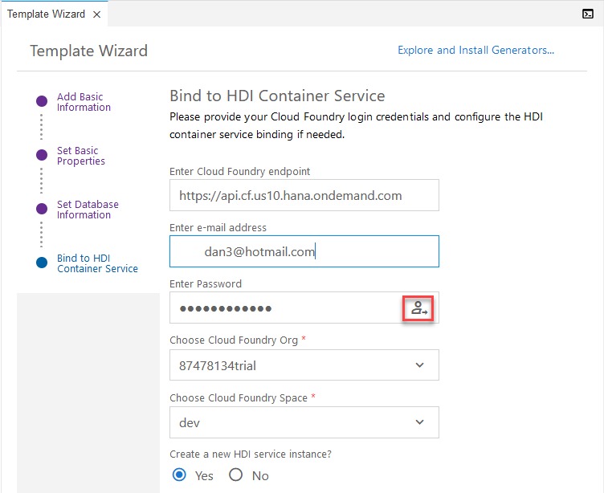

    >In the example below, notice that the API endpoint is slightly different (us10-001 instead of us10) and would need to be updated in the wizard.  
    >
    >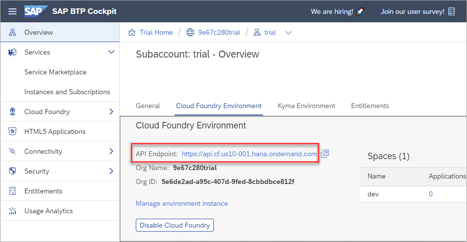
    >
    >---
    > 
    > The Cloud Foundry environment can aslo be interacted with the [Cloud Foundry CLI](https://docs.cloudfoundry.org/cf-cli/getting-started.html) as shown below.
    >
    >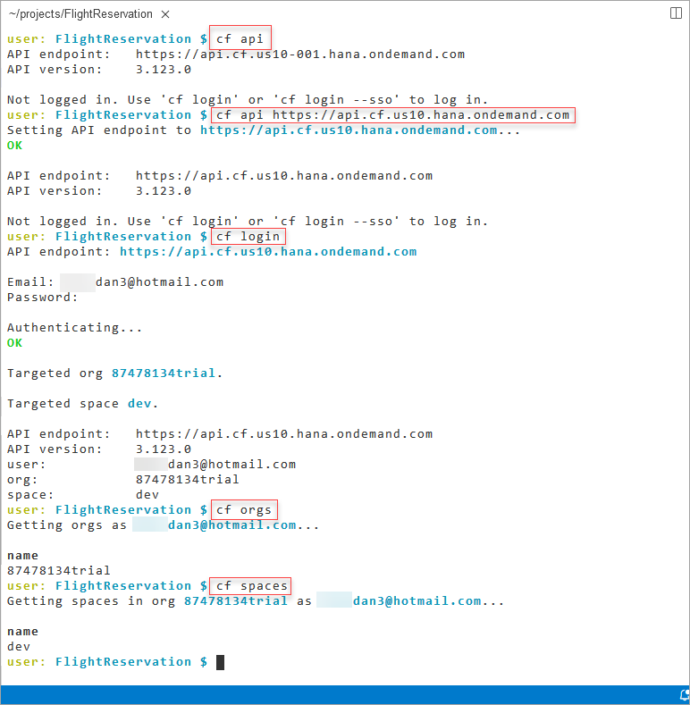

    Select the option to Open the Output View when asked.

    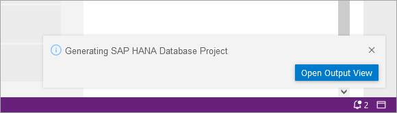

    >The bottom panel can also be shown (or hidden) by selecting View, Toggle Bottom Panel or by the icon in the bottom right.
    >
    >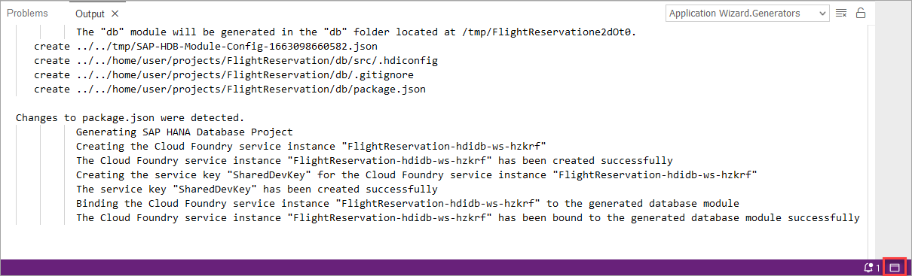

3. In the project explorer, open the generated project.

    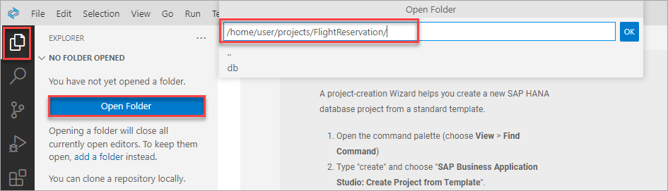

4. Examine the created project and result of the deployment.

    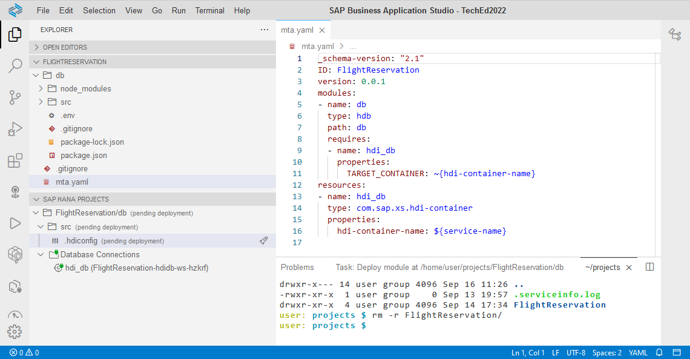

    The panes in the explorer can be expanded and resized.  
    
    >Optionally right click on OPEN EDITOR and choose hide.  Hidden panes can be shown again using the ... menu in the top right of the Explorer.

    At this point an HDI container has been created which is an isolated set of schemas within an SAP HANA Cloud database.  Multiple HDI containers can be included within one SAP HANA Cloud database.  This enables developers to have their own environment or for multiple instances of an application to use one SAP HANA Cloud database.  TODO Volker benefits (is it cost savings, better utilization, much quicker to deploy) 
    
    The HDI container can be seen in both the SAP BTP Cockpit and within the add database dialog of the SAP HANA database explorer.

    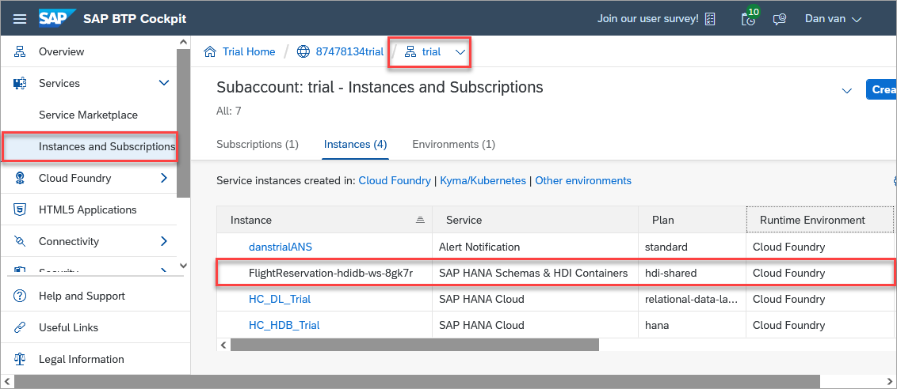

    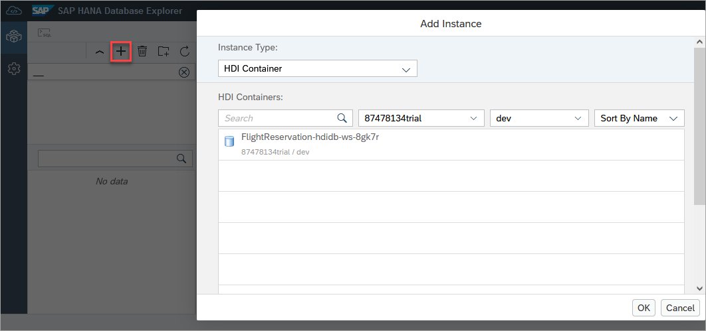

    A service key has been added to the service.  

    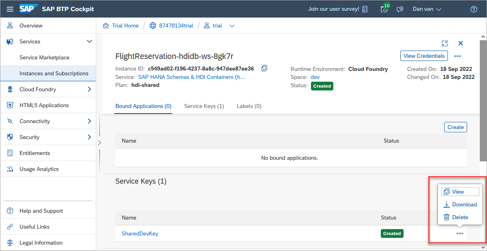

    It contains details such as the parameters needed to connect to the HDI container as well as credentials for a DT or design time user and RT or runtime user. 

    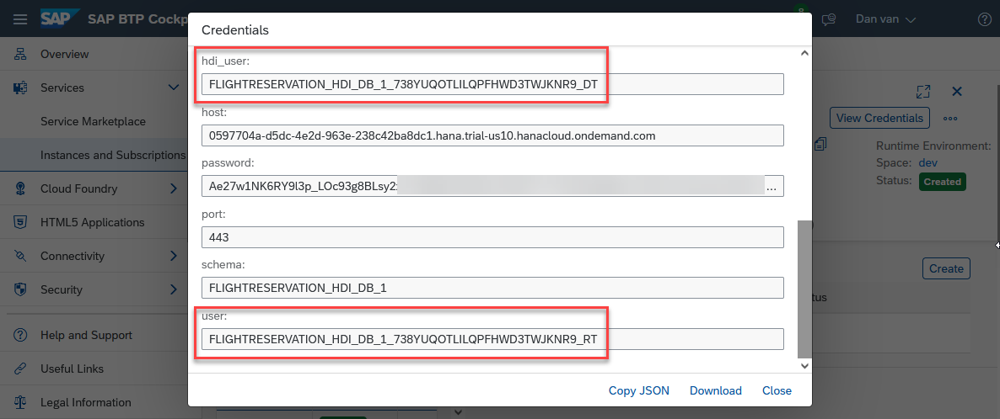

    These details could be also be used to connect to the HDI container from an application using one of the many SAP HANA client drivers (Java, ODBC, Node.js, Python, Go, .NET etc.) or the command line SQL tool HDBSQL.

    >An example is shown below of connecting with both the RT and DT users.  Additional details on client connections can be found at [Use Clients to Query an SAP HANA Database](https://developers.sap.com/mission.hana-cloud-clients.html).  The example shown above requires an installation of the SAP HANA Client.
    >
    > ```SQL
    > \al
    > SELECT CURRENT_USER, CURRENT_SCHEMA FROM DUMMY;
    > SELECT SCHEMA_NAME, SCHEMA_OWNER FROM SCHEMAS;
    > ```
    >
    >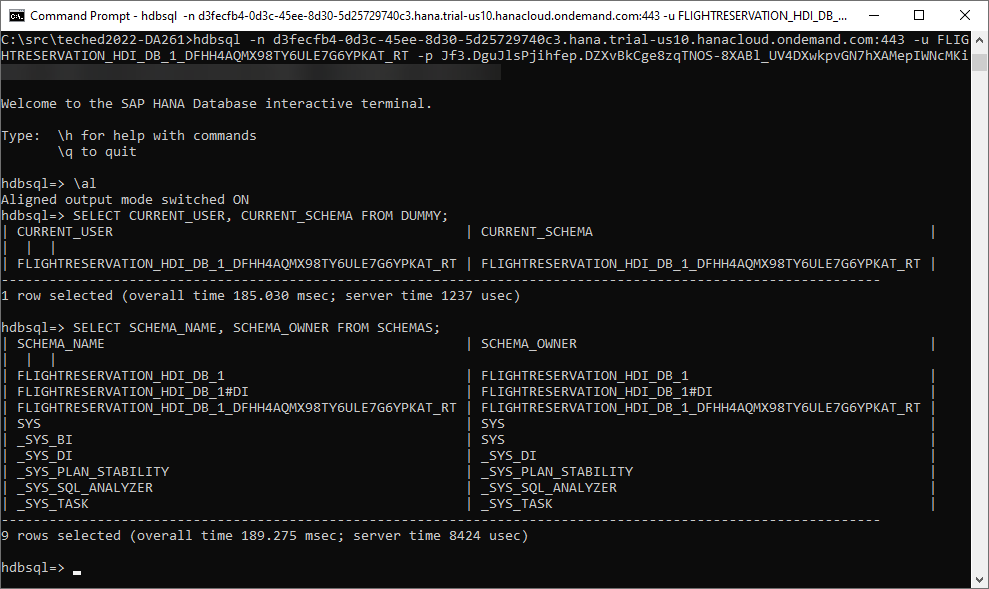
    >
    >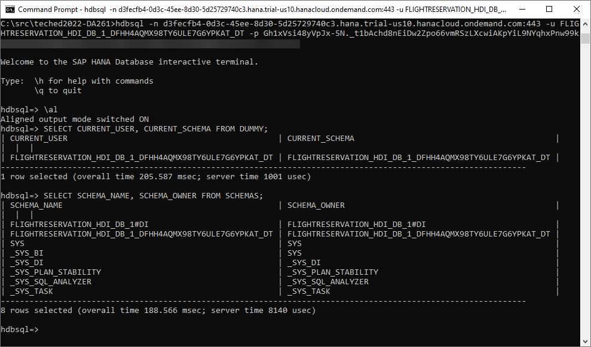


    TODO Volker ... in the above screenshot's which schema is the #OO?  

    TODO Volker ... at some point another service key is created for the HDI container.  What triggers that?  Seems to be when the HDI container is added to DBX.  Why do two sets of service keys get created?
  
    The SAP HANA database explorer is able to look up the service key and use the information contained in the service key to connect and browse the HDI container.

    An HDI container construct can also be described as a glorified set of schemas. 

    TODO Volker, the sreenshot below does not seem to correspond to the previous screenshots.

    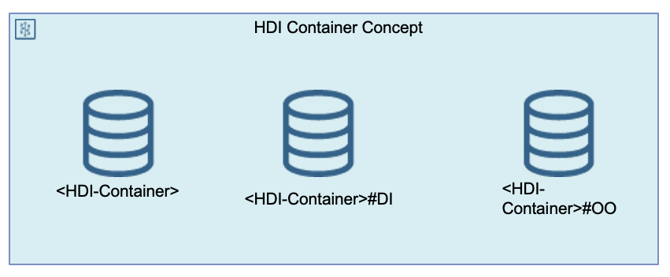

    - "HDI-container"  is the schema for the "RUN TIME" data,
    - "#DI" is the "DESIGN TIME" schema and 
    - "#OO" is a technical schema for the "Object Owner"

    For each DT and RT user there will be additional schema that only belong to this container context. RT/DT users are created by building a new service or adding an additional "shared key".
    The DI schema contains also some views that contain information about the design time objects including their source and with m_jobs also information about the previous deployments. HDI does have a SQL interface and also a Node.js and Java API that developers can use.

## Exercise 2.2 Initialize the Git Repository

1. The Git repository will be initialized now so that after subsequent steps it can be easily seen what changes have been made to the project.

    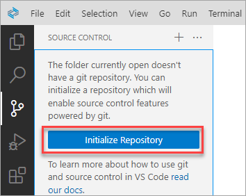

2. Commit the contents of the project and provide a commit message such as initial commit.  The green U stands for unstaged.

    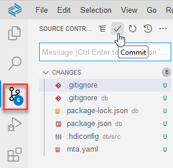

## Exercise 2.3 Add Database Artifacts

1. In the Getting Started wizard, select Add Database Artifacts.

    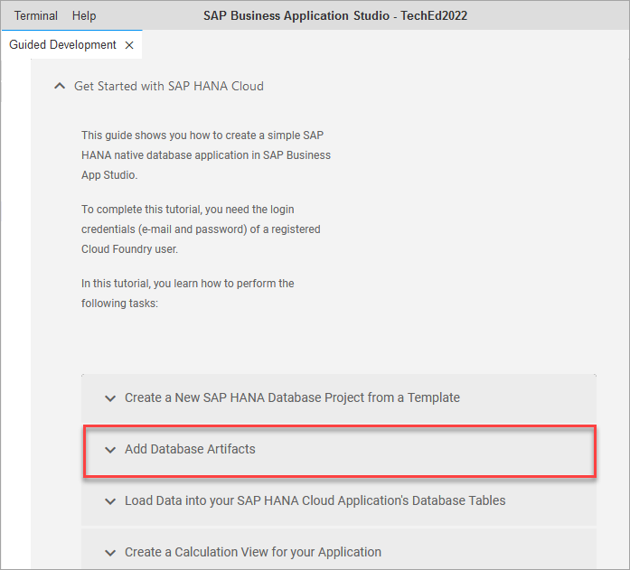

2. Complete all the steps to create two tables (PASSENGERS and FLIGHTRESERVATION), deploy these into tables, and to open the SAP HANA database explorer to view the deployed tables.

    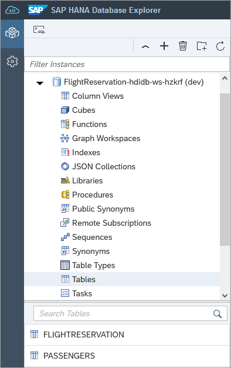

3. Note that the new files are again marked with a green U which means they are unstaged or new files.

    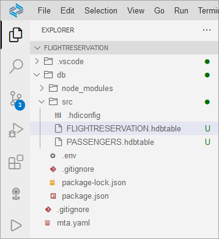

    Commit the changes and continue to do so afer subsequent steps.

    Note that in this way you will have a record of the changes from each step that can be viewed or the project can be restored to the state of a previous commit.

    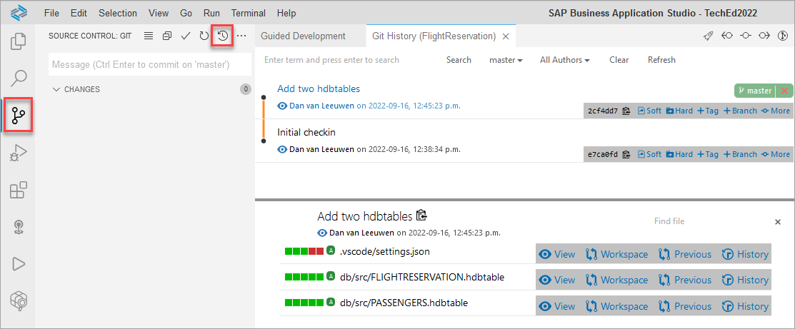

    For additional details see [Working with GIT Within SAP Business Application Studio](https://learning.sap.com/learning-journey/developing-applications-running-on-sap-btp-using-sap-hana-cloud/working-with-git-within-sap-business-application-studio_532f4c05-c108-4737-af9f-dd31c9c5707c) and [Git Source Control](https://help.sap.com/docs/SAP%20Business%20Application%20Studio/9d1db9835307451daa8c930fbd9ab264/9689c07b64364bbea43725dad9f27320.html).

## Exercise 2.4 Load Data into your SAP HANA Cloud Application's Database Tables

1. In the Getting Started wizard, select Load Data into your SAP HANA Cloud Application's Database Tables.

2. Complete all the steps to load data into the two previously created tables and to view the deployed data in the SAP HANA database explorer.

    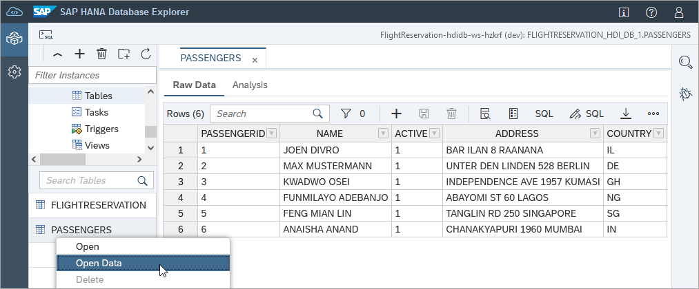

## Exercise 2.5 Create a Calculation View for your Application

Calculation views allow the developers to express their intent instead of defining with SQL code how the data should be processed.

1. In the Getting Started wizard, select Create a Calculation View for your Application.

2. Complete all the steps to create and deploy a calculation view and view its properties in the SAP HANA database explorer.  It may take a moment or two for the calculation view editor to load after its creation.  Note that the permissions to view its data will be granted in the next step.  Additional details on calculation views can be found at [Developing Data Models with SAP HANA Cloud](https://learning.sap.com/learning-journey/developing-applications-running-on-sap-btp-using-sap-hana-cloud/developing-data-models-with-sap-hana-cloud).

    There are various ways to open the Calculation View:
    
     -  Directly within the editor on the projection level

         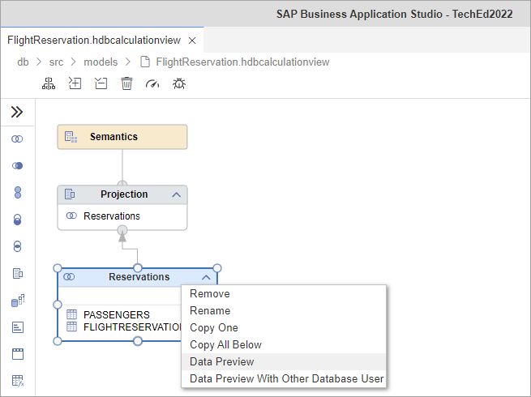
        
        with this result:
        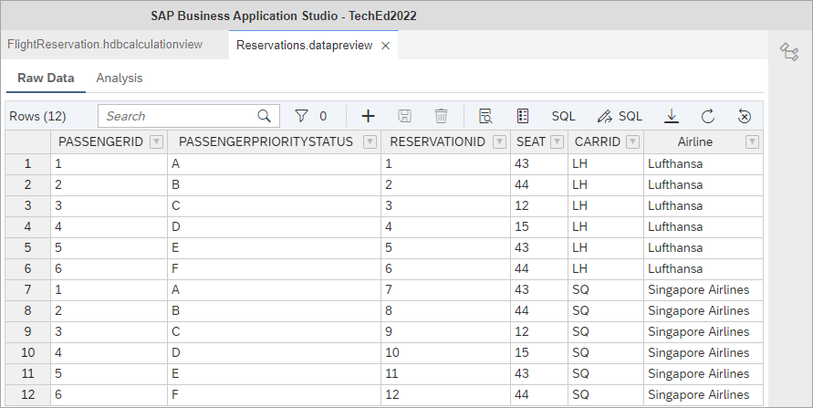

     -  Using the catalog browser in the SAP HANA database explorer as following

## Exercise 2.6 Create Analytic Privileges for your Calculation View

 - 1. In the Getting Started wizard, select Create Analytic Privileges for your Calculation View and complete the steps.
 Deploy


         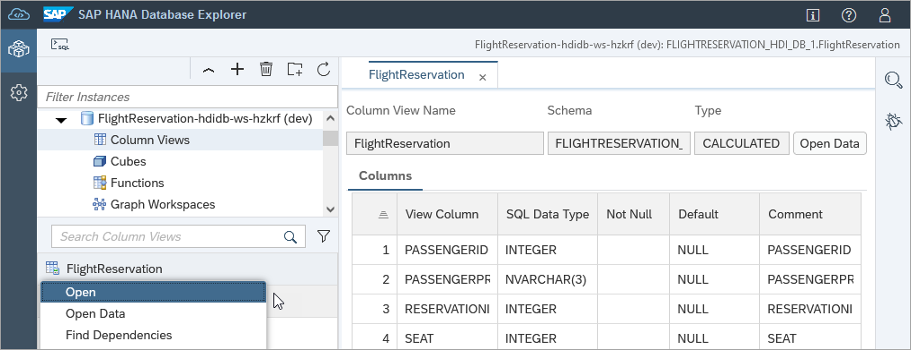
         
         with a filtered result. 


         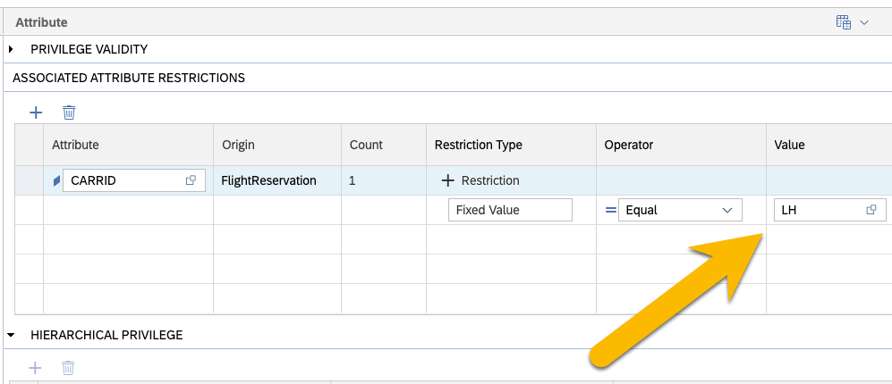
        If you now change the rule tp "SQ", deploy and review the calculation view:

        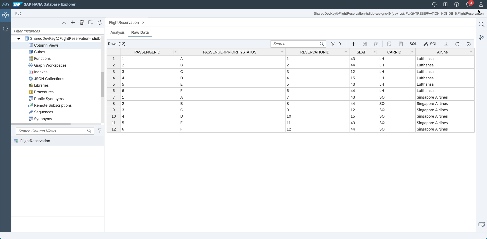


## Exercise 2.7 Create a Database Role for the Analytic Privilege

1. In the Getting Started wizard, select Create a Database Role for the Analytic Privilege and complete the steps.

2. TODO Volker, what are some debugging/tips to help ensure that everything was created properly.
Also need to be able to better describe what the roles and privileges did.  Should we simplify this?
YES

2. Show the data preview functionality in DBX when viewing the data of the calculation view.  Perhaps show count passenger ID by airline.  Seems odd though as it only shows one airline.  Perhaps this is by design in the calcuation view?  TODO Volker.

## Exercise 2.8 Create a Database Procedure File

1. In the Getting Started wizard, select Create a Database Procedure File and complete the steps.

2. In the SAP HANA database explorer, call the stored procedure.

    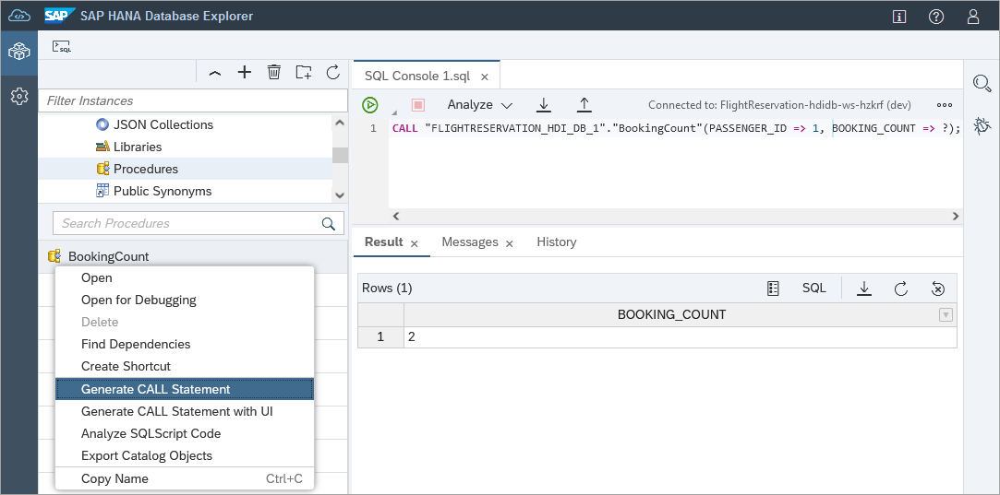

## Exercise 2.9 Debug a Database Procedure File

TODO Dan/Gurvick move this step to separate DBX exercise.

1.  In the SAP HANA database explorer, attempt to debug the stored procedure by selecting Open for Debugging, placing a breakpoint on the last line of the stored procedure, and then call the stored procedure again.

    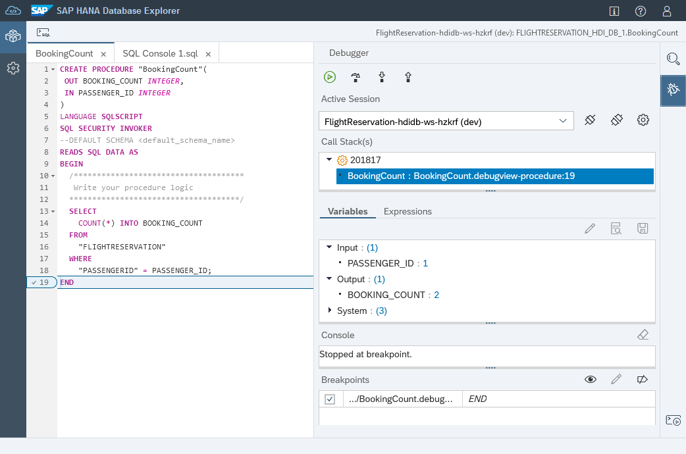

<<<<<<< HEAD
## Exercise 2.11 Opening a SQL Conole as Admin

1.  In the SAP HANA database explorer, open a SQL Console connected to the HDI container.  Execute the following SQL.

    ```SQL
    SELECT * FROM USERS WHERE USER_NAME LIKE '%FLIGHT%';
    SELECT * FROM SCHEMAS;
    SELECT CURRENT_USER, CURRENT_SCHEMA FROM DUMMY;
    SELECT * FROM FLIGHTRESERVATION_HDI_DB_1#DI.JOBS_;  --Fails 
    ```
    
    Notice that the user is the _DT or design time user as opposed to the runtime user.
    If you want to access the DT view you have to use the "ADMIN" container access in Database Explorer.

    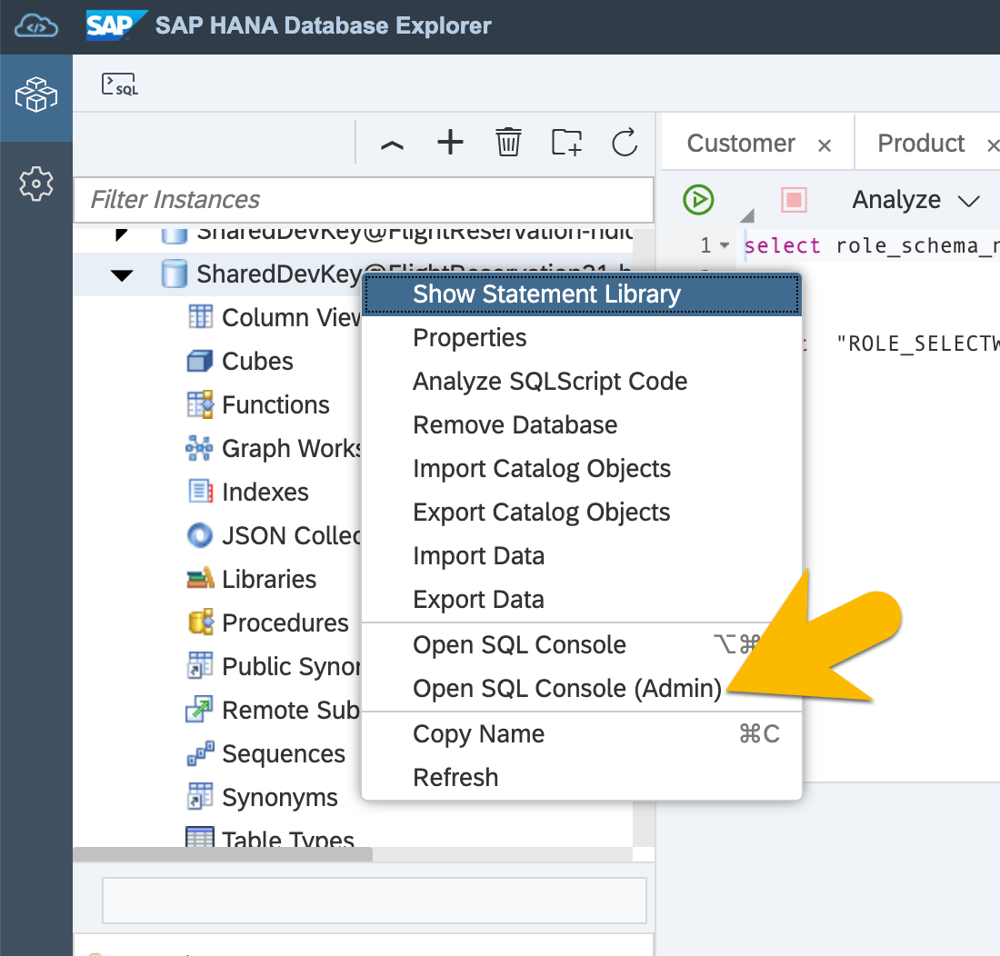

    ```SQL
    SELECT * from M_JOBS
    ```
Here is a blog on this topic:
https://blogs.sap.com/2022/06/13/can-i-see-the-hana-deployment-history/


2.  In the SAP HANA database explorer, open a SQL Console connected to the HDI container with ADMIN.  Execute the following SQL.

    ```SQL
    SELECT CURRENT_USER FROM DUMMY;
    ```

    Notice that the user is the _DT or design time user.
    


3.  The design time user has some additional privileges.  
TODO Volker what can b shown here?

    


## Exercise 2.12 Examining the Contents of the HDI Container

1.  In the SAP HANA database explorer, open the parent database of the HDI container.  Notice that you can see the schema and objects but do not have privileges to query them.
=======
>>>>>>> cac1abdddaecf530aa68f5f055279a5c647becdb

## Summary

You now have now created native SAP HANA database artifacts and deployed them into an HDI container.

Continue to - [Exercise 3 - Additional HDI Container Details (Optional)](../ex3/README.md)
