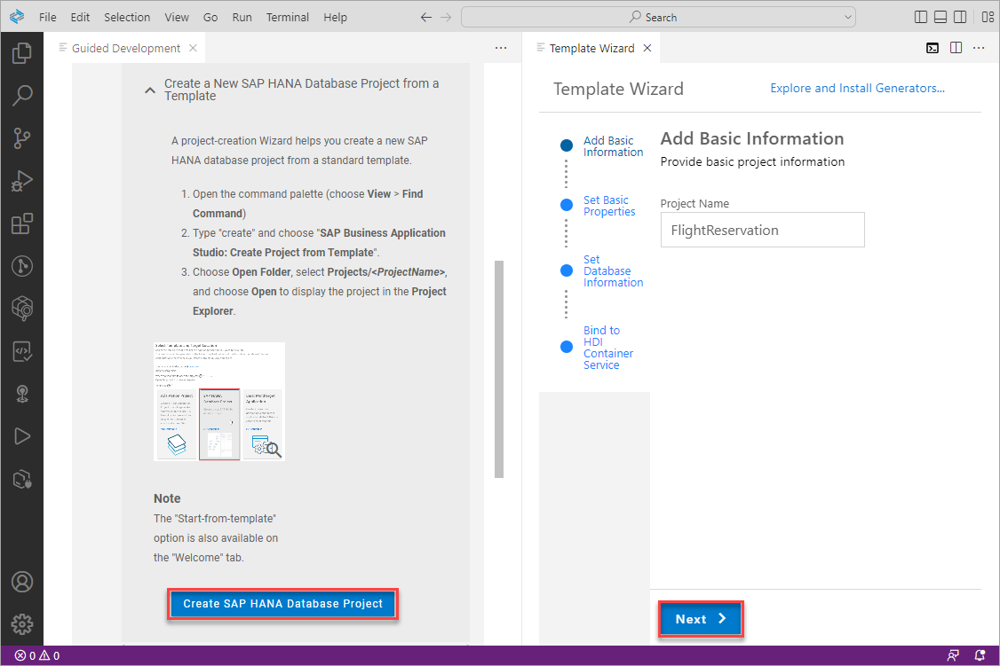
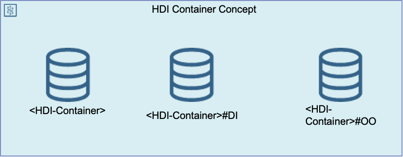

# Exercise 2 - Create and deploy a project containing database artifacts using the SAP HANA Getting Started Wizard

This exercise will demonstrate how to create a project containing tables and a calculation view using the Getting Started wizard.  Further details on some of the concepts shown here can be found at [SAP HANA Cloud, SAP HANA Database Developer Guide for Cloud Foundry Multitarget Applications ](https://help.sap.com/docs/HANA_CLOUD_DATABASE/c2b99f19e9264c4d9ae9221b22f6f589/f8e431e3cdc14516b4ba8c9932afd1f4.html?version=latest&locale=en-US).

## Exercise 2.1 Creating Database Objects with HDI vs SQL

Multiple developers working with the same objects can each have their own isolated deployment.  How does this differ from the upcoming (internal only) HANA Cloud multi-tenancy?  Schema less development.

### Why HDI

- HDI stands for SAP HANA Deployment Infrastructure
- HDI is integral part of SAP HANA and SAP HANA Cloud
- HDI is a scalable design-time \ runtime environment
- Supports most standard database artifacts like tables, procedures, views, virtual tables, roles
- Provides support for advanced SAP HANA artifacts like calculation views, flowgraphs, and replication tasks
- Determines correct deployment order
- Transactional all-or-nothing principle
- <B>Evolves the runtime objects</B>
- Simplifies the need for the developer to write DDL and DML to get schema evolution
- Re-deployment of dependent artifacts
- Can be generated from higher-level language like CAP CDS
- Eases deployment in a multi-tenant environments

Alternatively, database objects can also be created directly in the database using SQL as shown in the last step [](../database_explorer/README.md).

## Exercise 2.2 Create a New SAP HANA Database Project from a Template

1. In the SAP Business Application Studio, start the Guided Development Wizard by selecting it from the bottom of the Welcome screen, or select the View, Find Command menu (or Fn F1) to open the command palette and search for SAP HANA and select the option SAP HANA: Getting Started.

    

    or

    

    It may take a moment or two for the contents of the Guided Develpment Wizard to appear.  If it does not appear, try reloading the page.

2. Select Get Started with SAP HANA Cloud.

    

    Select the first sub option Create a New SAP HANA Database Project from a Template.

    

    Press the create button to open the project creation wizard and then press next multiple times to accept the defaults.

    

    When asked to, provide your Cloud Foundry user id and password and select login. [JOSE: where do you get these from?]

    

    Select the option to Open the Output View when asked.

    

    The bottom panel can also be shown (or hidden) by selecting View, Toggle Bottom Panel or by the icon in the bottom right.

    

3. In the project explorer, open the generated project.

    

4. Examine the created project.

    

    The panes in the explorer can be expanded and resized.  Optionally right click on OPEN EDITOR and choose hide.  Hidden panes can be shown again using the ... menu in the top right of the Explorer.

    At this point an HDI Container has been created and can be seen in both the SAP BTP Cockpit and within the add database dialog of the SAP HANA database explorer.

    

    A service key has been added to the service.  

    

    It contains details such as the parameters needed to connect to the HDI container as well as credentials for a _DT or design time user and _RT or runtime user. 

    

    These details could be also be used to connect to the HDI container from an application using one of the many SAP HANA client drivers (Java, ODBC, Node.js, Python, Go, .NET etc.) or the command line SQL tool HDBSQL.

    An example is shown below.  Additional details on client connections can be found at [Use Clients to Query an SAP HANA Database](https://developers.sap.com/mission.hana-cloud-clients.html).

    

    TODO Dan, maybe demonstrate connecting with the DT user and show the different schemas that user is able to see or show both in DBX?  Note that the OO and DT schemas are not shown in the above example.

    TODO at some point another service key is created for the HDI container.  What triggers that?
  
    The SAP HANA database explorer is able to look up the service key and use the information to connect and browser the HDI container.

    

    An HDI container is construct one can also describe as a glorified set of schemas.

    

    - "HDI-container"  is the schema for the "RUN TIME" data,
    - "#DI" is the "DESIGN TIME" schema and 
    - "#OO" is a technical schema for the "Object Owner"

    For each DT and RT user there will additional schema that only belong to this container context. RT/DT users are created by building a new service or adding an additional "shared key".
    The DI schema contains also some views that contain information about the design time objects including their source and with m_jobs also information about the previous deployments. HDI does have a SQL interface and also a Node.js and Java API that developers can use.

## Exercise 2.3 Initialize the Git Reprository

1. The Git repository will be initialized now so that after subsequent steps it can be easily seen what changes have been made to the project.

    

2. Commit the contents of the project and provide a commit message such as initial commit.  The green U stands for unstaged.

    

## Exercise 2.4 Add Database Artifacts

1. In the Getting Started wizard, select Add Database Artifacts.

    

2. Complete all the steps to create two tables (PASSENGERS and FLIGHTRESERVATION), deploy these into tables, and to open the SAP HANA database explorer to view the deployed tables.

    

3. Note that the new files are again marked with a green U which means they are unstaged or new files.

    

    Commit the changes and continue to do so afer subsequent steps.

    Note that in this way you will have a record of the changes from each step that can be viewed or the project can be restored to the state of a previous commit.

    

    For additional details see [Working with GIT Within SAP Business Application Studio](https://learning.sap.com/learning-journey/developing-applications-running-on-sap-btp-using-sap-hana-cloud/working-with-git-within-sap-business-application-studio_532f4c05-c108-4737-af9f-dd31c9c5707c) and [Git Source Control](https://help.sap.com/docs/SAP%20Business%20Application%20Studio/9d1db9835307451daa8c930fbd9ab264/9689c07b64364bbea43725dad9f27320.html).

## Exercise 2.5 Load Data into your SAP HANA Cloud Application's Database Tables

1. In the Getting Started wizard, select Load Data into your SAP HANA Cloud Application's Database Tables.

2. Complete all the steps to load data into the two previously created tables and to view the deployed data in the SAP HANA database explorer.

    

## Exercise 2.6 Create a Calculation View for your Application

Calculation views allow the developers to express their intent instead of defining with SQL code how the data should be processed.

1. In the Getting Started wizard, select Create a Calculation View for your Application.

2. Complete all the steps to create and deploy a calculation view and view its properties in the SAP HANA database explorer.  It may take a moment or two for the calculation view editor to load after its creation.  Note that the permissions to view its data will be granted in the next step.

    

    There are various ways to open the Calculation View:
    
     -  1. Directly within the editor on the projection level
     -  2. Using DBX as a "Column View"

## Exercise 2.7 Create Analytic Privileges for your Calculation View

1. In the Getting Started wizard, select Create Analytic Privileges for your Calculation View and complete the steps.

2. TODO Volker, why does it suggest opening dbx here?  Unless I am mistaken, nothing can be seen in DBX related to the privileges and the calculation view can not yet preview the data.

## Exercise 2.8 Create a Database Role for the Analytic Privilege

1. In the Getting Started wizard, select Create a Database Role for the Analytic Privilege and complete the steps.

2. I get a insufficient privilege: Detailed info for this error can be found with guid 'D00DD9BE37D9B749B81DCBB1C1B0990A'
 when I try to view the data for the calculation view.  TODO Volker, what are some debugging/tips to help ensure that everything was created properly.

2. Show the data preview functionality in DBX when viewing the data of the calculation view.  Perhaps show count passenger ID by airline.  Seems odd though as it only shows one airline.  Perhaps this is by design in the calcuation view?  TODO Volker.

## Exercise 2.9 Create a Database Procedure File

1. In the Getting Started wizard, select Create a Database Procedure File and complete the steps.

2. In the SAP HANA database explorer, call the stored procedure.

    

## Exercise 2.10 Debug a Database Procedure File

1.  In the SAP HANA database explorer, attempt to debug the stored procedure by selecting Open for Debugging, placing a breakpoint on the last line of the stored procedure, and then call the stored procedure again.

    

## Exercise 2.11 Opening a SQL Conole as Admin

1.  In the SAP HANA database explorer, open a SQL Console connected to the HDI container.  Execute the following SQL.

    ```SQL
    SELECT * FROM USERS WHERE USER_NAME LIKE '%FLIGHT%';
    SELECT * FROM SCHEMAS;
    SELECT CURRENT_USER, CURRENT_SCHEMA FROM DUMMY;
    SELECT * FROM FLIGHTRESERVATION_HDI_DB_1#DI.JOBS_;  --Fails 
    ```
    
    Notice that the user is the _DT or design time user as opposed to the runtime user.

    TODO Volker.  How does one query the JOBS_.  How does one connect as OO?

2.  In the SAP HANA database explorer, open a SQL Console connected to the HDI container with ADMIN.  Execute the following SQL.

    ```SQL
    SELECT CURRENT_USER FROM DUMMY;
    ```

    Notice that the user is the _DT or design time user.
    
    

3.  The design time user has some additoinal privileges.  TODO Volker what can b shown here?

## Exercise 2.12 Examining the Contents of the HDI Container

1.  In the SAP HANA database explorer, open the parent database of the HDI container.  Notice that you can see the schema and objects but do not have privileges to query them.

## Summary

You now have now created native SAP HANA database artifacts and deployed them into an HDI container.

Continue to - [Exercise 3 - Exercise 3 Description](../ex3/README.md)
