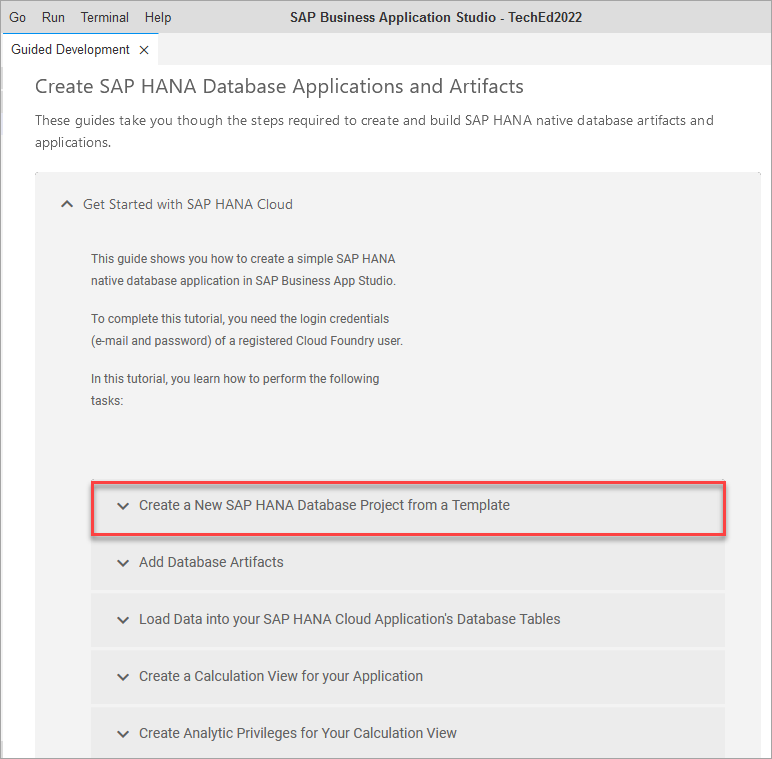
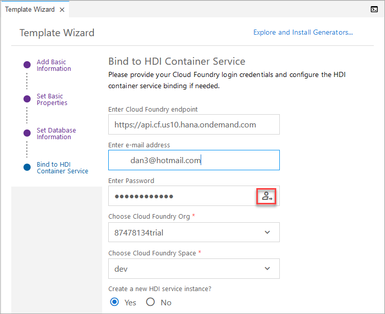
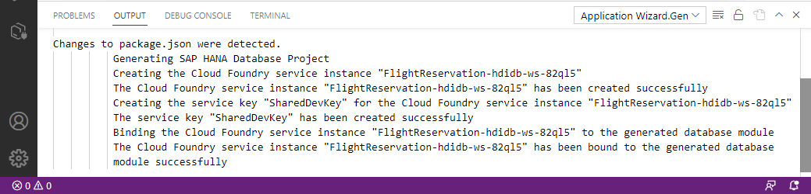

# Exercise 2 - Create and deploy a project containing database artifacts using the SAP HANA Getting Started Wizard

This exercise will demonstrate how to create a project containing tables and calculation views using the Getting Started wizard.  

## Exercise 2.1 Create a New SAP HANA Database Project from a Template

1. In the SAP Business Application Studio, select the View, Find Command menu (or Fn F1) to open the command palette and search for SAP HANA and select the option shown below.

    

    It may take a moment or two for the contents to load.

2. Select Get Started with SAP HANA Cloud.

    

    Select the first sub option Create a New SAP HANA Database Project from a Template.

    

    Press Next multiple times to accept the defaults.

    When asked for provide your Cloud Foundry user id and password and select login.

    

    

3. TODO by Volker?, explain what has just happened, HDI container created, service keys etc.  Maybe some content on what an HDI container is?

4. In the project explorer, open the generated project.

    

## Exercise 2.2 Add Database Artifacts

1.  In the Getting Started wizard, select Add Database Artifacts.

    

2. Complete all the steps to create two tables (PASSENGERS and FLIGHTRESERVATION), deploy these into tables, and to open the SAP HANA database explorer to view the deployed tables.

    

## Exercise 2.3 Load Data into your SAP HANA Cloud Application's Database Tables

1.  In the Getting Started wizard, select Load Data into your SAP HANA Cloud Application's Database Tables.

2. Complete all the steps to load data into the two previously created tables and to view the deployed data in the SAP HANA database explorer.

    

## Exercise 2.4 Create a Calculation View for your Application

1.  In the Getting Started wizard, select Create a Calculation View for your Application.

2. Complete all the steps to create and deploy a calculation view and view its properties in the SAP HANA database explorer.  Note that the permissions to view its data will be granted in the next step. 

    

## Exercise 2.5 Create Analytic Privileges for your Calculation View

1.  In the Getting Started wizard, select Create Analytic Privileges for your Calculation View and complete the steps.

2. TODO @Volker, why does it suggest opening dbx here?  

## Exercise 2.6 Create a Database Role for the Analytic Privilege

1.  In the Getting Started wizard, select Create a Database Role for the Analytic Privilege and complete the steps.

2. TODO @Volker, what would be interesting to show when viewing the data of the calculation view?

## Exercise 2.7 Create a Database Role for the Analytic Privilege

1.  In the Getting Started wizard, select Create a Database Procedure File and complete the steps.

2.  In the SAP HANA database explorer, call the stored procedure.

    

3.  In the SAP HANA database explorer, attempt to debug the stored procedure by selecting Open for Debugging, placing a breakpoint on the last line of the stored procedure, and then call the stored procedure again.

    

## Summary

You now have now created native SAP HANA database artifacts and deployed them into an HDI container.

Continue to - [Exercise 3 - Exercise 3 Description](../ex3/README.md)

