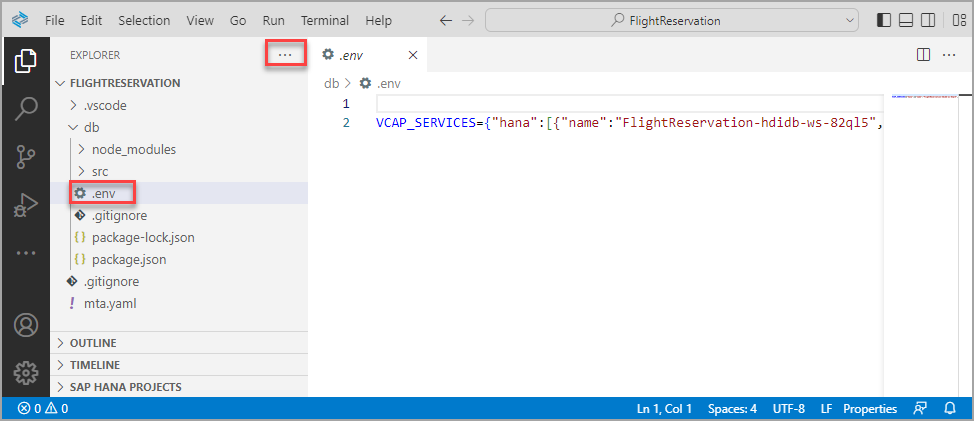
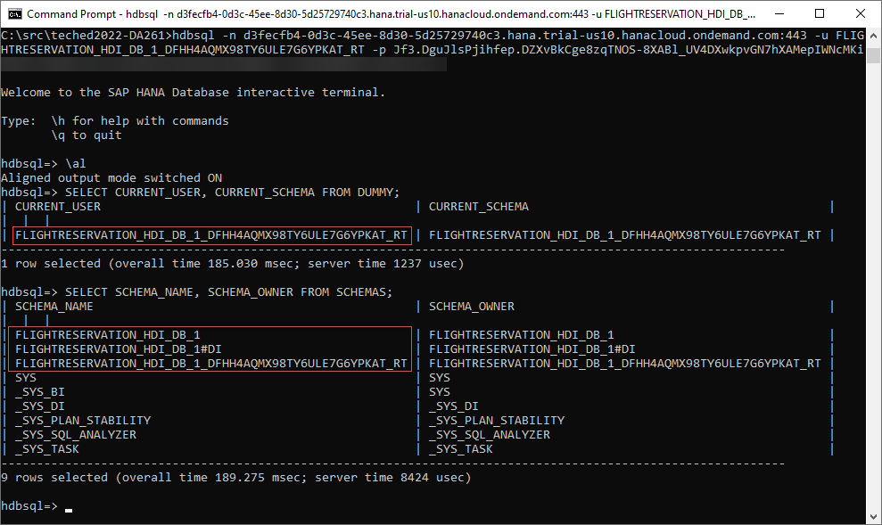
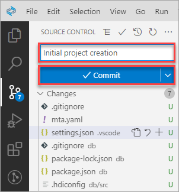
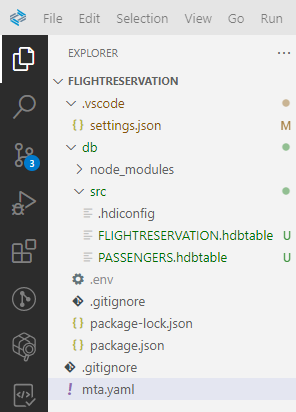
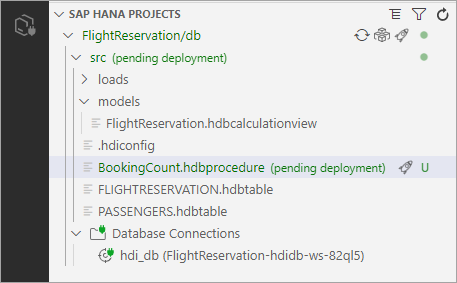
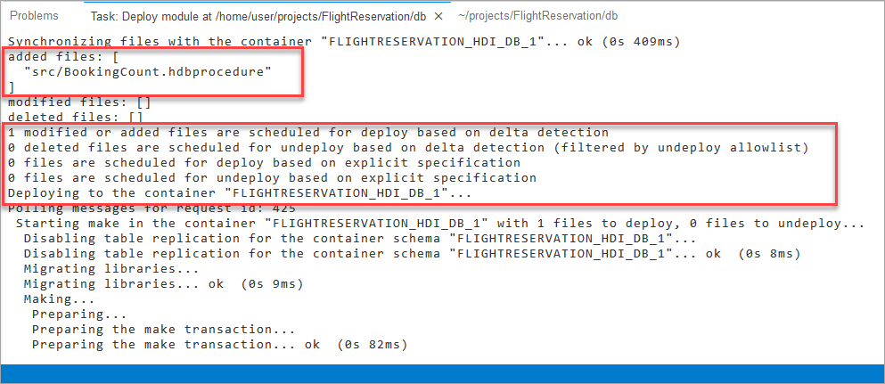
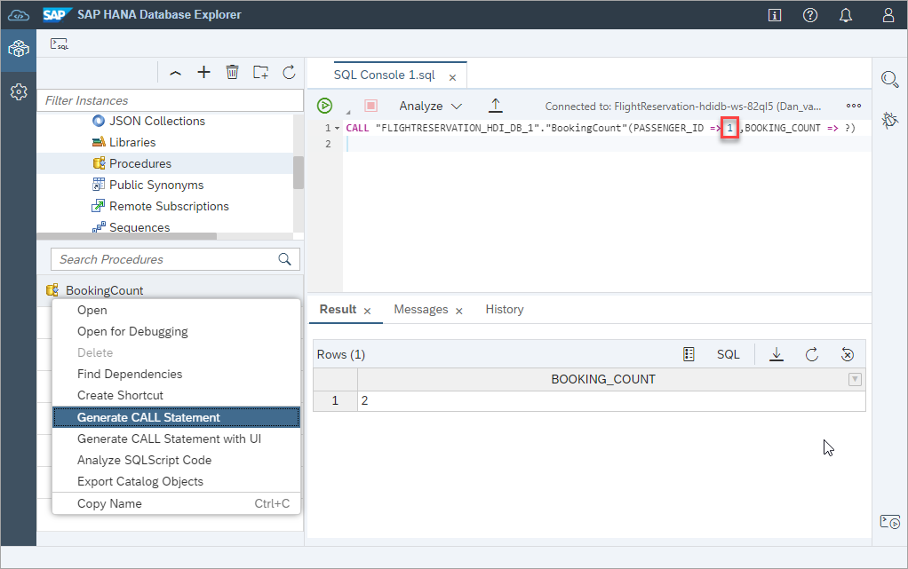

# Exercise 2 - Create and Deploy Native Database Artifacts Using Guided Development

This exercise will demonstrate how to create a project containing tables, a calculation view, and a stored procedure using the guided development tool.  [Exercise 3](../ex3/README.md) is an optional exercise and walks through the process of importing a completed project.

## Exercise 2.1 Create a New SAP HANA Database Project from a Template

1. In the SAP Business Application Studio, start the **Guided Development** tool by selecting it from the bottom of the Welcome screen.

    

    > Alternatively, select the menu **View**, **Find Command** (or Fn F1) to open the command palette and search for **SAP HANA** and select the option **SAP HANA: Getting Started**.
    >
    >

    It may take a moment or two for the contents of the Guided Development wizard to appear.  If it does not appear, try reloading the page.

2. Select **Get Started with SAP HANA Cloud**.

    

    Select the first sub option **Create a New SAP HANA Database Project from a Template**.

    

    Press the **Create SAP HANA Database Project** button to open the project creation wizard and then press **Next** multiple times to accept the defaults.

    

    When asked to on the third page, provide your **Cloud Foundry API endpoint**, **email address** used for the trial account, **password**, and select **login** icon.  
    
    >The API endpoint value can be obtained from the BTP Cockpit subaccount page.  
    
    >If 2 factor authentication is enabled, provide your password followed by a 2 factor authentication code. 

    

    >In the example below, notice that the API endpoint is slightly different (us10-001 instead of us10) and hence the endpoint value in the above wizard would need to be updated to use the correct endpoint value.  Also make sure that there is not a space before or after the URL.
    >
    >
    >
    >---
    > 
    > The Cloud Foundry environment can also be interacted with the [Cloud Foundry CLI](https://docs.cloudfoundry.org/cf-cli/getting-started.html) as shown below.
    >
    >
    >
    >It should also be noted that if you are using a non-trial account (trial account limit the number of instances to one), you may wish to specify which SAP HANA Cloud instance to deploy the SAP HANA Deployment Infrastructure (HDI) container to.
    >
    >

    Select the option to Open the Output View when asked.

    

    >The bottom panel can also be shown (or hidden) by selecting View, Toggle Bottom Panel or by the icon in the bottom right.
    >
    >
    >
    >*Above, notice that the HDI container and a service key has been created and that the container has been bound to the SAP HANA Cloud instance.*

3. In the project explorer, open the generated project.

    

4. Examine the created project.

    

    The panes in the explorer can be expanded and resized.  
    
    >Optionally right click on **OPEN EDITORS** and choose **Hide** or uncheck the item.  Hidden panes can be shown again using the ... menu in the top right of the Explorer.

    At this point an HDI container has been created which is an isolated set of schemas within an SAP HANA Cloud database.
    
    HDI provides a service that enables you to deploy database development artifacts to containers. This service includes a family of consistent design-time artifacts for all key SAP HANA database features which describe the target (run-time) state of SAP HANA database artifacts, for example: tables, views, or procedures. These artifacts are modeled, staged (uploaded), built, and deployed into SAP HANA. 
    
    Multiple HDI containers can be included within one SAP HANA Cloud database.  This enables developers to have their own environment or for multiple instances of an application to use one SAP HANA Cloud database each with a separate container.
    
    The HDI container can be seen in the SAP BTP Cockpit. 

    

    It is also visible within the add database dialog of the SAP HANA database explorer.
    
    >The SAP HANA database explorer can connect to the HDI container without providing credentials as it is able to look up the service key mentioned below  to connect and browse the HDI container.

    

    *Above, the service key SharedDevKey is created when A service key has been added to the service.  

    

    It contains details such as the parameters needed to connect to the HDI container (host, port, certificate) as well as credentials for a DT or design time user and RT or runtime user. 

    

    These details could also be used to connect to the HDI container from an application using one of the many SAP HANA client drivers (Java, ODBC, Node.js, Python, Go, .NET etc.) or the command line SQL tool HDBSQL.

    >An example is shown below of connecting with the RT user.  Additional details on client connections can be found at [Use Clients to Query an SAP HANA Database](https://developers.sap.com/mission.hana-cloud-clients.html).  The example shown above requires an installation of the SAP HANA Client (which is not on the TechEd laptops) and is shown for illustrative purposes only.
    >
    > ```SQL
    > \al
    > SELECT CURRENT_USER, CURRENT_SCHEMA FROM DUMMY;
    > SELECT SCHEMA_NAME, SCHEMA_OWNER FROM SCHEMAS;
    > ```
    >
    >
    >
    >
    >The blog [How to recreate a HANA Cloud service key aka password rotation](https://blogs.sap.com/2022/10/05/how-to-recreate-a-hana-cloud-service-key-aka-password-rotation/) provides some additional details on how these service keys can be recreated or rotated.

## Exercise 2.2 Initialize the Git Repository

1. Initialize the Git repository by selecting the **GIT** extension and pressing the **+** icon.

    

2. Commit the contents of the project and provide a commit message such as initial commit.  Optionally select **Always** to the question "Would you like to stage all your changes and commit them directly?" to simplify the check in process. 

    

    *The green U stands for unstaged or files that have not yet been added to the repository.*

## Exercise 2.3 Add Database Artifacts

1. In the guided development tool, select **Add Database Artifacts**.

    

2. Complete all the steps to create two tables, deploy them, and to open the SAP HANA database explorer to view the deployed tables.

    

3. Note that the new files are again marked with a green U which means they are unstaged or new files.

    

    Commit the changes and continue to do so after subsequent steps.

    Note that in this way you will have a record of the changes from each step that can be viewed, or the project can be restored to the state of a previous commit.

    

    For additional details see [Working with GIT Within SAP Business Application Studio](https://learning.sap.com/learning-journey/developing-applications-running-on-sap-btp-using-sap-hana-cloud/working-with-git-within-sap-business-application-studio_532f4c05-c108-4737-af9f-dd31c9c5707c) and [Git Source Control](https://help.sap.com/docs/SAP%20Business%20Application%20Studio/9d1db9835307451daa8c930fbd9ab264/9689c07b64364bbea43725dad9f27320.html).

## Exercise 2.4 Load Data into your SAP HANA Cloud Application's Database Tables

1. In the guided development tool, select **Load Data into your SAP HANA Cloud Application's Database Tables**.

2. Complete all the steps to load data into the two previously created tables and to view the deployed data in the SAP HANA database explorer.

    

    Notice also that the metadata of a table can be viewed by selecting Open.

    


## Exercise 2.5 Create a Calculation View

Calculation views allow the developers to express their intent instead of defining with SQL code how the data should be processed.  Additional details on calculation views can be found at [Developing Data Models with SAP HANA Cloud](https://learning.sap.com/learning-journey/developing-applications-running-on-sap-btp-using-sap-hana-cloud/developing-data-models-with-sap-hana-cloud) and [Working with Calculation Views in SAP HANA Cloud](https://open.sap.com/courses/hana9).

1. In the guided development tool, select **Create a Calculation View for your Application**.

2. Complete all the steps to create and deploy a calculation view and view its properties in the SAP HANA database explorer.  It may take a moment or two for the calculation view editor to load after its creation.  Note that the permissions to view its data will be granted in a subsequent step.  

    Within the SAP HANA database explorer, the deployed calculation view can be seen as well as its metadata.

    

    Note that the data cannot yet be viewed from the SAP HANA database explorer as this calculation view is configured to use analytic privileges which have not yet been created.  
    
    

    From the above drop down for **Analytic Privileges**, clear the option **SQL Analytic Privileges**.

    

    Once the calculation view has been re-deployed, its data can be viewed in the SAP HANA database explorer as shown below.  The data can be placed in a chart or in columnar form by selecting Raw Data. 

    
    
    *Notice that the Airline column has been added to the label axis and a count of the passenger ids has been added to the value axis.*

    It is also possible to see a similar preview within the calculation view editor.

    
        
    


## Exercise 2.6 Create a Database Procedure File

1. In the guided development tool, skip a couple of steps and select **Create a Database Procedure File** and complete the steps.

2. Notice that the changed artifact, the procedure is identified as needing to be deployed.

    

    The output view provides details on what was deployed.

    

3. In the SAP HANA database explorer, call the stored procedure.

    

## Summary

You now have now created native SAP HANA database artifacts and deployed them into an HDI container.  Further details on some of the concepts shown here can be found at [SAP HANA Cloud, SAP HANA Database Developer Guide for Cloud Foundry Multitarget Applications](https://help.sap.com/docs/HANA_CLOUD_DATABASE/c2b99f19e9264c4d9ae9221b22f6f589/f8e431e3cdc14516b4ba8c9932afd1f4.html?version=latest&locale=en-US).  In the next set of exercises, we will focus on functionality within the SAP HANA database explorer.

Continue to - [Exercise 1 - Exercise 1 - Launch the SAP HANA Database Explorer](../../database_explorer/ex1/README.md)
