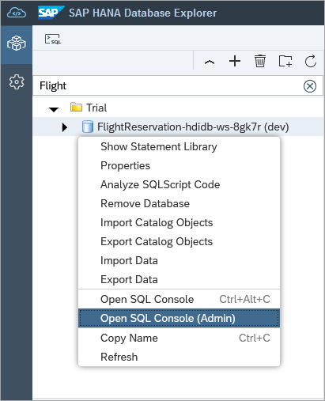

# Exercise 3 - Additional HDI Container Details (Optional)

This exercise will further examine the deployed HDI container.  

## Exercise 3.1 Why HDI?

- HDI stands for SAP HANA Deployment Infrastructure
- HDI is an integral part of SAP HANA and SAP HANA Cloud
- HDI is a scalable design-time \ runtime environment
- Supports most standard database artifacts like tables, procedures, views, virtual tables, roles
- Provides support for advanced SAP HANA artifacts like calculation views, flowgraphs, and replication tasks
- Determines correct deployment order
- Transactional all-or-nothing principle
- Evolves the runtime objects
- Simplifies the need for the developer to write DDL and DML to get schema evolution
- Re-deployment of dependent artifacts
- Schema less development
- Multiple developers can each have their own isolated deployments
- Can be generated from higher-level language like CAP CDS
- Eases deployment in multi-tenant environments

Alternatively, database objects can also be created directly in the database using SQL as shown in the last step of [SAP HANA database explorer exercise 1](../database_explorer/README.md).

## Exercise 3.2 Opening a SQL Console as Admin

1.  In the SAP HANA database explorer, open a SQL Console connected to the HDI container.  Execute the following SQL.

    ```SQL
    SELECT * FROM USERS WHERE USER_NAME LIKE '%FLIGHT%';
    SELECT * FROM SCHEMAS;
    SELECT CURRENT_USER, CURRENT_SCHEMA FROM DUMMY;
    SELECT * FROM M_JOBS;  --Fails 
    ```
    
    Notice that the user is the _RT or run time user as opposed to the design time user.
    If you want to access the DT view you have to use the "ADMIN" container access in Database Explorer.

    

    Here is a blog on this topic:
    https://blogs.sap.com/2022/06/13/can-i-see-the-hana-deployment-history/

2.  The design time user has some additoinal privileges.  
TODO Volker what can be shown here?

## Exercise 3.3 Examining the Contents of the HDI Container

1.  In the SAP HANA database explorer, open the parent database of the HDI container.  Notice that you can see the schema and objects but do not have privileges to query them.

    TODO, demonstrate this

## Summary

You have now have a better understanding of some of the HDI concepts.

Continue to - [Exercise ? - Description](../ex?/README.md)

