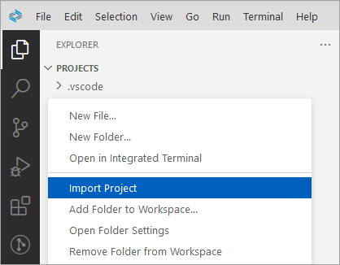
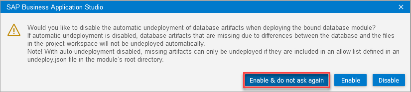
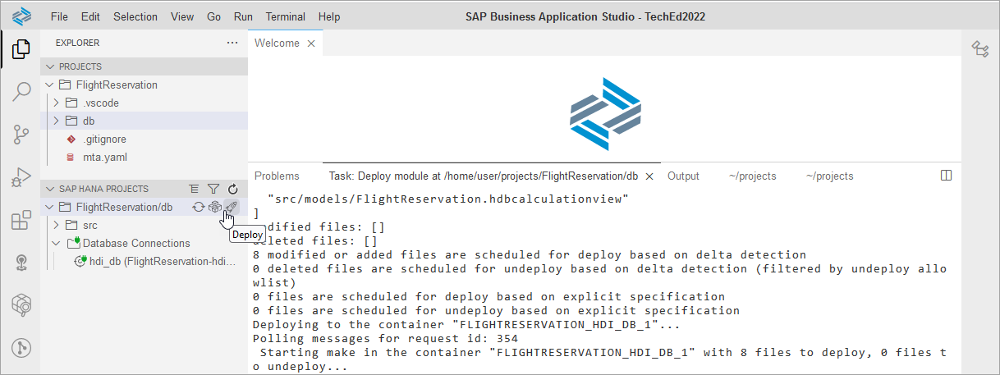
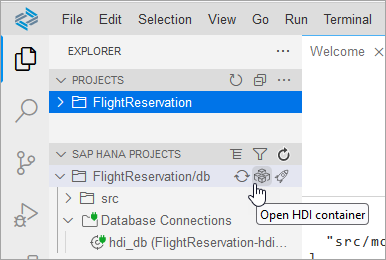
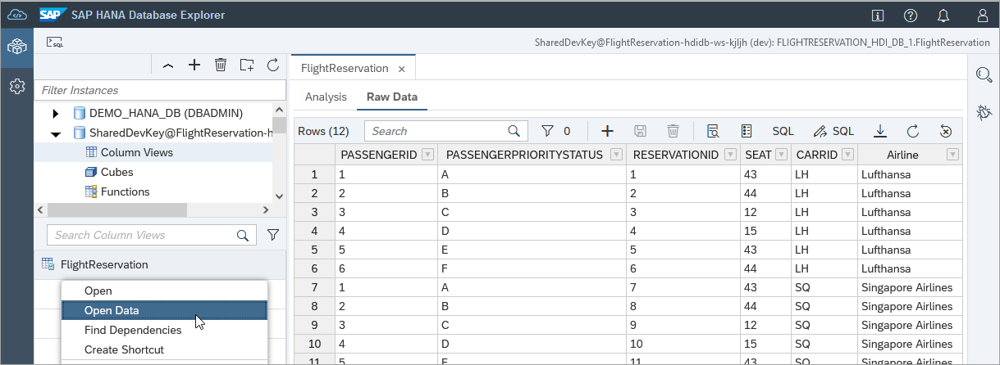

# Exercise 3 - Import and Deploy the Completed Project (Optional)

This exercise demonstrates how a project could be imported and deployed into a workspace.  If you were successful with the previous step, please read through these steps or continue on to exercise 4.

## Exercise 3.1 Open an empty workspace

1. Select File, Open Workspace and browse to projects.

    An empty workspace will open.  If a previous project exists with the same name it can be deleted.

## Exercise 3.2 Import the FlightReservation Project

1. Download the file [FlightReservation.tar](FlightReservation.tar).

2. Right click on an empty space below PROJECTS and select **Import Project** and select the previously downloaded file.

    

## Exercise 3.3 Install the Required Node Modules

1. Open a terminal by selecting Terminal, New Terminal.  Change directories to the location where the Node.js modules are specified, view the required Node.js modules, and then install them.

    ```
    cd FlightReservation/db
    cat package.json
    npm install
    ```

## Exercise 3.4 Bind to an HDI Container

1. In the SAP HANA PROJECTS editor, choose to bind the hdi_db.  Select Bind to the default instance.  This will provide details of which SAP HANA Cloud database to create an HDI container in.  These values are saved in the .env file within the project.

    

    Select **Enable & do not ask again** to enable the undeployment of artifacts.

    

## Exercise 3.5 Deploy the Project

1. In SAP HANA PROJECTS, click on the deploy icon.

    

## Exercise 3.6 Examine the Deployed Objects

1. Open the SAP HANA database explorer.

    

2. View the deployed objects.

    

## Summary

You now have imported a project, bound it to an HDI container, and deployed the project.

Continue to - [Exercise 4 - Additional HDI Container Details (Optional)](../ex4/README.md)

