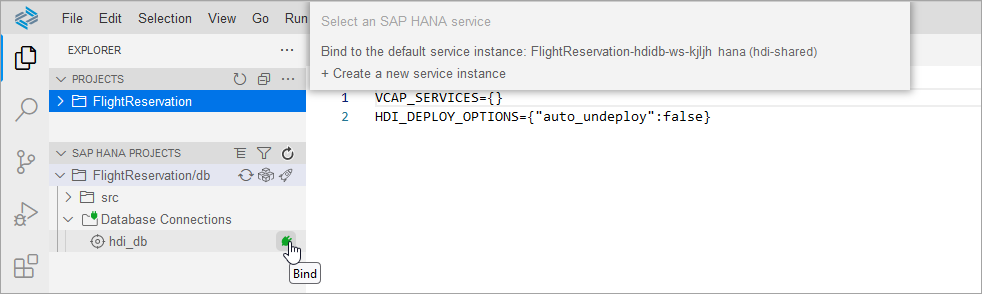

# Appendix 1 - Import and Deploy the Completed Project

This exercise demonstrates how a project could be imported and deployed into a workspace.  If you were successful with the previous step, optionally continue to the appendix on [Additional HDI Container Details](../ex4/README.md) or proceed with [Exercise 1 - Launch the SAP HANA Database Explorer](../../database_explorer/ex1/README.md).

## Exercise 1.1 Open an Empty Workspace

1. If an existing workspace is open, close it by selecting **File**, **Close Folder**.

2. Select **File**, **Open Folder** and browse to the **projects** folder.

    An empty workspace will open.  If a previous project exists with the name FlightReservation, delete it.

## Exercise 1.2 Import the FlightReservation Project

1. Download the file [FlightReservation.tar](FlightReservation.tar).
<a href="FlightReservation.tar" download="FlightReservation.tar">FlightReservation.tar</a>

2. Right click on an empty space below PROJECTS, select **Import Project**, and select the previously downloaded file.

    

## Exercise 1.3 Install the Required Node Modules

1. Open a terminal by selecting **Terminal**, **New Terminal**.  Change directories to the location where the Node.js modules are specified, view the required Node.js modules, and then install them.

    ```
    cd FlightReservation/db
    cat package.json
    npm install
    ```

## Exercise 1.4 Bind to an HDI Container

1. In the SAP HANA PROJECTS editor, choose to **Bind** the hdi_db.  Select **Bind to the default instance**.  This will provide details of which SAP HANA Cloud database to create an HDI container in.  These values are saved in the .env file within the project.

    

    Select **Enable & do not ask again** to enable the undeployment of artifacts.

    

## Exercise 1.5 Deploy the Project

1. In SAP HANA PROJECTS, click on the **Deploy** icon.

    

## Exercise 1.6 Examine the Deployed Objects

1. Open the SAP HANA database explorer by selecting **Open HDI container**.

    

2. View the deployed objects (1 Column View, 2 tables, and 1 stored procedure)

    

## Summary

You now have imported a project, bound it to an HDI container, and deployed the project.

Back to - [DA261 - SAP HANA Cloud Database Administration and Development](../../../README.md)

