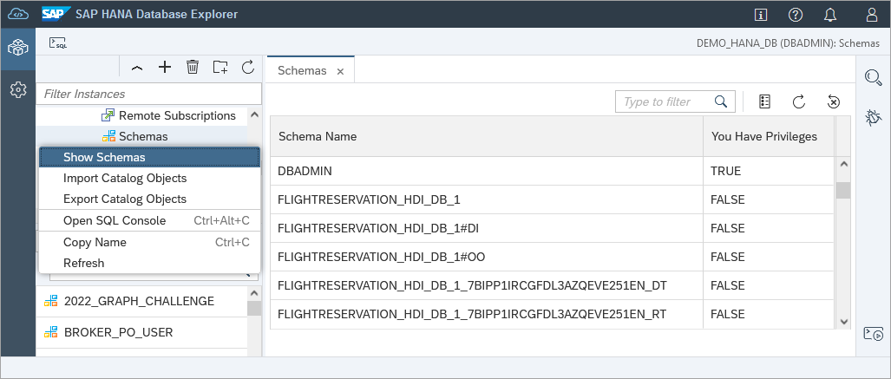
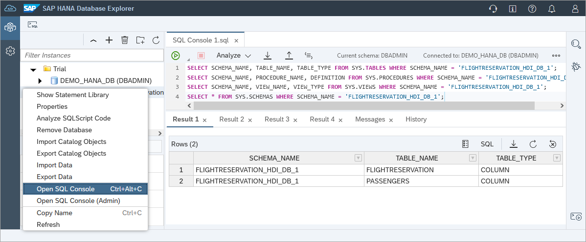
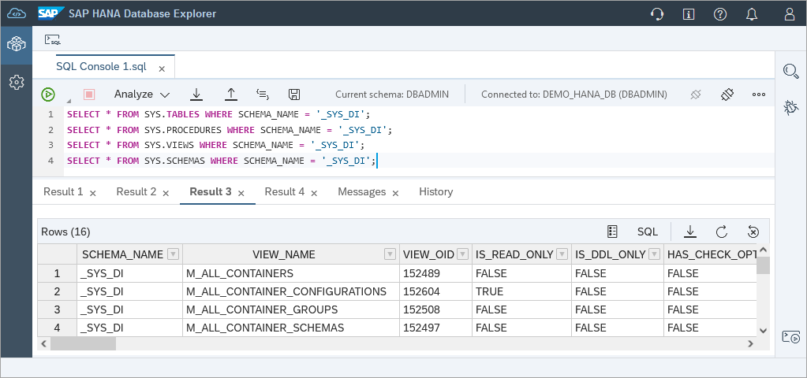
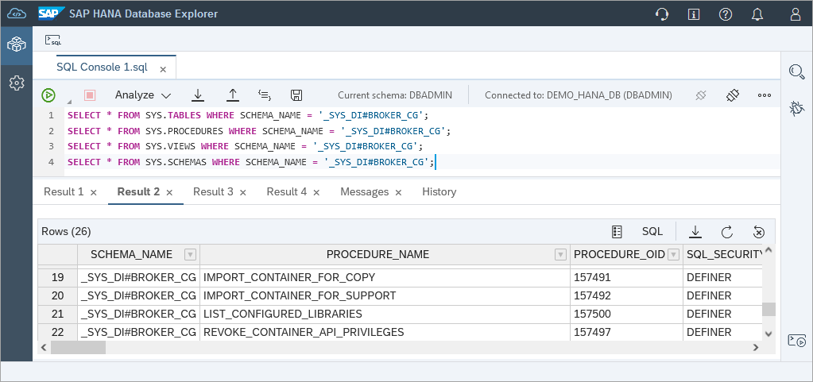
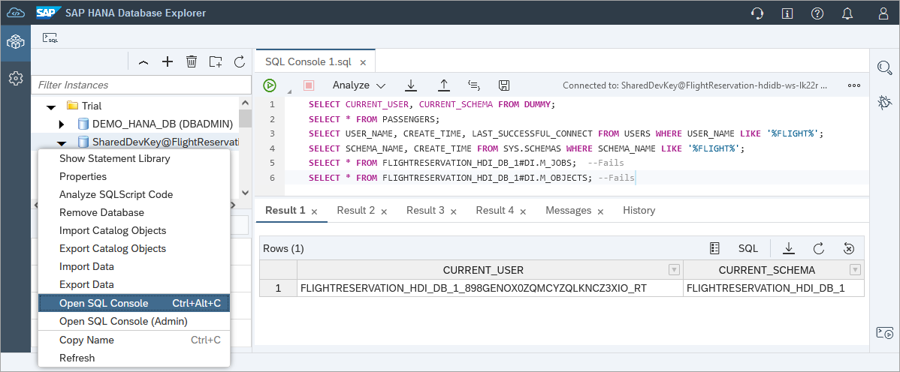
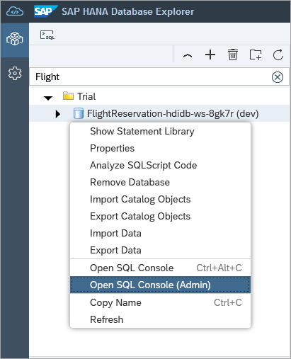
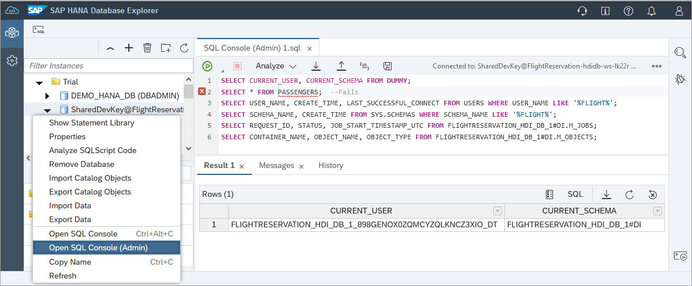

# Appendix 2 - Additional HDI Container Details (Optional)

This exercise will further examine the deployed HDI container.  

## Exercise 2.1 Why HDI?

- HDI stands for SAP HANA Deployment Infrastructure
- HDI is an integral part of SAP HANA and SAP HANA Cloud
- Supports most standard database artifacts like tables, procedures, views, virtual tables, roles
- Provides support for advanced SAP HANA artifacts like calculation views, flowgraphs, and replication tasks
- Determines correct deployment order
- Transactional all-or-nothing principle
- Evolves the runtime objects
- Simplifies the need for the developer to write DDL and DML to get schema evolution
- Re-deployment of dependent artifacts
- Schema less development
- Multiple developers can each have their own isolated deployments
- Can be generated from higher-level language like CAP CDS
- Eases deployment in multi-tenant environments

Alternatively, database objects can also be created directly in the database using SQL.  An example of this is shown in the tutorial [Create Database Objects with SAP HANA Database Explorer](https://developers.sap.com/tutorials/hana-dbx-create-schema.html).

## Exercise 2.2 HDI Schemas

1. In the SAP HANA database explorer, in the **DEMO_HANA_DB** connection, select **Show Schemas**.

    

    - "FLIGHTRESERVATION_HDI_DB_1 contains the runtime objects previously created such as the two tables, calculation view, and stored procedure.

        Right-click on **DEMO_HANA_DB** and choose **Open SQL Console**.  Execute the below SQL.

        ```SQL
        SELECT SCHEMA_NAME, TABLE_NAME, TABLE_TYPE FROM SYS.TABLES WHERE SCHEMA_NAME = 'FLIGHTRESERVATION_HDI_DB_1';
        SELECT SCHEMA_NAME, PROCEDURE_NAME, DEFINITION FROM SYS.PROCEDURES WHERE SCHEMA_NAME = 'FLIGHTRESERVATION_HDI_DB_1';
        SELECT SCHEMA_NAME, VIEW_NAME, VIEW_TYPE FROM SYS.VIEWS WHERE SCHEMA_NAME = 'FLIGHTRESERVATION_HDI_DB_1';
        SELECT * FROM SYS.SCHEMAS WHERE SCHEMA_NAME = 'FLIGHTRESERVATION_HDI_DB_1';
        ```

        

    - FLIGHTRESERVATION_HDI_DB_1#DI is the design time schema and contains procedures used by the deployment infrastructure 
    - FLIGHTRESERVATION_HDI_DB_1#OO is a technical schema for the object owner
    - FLIGHTRESERVATION_HDI_DB_1_GUID_DT is a schema for the design-time user
    - FLIGHTRESERVATION_HDI_DB_1_GUID_RT is a schema for the runtime or application user.  A RT and DT user and schema is created when a new service key is created.  
    - _SYS_DI contains monitoring views and procedures to show information about all HDI containers and to configure them

        ```SQL
        SELECT * FROM SYS.TABLES WHERE SCHEMA_NAME = '_SYS_DI';
        SELECT * FROM SYS.PROCEDURES WHERE SCHEMA_NAME = '_SYS_DI';
        SELECT * FROM SYS.VIEWS WHERE SCHEMA_NAME = '_SYS_DI';
        SELECT * FROM SYS.SCHEMAS WHERE SCHEMA_NAME = '_SYS_DI';
        --SELECT * FROM PASSENGERS; --Fails as we are connected as DBADMIN and not the RT user
        ```

        

    - _SYS_DI#BROKER_CG contains procedures for viewing and managing container groups.

        ```SQL
        SELECT * FROM SYS.TABLES WHERE SCHEMA_NAME = '_SYS_DI#BROKER_CG';
        SELECT * FROM SYS.PROCEDURES WHERE SCHEMA_NAME = '_SYS_DI#BROKER_CG';
        SELECT * FROM SYS.VIEWS WHERE SCHEMA_NAME = '_SYS_DI#BROKER_CG';
        SELECT * FROM SYS.SCHEMAS WHERE SCHEMA_NAME = '_SYS_DI#BROKER_CG';
        ```

        

## Exercise 2.3 Opening a SQL Console with Different Users

1.  In the SAP HANA database explorer, open a SQL Console connected to the HDI container.  Execute the following SQL.

    ```SQL
    SELECT CURRENT_USER, CURRENT_SCHEMA FROM DUMMY;
    SELECT * FROM PASSENGERS;
    SELECT USER_NAME, CREATE_TIME, LAST_SUCCESSFUL_CONNECT FROM USERS WHERE USER_NAME LIKE '%FLIGHT%';
    SELECT SCHEMA_NAME, CREATE_TIME FROM SYS.SCHEMAS WHERE SCHEMA_NAME LIKE '%FLIGHT%';
    --SELECT * FROM FLIGHTRESERVATION_HDI_DB_1#DI.M_JOBS;  --Fails
    --SELECT * FROM FLIGHTRESERVATION_HDI_DB_1#DI.M_OBJECTS; --Fails
    ```
    
    

    Notice that the user is the RT or runtime user as opposed to the DT or design time user.

    Details of the HDI container such as when was the last successful deployment can be seen when connecting as an Admin/DT user.  Right click on the HDI container and choose **Open SQL Console (ADMIN)**.

    

    Notice that the select from M_JOBS and M_OBJECTS now succeeds. 

    ```SQL
    SELECT CURRENT_USER, CURRENT_SCHEMA FROM DUMMY;
    --SELECT * FROM PASSENGERS;  --Fails
    SELECT USER_NAME, CREATE_TIME, LAST_SUCCESSFUL_CONNECT FROM USERS WHERE USER_NAME LIKE '%FLIGHT%';
    SELECT SCHEMA_NAME, CREATE_TIME FROM SYS.SCHEMAS WHERE SCHEMA_NAME LIKE '%FLIGHT%';
    SELECT REQUEST_ID, STATUS, START_TIMESTAMP_UTC FROM FLIGHTRESERVATION_HDI_DB_1#DI.M_JOBS ORDER BY START_TIMESTAMP_UTC DESC;
    SELECT CONTAINER_NAME, OBJECT_NAME, OBJECT_TYPE FROM FLIGHTRESERVATION_HDI_DB_1#DI.M_OBJECTS;
    ```

    

    For additional details on the monitoring views used above consult [_SYS_DI Monitoring Views](https://help.sap.com/docs/HANA_CLOUD_DATABASE/c2cc2e43458d4abda6788049c58143dc/78e1657f43f04741b9c2b161632e4fe5.html) in the Database Deployment Infrastructure (HDI) Reference and [Can I see the HANA deployment history ?](https://blogs.sap.com/2022/06/13/can-i-see-the-hana-deployment-history/)


## Summary

You have now further explored the schemas and some of the objects in an HDI container.

In the next set of exercises, we will focus on functionality within the SAP HANA database explorer.

Back to - [DA261 - SAP HANA Cloud Database Administration and Development](../../../README.md)

