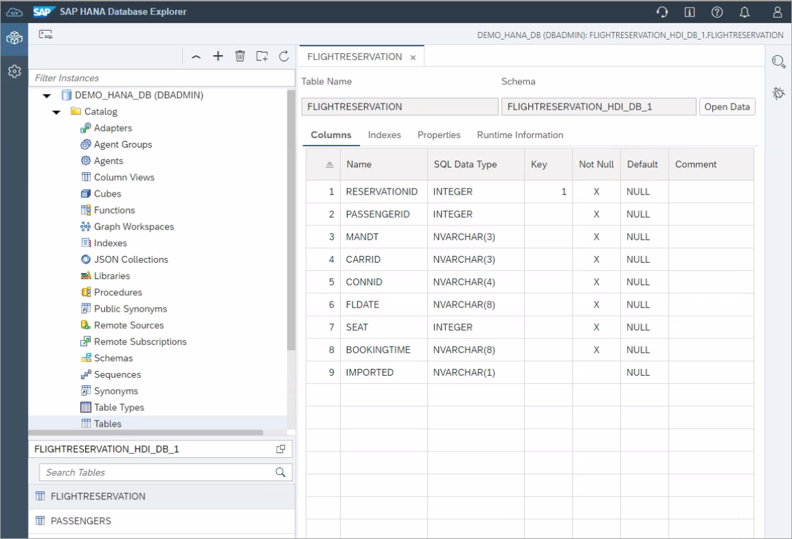
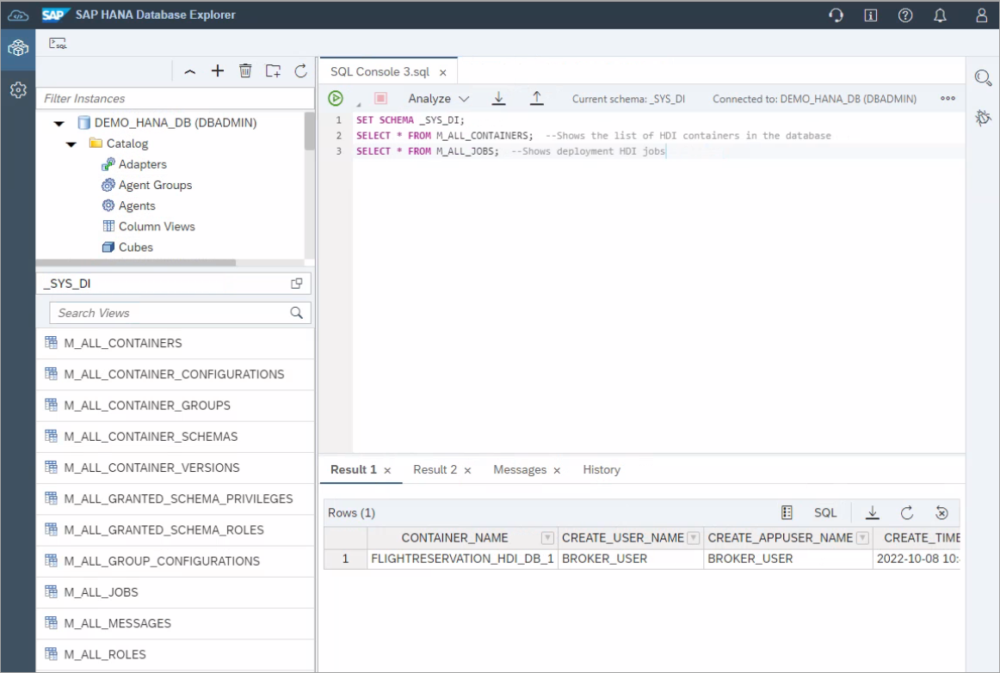

# Exercise 4 - Additional HDI Container Details (Optional)

This exercise will further examine the deployed HDI container.  

## Exercise 4.1 Why HDI?

- HDI stands for SAP HANA Deployment Infrastructure
- HDI is an integral part of SAP HANA and SAP HANA Cloud
- Supports most standard database artifacts like tables, procedures, views, virtual tables, roles
- Provides support for advanced SAP HANA artifacts like calculation views, flowgraphs, and replication tasks
- Determines correct deployment order
- Transactional all-or-nothing principle
- Evolves the runtime objects
- Simplifies the need for the developer to write DDL and DML to get schema evolution
- Re-deployment of dependent artifacts
- Schema less development
- Multiple developers can each have their own isolated deployments
- Can be generated from higher-level language like CAP CDS
- Eases deployment in multi-tenant environments

Alternatively, database objects can also be created directly in the database using SQL as shown in the tutorial [Create Database Objects with SAP HANA Database Explorer](https://developers.sap.com/tutorials/hana-dbx-create-schema.html).

## Exercise 4.2 HDI Schemas

1. In the SAP HANA database explorer, in the **DEMO_HANA_DB** connection, select **Show Schemas**.

    

    - "FLIGHTRESERVATION_HDI_DB_1 contains the runtime objects (tables, calculation view, stored procedure)

        ```SQL
        SELECT * FROM SYS.TABLES WHERE SCHEMA_NAME = 'FLIGHTRESERVATION_HDI_DB_1';
        SELECT * FROM SYS.PROCEDURES WHERE SCHEMA_NAME = 'FLIGHTRESERVATION_HDI_DB_1';
        SELECT * FROM SYS.VIEWS WHERE SCHEMA_NAME = 'FLIGHTRESERVATION_HDI_DB_1';
        ```

        

    - FLIGHTRESERVATION_HDI_DB_1#DI is the design time schema and contains procedures used by the deployment infrastructure 
    - FLIGHTRESERVATION_HDI_DB_1#OO is a technical schema for the object owner
    - FLIGHTRESERVATION_HDI_DB_1_GUID_DT is a schema for the design-time user
    - FLIGHTRESERVATION_HDI_DB_1_GUID_RT is a schema for the runtime or application user

    A RT and DT user and schema is created when a new service key is created.  

## Exercise 4.3 Opening a SQL Console as Admin

1.  In the SAP HANA database explorer, open a SQL Console connected to the HDI container.  Execute the following SQL.

    ```SQL
    SELECT CURRENT_USER, CURRENT_SCHEMA FROM DUMMY;
    SELECT * FROM USERS WHERE USER_NAME LIKE '%FLIGHT%';
    SELECT SCHEMA_NAME, HAS_PRIVILEGES FROM SCHEMAS WHERE SCHEMA_NAME LIKE '%FLIGHT%';
    SELECT * FROM FLIGHTRESERVATION_HDI_DB_1#DI.M_JOBS;  --Fails
    SELECT * FROM FLIGHTRESERVATION_HDI_DB_1#DI.M_OBJECTS; --Fails
    ```
    
    Notice that the user is the _RT or run time user as opposed to the _DT or design time user.

    If you want to access the DT view you have to use the "ADMIN" container access in Database Explorer.

    

    Now rerun the previous code.  Notice that the select from M_JOBS now succeeds.

    The DI schema also contains some views that contain information about the design time objects including their source and with m_jobs also information about the previous deployments.

    Here is a blog on this topic:
    https://blogs.sap.com/2022/06/13/can-i-see-the-hana-deployment-history/


## Exercise 4.4 Examining the Contents of the HDI Container

1.  In the SAP HANA database explorer, open the parent database of the HDI container.  Notice that you can see the schema and objects but do not have privileges to query them.

    

## Exercise 4.5 HDI Monitoring Views

1. These can be viewed when connecting to the **DEMO_HANA_DB** database in the schema **_SYS_DI**.  The M_ indicates that these are monitoring views.  A few example queries follow that can be run.

    ```SQL
    SET SCHEMA _SYS_DI;
    SELECT * FROM M_ALL_CONTAINERS;  --Shows the list of HDI containers in the database
    SELECT * FROM M_ALL_JOBS;  --Shows deployment HDI jobs
    ```

    

    For additional details consult [_SYS_DI Monitoring Views](https://help.sap.com/docs/HANA_CLOUD_DATABASE/c2cc2e43458d4abda6788049c58143dc/78e1657f43f04741b9c2b161632e4fe5.html) in the Database Deployment Infrastructure (HDI) Reference.


## Summary

You have now have a better understanding of some of the HDI concepts.  Additionally, HDI has a [SQL interface](https://help.sap.com/docs/HANA_CLOUD_DATABASE/c2cc2e43458d4abda6788049c58143dc/035dbbe23ac14242b1f7d724dd102825.html) and a Node.js ([@sap/hdi](https://www.npmjs.com/package/@sap/hdi)) interface.

In the next set of exercises, we will focus on functionality within the SAP HANA database explorer.

Continue to - [Exercise 2 - Description](../../database_explorer/ex2/README.md)

