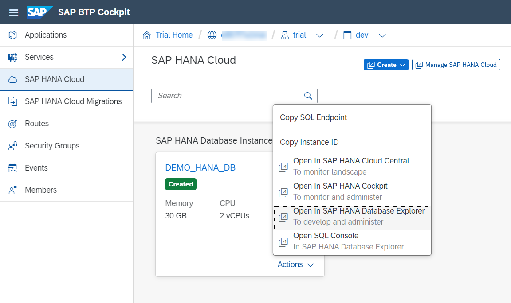

# Exercise 1 - Launch and Connect with the SAP HANA Database Explorer

In this exercise, we will launch an instance of the SAP HANA database explorer and walk through some of the features relating to databases.

1. From the SAP BTP Cockpit, you can choose to open the SAP HANA database explorer by clicking the **Actions** dropdown on your instance and selecting **Open in SAP HANA Database Explorer**.

    

## Summary

Now that you have ... 
Continue to - [Exercise 2 - Exercise 2 Description](../ex2/README.md)
