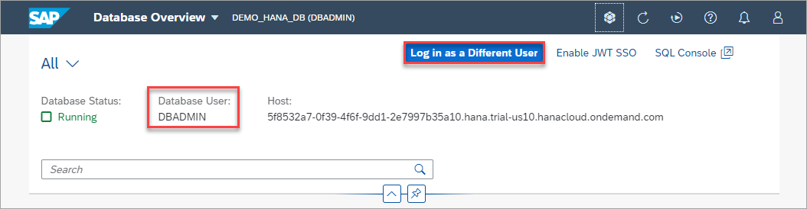
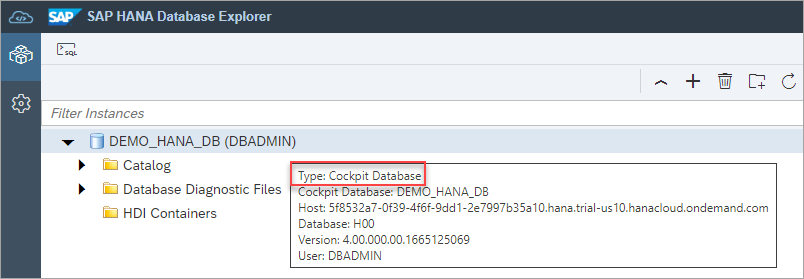
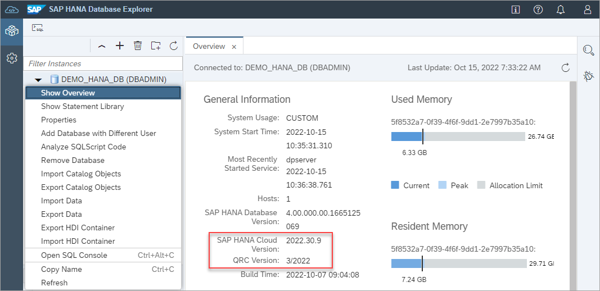
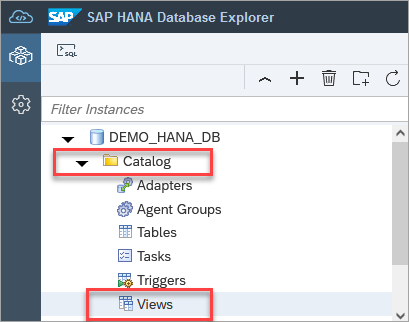
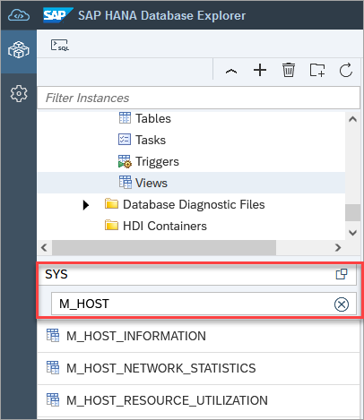
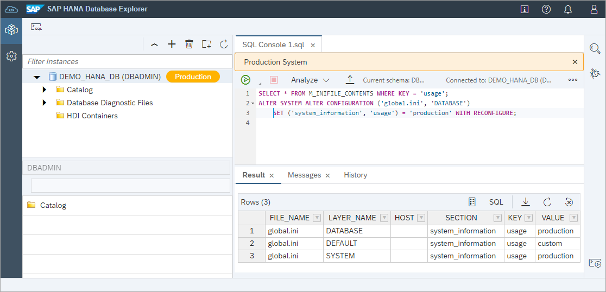
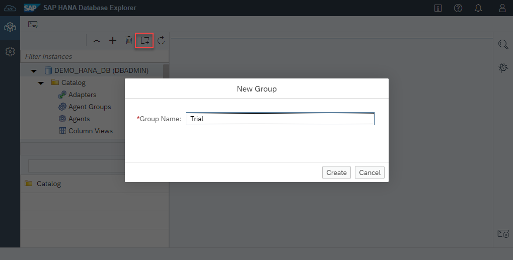

# Exercise 1 - Launch and Connect with the SAP HANA Database Explorer

  In addition to browsing schema objects and executing SQL, the SAP HANA database explorer enables importing and exporting data with wizards, debugging SQLScript, working with multi-model data such as graph, spatial and JSON collections,  viewing trace files, and creating remote sources.  It also offers support for data lake Relational Engine and data lake Files connections.

In this exercise, we will launch an instance of the SAP HANA database explorer and walk through some of the features relating to databases.

1. From the SAP BTP Cockpit, you can choose to open the SAP HANA database explorer by clicking the **Actions** dropdown on your instance and selecting **Open in SAP HANA Database Explorer**.

    

    You may be prompted to enter database login credentials at this point. Enter the DBADMIN user credentials which were set during the SAP HANA instance creation process.

    >Note: Trial instances are shut down overnight. Instances can be restarted by clicking the **Manage SAP HANA Cloud** button and selecting **Start** on the dropdown menu for your instance.

    >Note: Credentials for a cockpit database can be saved within the SAP HANA cockpit, removing the need for users to log in each time they wish to access their database. For credentials to be saved, users must navigate to SAP HANA cockpit to save or manage their credentials.
    >
    >

2. Hover over your database in the database context menu. A summary should appear that identifies the type as a cockpit database.

    

     Right-click on the database name and select **Show Overview**. The release your database belongs to can be identified by looking at the last section of the Version field.

    

    *In this example, the database is from a release in July 2021, week 30 of the year.*

3. Click the arrow next to the database icon to expand the object hierarchy for the database. You will see that it holds catalog objects and database diagnostic files (trace files, or log files).

    

    Expand **Catalog** then select **Views**.  Directly above the list of views are search bars for schema and objects. Use the schema and object search  at the bottom left of your screen to search for the **SYS** schema and views that begin with **M_HOST**. Right-click and select **Open Data** to access those views. More information on the SAP HANA monitoring views can be found at [Monitoring Views](https://help.sap.com/viewer/c1d3f60099654ecfb3fe36ac93c121bb/2021_3_QRC/en-US/d3c10d23e8334a35afa8d9bdbc102366.html).

    


4. Users may benefit from visual clues identifying  production databases. This next step will demonstrate how to label production databases, and how to remove the production label from a database. To enable this use SQL console to run the statements below and refresh your browser.
   
    >To open the SQL console, right-click on the database connection and select **Open SQL Console** or click on the toolbar icon in the top left.  
    
    >An instance of a SQL console is associated with the selected database.

    >To execute SQL commands, click on the green run arrow.

    ```SQL
    SELECT * FROM M_INIFILE_CONTENTS WHERE KEY = 'usage';
    ALTER SYSTEM ALTER CONFIGURATION ('global.ini', 'DATABASE') SET ('system_information', 'usage') = 'production' WITH RECONFIGURE;
    ```

    

    >Note: Remember to refresh your browser window once you've run the above statement.


    As this database is not a production database, we can turn off this setting by executing the below SQL statement.

    ```SQL
    ALTER SYSTEM ALTER CONFIGURATION ('global.ini', 'DATABASE') SET ('system_information', 'usage') = 'custom' WITH RECONFIGURE;
    ```

5. Database connections can be organized by creating database groups. Use the folder icon at the top of your databases panel to create a new group and drag and drop the database into it. 

    

    A database can be quickly found using the filter as shown below.
    
    

6. Create some objects from the HOTEL schema.  Explain how this is created directly in the database.  Used later to contrast with native development and HDI.

This concludes the exercise on launching and exploring database connections in the SAP HANA database explorer.

Continue to - [Exercise 2 - Using the SQL Console](../ex2/README.md)
