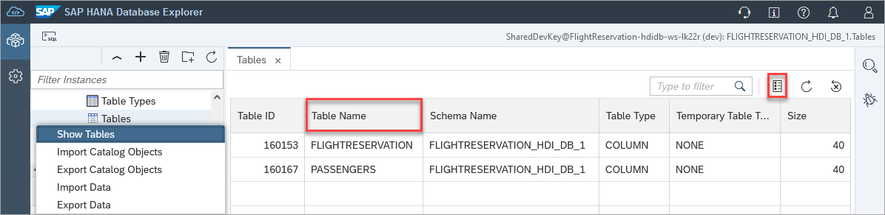
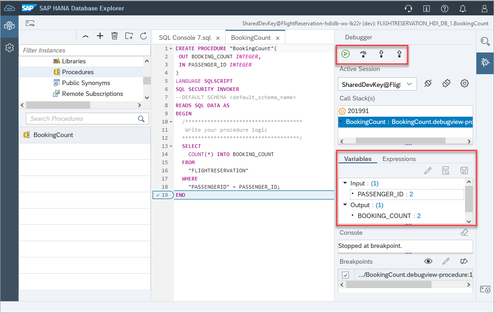
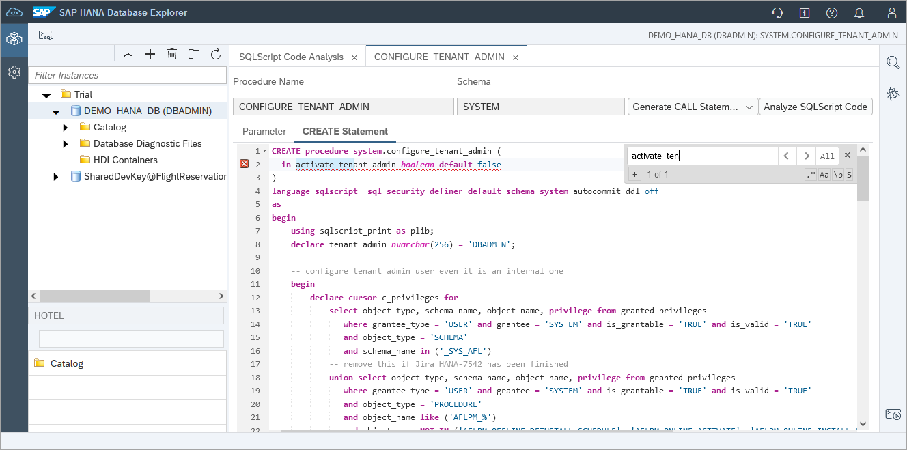
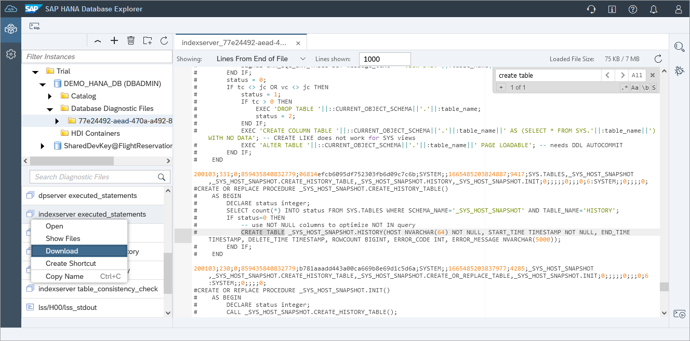

# Exercise 2 - Catalog Browser and Object Search

In this exercise, we will explore some of the functionality that the catalog browser and object search provide when working with database objects.  Some of this functionality was previously introduced in a previous exercise.

1. Database objects can be viewed in the catalog browser as shown below after selecting the HDI container connection and then **Tables**.

    

    Alternatively, a table can be found by selecting **Tables** and choosing **Show Tables** from the context menu.
    
    

    *Additional filters can be applied in this view by clicking on the column header and the list of columns displayed can specified.*

2. A create, select, or insert statement can be generated as shown below.

    

3. A stored procedure's create statement can be viewed on its properties page.

    

4. A graphical debugger can be used.  Add a breakpoint on line 19.

    
  
    To trigger the breakpoint, call the stored procedure.

    

    Once the breakpoint has been hit, the variables can be examined and the code stepped through.

    

5. The source code for a specific stored procedure, for all stored procedures in a schema, or for all stored procedures in a database can also be analyzed.  This can provide suggestions for code quality, security, or performance.

    

    To view more details, double click on a row.

    
    
    *Note that the input parameter is not referenced.*

6. Database objects can also be found using **Object Search**.  The search shown below looks for any objects that use FLIGHTRESERVATION in their definitions in the HDI connection. 

    

    A found object can be double clicked on to open its properties page.

    
    
    It is also possible to reveal the item in the Catalog Browser after selecting **Display in Database Browser**.

7. Database diagnostic files can also be viewed or downloaded. 

    

    Additional instructions showing how to enable a SQL and expensive statement trace are available in the tutorial [Troubleshoot SQL with SAP HANA Database Explorer](https://developers.sap.com/tutorials/hana-dbx-troubleshooting.html).  For more on executed statement tracing see [SAP Note: 2366291 - FAQ: SAP HANA Executed Statements Trace](https://launchpad.support.sap.com/#/notes/2366291).

This concludes the exercises on the catalog browser and object search.

Continue to - [Exercise 3 - Using the SQL Console](../ex3/README.md)