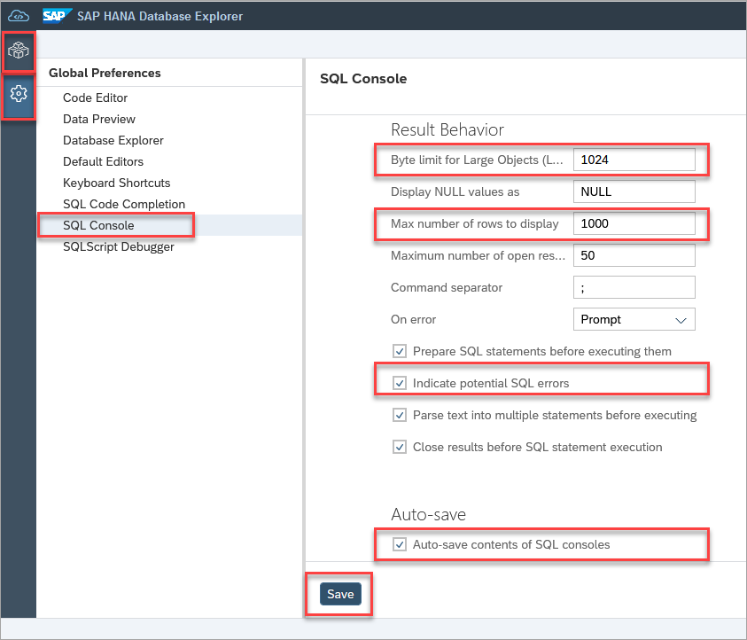

# Exercise 3 - Using the SQL Console
In this exercise, we will use SAP HANA database explorer's SQL console. 

0. Show how a SQL Console is connected to a connection and mention it can be changed in the UI or via SQL.

1. Show a select with a join against the tables that perhaps uses a built-in function.  Demonstrate autocomplete.

2. Show the statement help panel.  Use it to find more details about the function used.

3. Show the messages tab.

4. Show the history tab.

5. Show how to go full screen by double tapping the tab, how to rename the tab, and how to reveal in tree.

6.  A list of keyboard shortcuts can be found by right-clicking and selecting **Keyboard Shortcuts** within the SQL console window.

    

    Here is a list of common keyboard shortcuts for future reference:
    Action | Shortcut
    ------ | ------
    Add Comment Block | Ctrl+Shift+/
    Comment/Uncomment Line | Ctrl+/
    Format Code	|Ctrl+B
    Go to Next Error | Alt+E
    Go to Previous Error | Alt+Shift+E
    Increase/Decrease Font Size | Ctrl+Shift+Up  or Ctrl+Shift+Down
    Jump to Matching Brackets | Ctrl+Shift+M
    Run All | F8
    Run Statement |	F9
    Switch tabs	|Ctrl+Alt+Pageup  or Ctrl+Alt+Pagedown
    Text Completion | Ctrl+Space (requires two characters to be entered)

    >Note: The shortcut keys may vary depending on the browser used.

7. Examine the SQL Console preferences.  Navigate to the database explorer preferences icon on the left of your screen, and select **SQL Console**. Notice that a byte limit is provided for the size of a returned value, the number of rows that are returned, and that the SQL statements in a console will be saved.  If changes are made to this screen, the Save button must be pressed.
   
   

8. Demonstrate running a statement in the background.

9. Show that a result can be downloaded.  Link to further content on import/export.

10. Show the additional viewers (spatial, json, xml)

This concludes the exercise on the using SQL console.

Continue to - [Exercise 4 - Import and Export of HDI Containers](../ex3/README.md)
