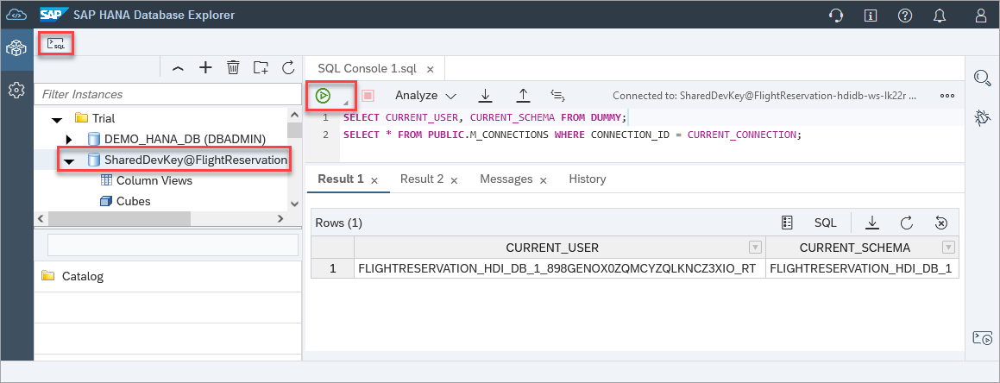

# Exercise 3 - Using the SQL Console
In this exercise, we will explore some of the functionality in the SAP HANA database explorer's SQL Console. 

1. A SQL Console can be opened by the context menu of a connection or after selecting a connection and clicking on the SQL Console toolbar icon.  

    

    ```SQL
    SELECT CURRENT_USER, CURRENT_SCHEMA FROM DUMMY;
    SELECT * FROM PUBLIC.M_CONNECTIONS WHERE CONNECTION_ID = CURRENT_CONNECTION;
    ```

    The connection that the SQL Console is attached to can be changed if needed.

    

2. The SQL Console has the ability to auto-copmlete statements.  Enter the statement below into the SQL Console, position the cursor on the C and press Ctrl + space.

    ```SQL
    SELECT 	NAME, ADDRESS, C, FLDATE, SEAT
        FROM 
            PASSENGERS AS P,
            FLIGHTRESERVATION AS F
        WHERE P.PASSENGERID = F.PASSENGERID
        ORDER BY NAME ASC;
    ```

    


3. Commonly used statements can be saved to or retrieved from the statement library.  

    


4. The SQL Console has an optional statement help panel that shows additional details SQL statement that currently has focus.  

    ```SQL
    SELECT SEAT, COUNT(SEAT)
    FROM 
        PASSENGERS AS P,
        FLIGHTRESERVATION AS F
    WHERE P.PASSENGERID = F.PASSENGERID 
    GROUP BY F.SEAT
    ORDER BY F.SEAT ASC;
    ```

    
    
    *Links are provided to the SAP Help documentation as well as metadata about the tables being used.* 
    
5. Resource consumption metrics of the executed SQL statement is availalbe in the **Messages** tab.

    

6. The previously executed statements can be found in the **History** tab.  Previously executed statements can be recalled by double clicking on them or by dragging and dropping them.

    

    The results, messages, and history contents are not preserved following a browser reload while the SQL statements are preserved by default.

7. Show how to go full screen by double tapping the tab, how to rename the tab, and how to reveal in tree.

8.  A list of keyboard shortcuts can be found by right-clicking and selecting **Keyboard Shortcuts** within the SQL console window.

    

    Here is a list of common keyboard shortcuts for future reference:
    Action | Shortcut
    ------ | ------
    Add Comment Block | Ctrl+Shift+/
    Comment/Uncomment Line | Ctrl+/
    Format Code	|Ctrl+B
    Go to Next Error | Alt+E
    Go to Previous Error | Alt+Shift+E
    Increase/Decrease Font Size | Ctrl+Shift+Up  or Ctrl+Shift+Down
    Jump to Matching Brackets | Ctrl+Shift+M
    Run All | F8
    Run Statement |	F9
    Switch tabs	|Ctrl+Alt+Pageup  or Ctrl+Alt+Pagedown
    Text Completion | Ctrl+Space (requires two characters to be entered)

    >Note: The shortcut keys may vary depending on the browser used.

9. Examine the SQL Console preferences.  Navigate to the database explorer preferences icon on the left of your screen, and select **SQL Console**. Notice that a byte limit is provided for the size of a returned value, the number of rows that are returned, and that the SQL statements in a console will be saved.  If changes are made to this screen, the Save button must be pressed.
   
   

10. Demonstrate running a statement in the background.

11. Show that a result can be downloaded.  Link to further content on import/export.

12. Show the additional viewers (spatial, json, xml)


This concludes the exercise on the using SQL console.

Continue to - [Exercise 4 - Export and Import HDI Containers](../ex4/README.md)
