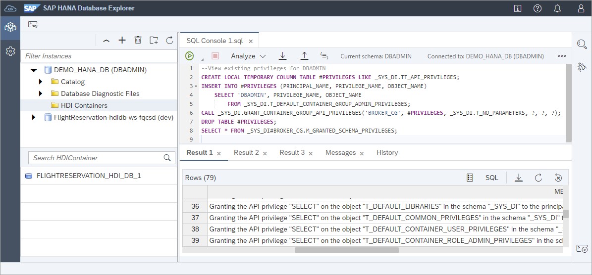
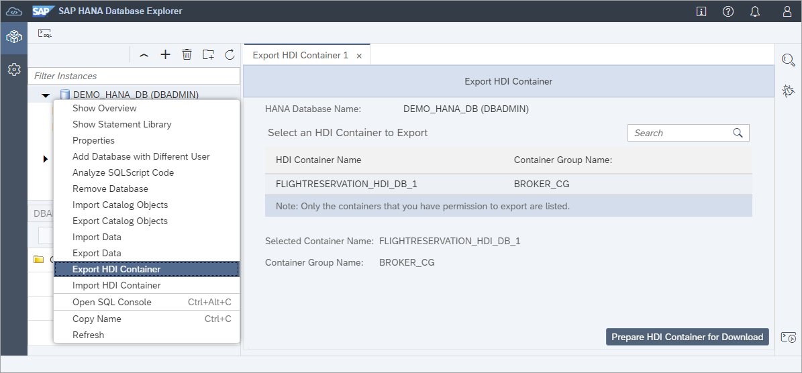

# Exercise 4 - Import and Export of HDI Containers

  In this exercise, the HDI container will be exported and then imported.  This could occur if you wished to move an HDI container from one SAP HANA Cloud instance to another such as from DEV to QA.
  
  >It should be noted that there are additional methods deploying an HDI container to a new SAP HANA Cloud instance:  (TODO Volker)
 > 
  >* Right click on the yaml file and select Build MTA Project.  The resultant mtar file can be deployed using the SAP BTP CLI
  >* Is there a way to change the project to point to another database?

## Exercise 4.1 Grant Container Admin

1. Additional actions such as import/export and viewing the HDI containers belonging to a SAP HANA database can be enabled by granting additional privileges.  Execute the below SQL

    ```SQL
    --View existing privileges for DBADMIN
    CREATE LOCAL TEMPORARY COLUMN TABLE #PRIVILEGES LIKE _SYS_DI.TT_API_PRIVILEGES;
    INSERT INTO #PRIVILEGES (PRINCIPAL_NAME, PRIVILEGE_NAME, OBJECT_NAME)  
        SELECT 'DBADMIN', PRIVILEGE_NAME, OBJECT_NAME 
            FROM _SYS_DI.T_DEFAULT_CONTAINER_GROUP_ADMIN_PRIVILEGES;
    CALL _SYS_DI.GRANT_CONTAINER_GROUP_API_PRIVILEGES('BROKER_CG', #PRIVILEGES, _SYS_DI.T_NO_PARAMETERS, ?, ?, ?);
    DROP TABLE #PRIVILEGES;
    --View added privileges
    SELECT * FROM _SYS_DI#BROKER_CG.M_GRANTED_SCHEMA_PRIVILEGES;  
    ```

    Notice that now the list of HDI containers appears.

    

    Addiional details on this topic can be found at [Create an SAP HDI Administrator](https://help.sap.com/docs/HANA_CLOUD_DATABASE/c2cc2e43458d4abda6788049c58143dc/9a6bf8dc816e4b128ecec7580686236e.html).
    

## Exercise 4.2 Export an HDI Container

1. Right click on the DEMO_HANA_DB (DBADMIN) connection and choose **Export HDI Container** and then select **Prepare HDI Container for Download**.

    

2. 

    The above demonstrates using the wizard.  The [Export an SAP HDI Container for Copy Purposes](https://help.sap.com/docs/HANA_CLOUD_DATABASE/c2cc2e43458d4abda6788049c58143dc/c25ee286cee5496cb96fdf5875f444a2.html) provides details on executing the same action using SQL.

## Exercise 4.3 Import an HDI Container

1.  TODO

    The above demonstrates using the wizard.  The [Import an SAP HDI Container for Copy Purposes](https://help.sap.com/docs/HANA_CLOUD_DATABASE/c2cc2e43458d4abda6788049c58143dc/54fa5466cdeb4e488b08d6c7da0244f2.html) provides details on executing the same action using SQL.

This concludes the exercise on import and export.  

In the next exercise ...

Continue to - [Exercise 5 - HDI container auditing](../../business_app_studio/ex5/README.md)
