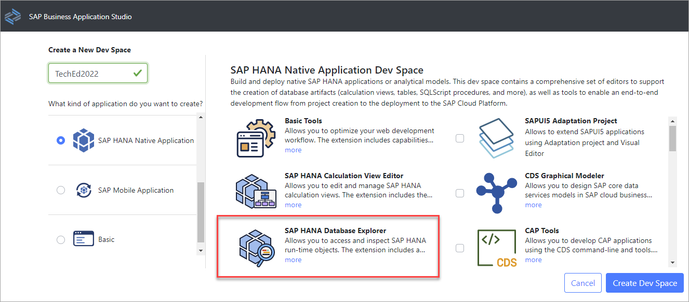
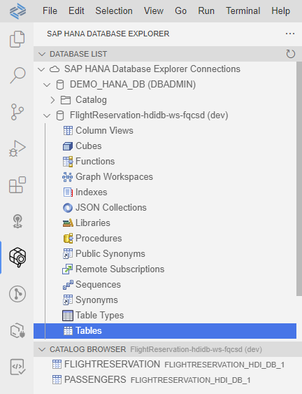
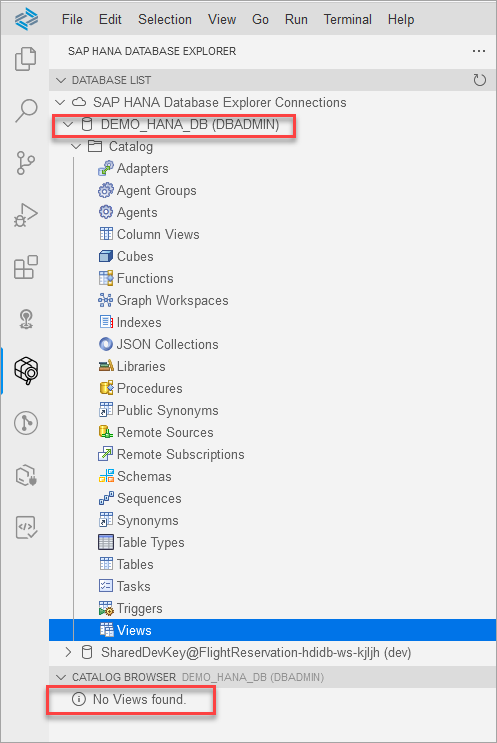
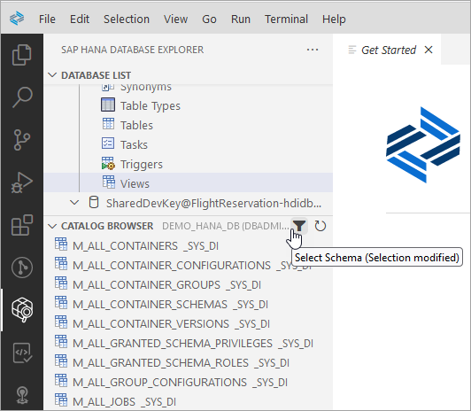
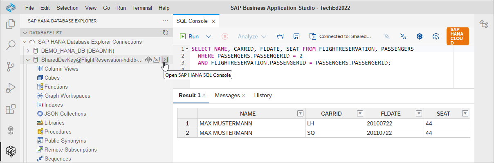

# Exercise 4 - SAP HANA Database Explorer Extension (Optional)

  In this exercise, we will examine how the SAP HANA database explorer extension can be used to browse schema and execute queries.  The extension has  a subset of the functionality available in the SAP HANA database explorer that has been shown previously.  The extension is automatically included when the development workspace is created as shown below.

  

## Exercise 5.1 Connections

1. Select the **SAP HANA database explorer** extension.  The list of connections should appear.  This list is managed by the full SAP HANA database explorer web application and uses the currently connected cloud foundry user and org to retrieve the connection details.

    


## Exercise 5.2 Catalog Browser

1. Select **Tables** on the HDI Container and see that the list of deployed tables can be seen.

    

2. Select **Views** on the **DEMO_HANA_DB** connection.  Notice that no views are shown.  A filter is applied by default to only show views created by the connected user which is DBADMIN in this case.  

    

    Press F1 to open the command palette and choose **Select Schema**.  Select the schema **_SYS_DI**.  
     
    Now the views that belong to the schema _SYS_DI appear.

    

## Exercise 5.3 SQL Console

1. Select the HDI Container and open a SQL Console.  Execute the below SQL.

    

    ```SQL
    SELECT NAME, CARRID, FLDATE, SEAT 
        FROM FLIGHTRESERVATION, PASSENGERS 
        WHERE PASSENGERS.PASSENGERID = 2 
        AND FLIGHTRESERVATION.PASSENGERID = PASSENGERS.PASSENGERID;    
    ```

    Notice that the result is shown and includes the Messages and History tabs.


This concludes the SAP HANA Database Explorer extension.  Note that it is also available as a plugin for [Visual Studio Code](https://marketplace.visualstudio.com/items?itemName=SAPSE.hana-database-explorer&ssr=false#overview).    

Continue to - [SAP HANA Cockpit - Exercise 2 - Configuring Database Properties](../../hana_cockpit/ex2/README.md)
