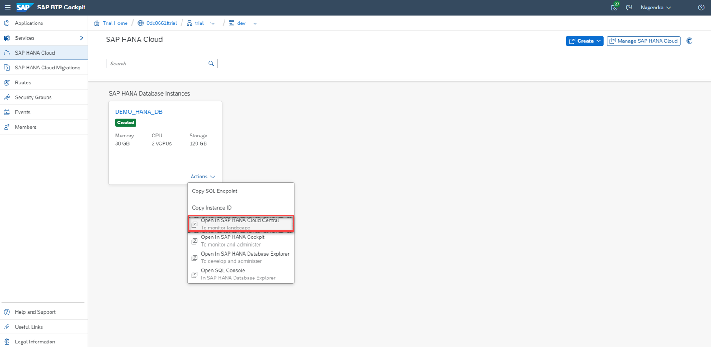
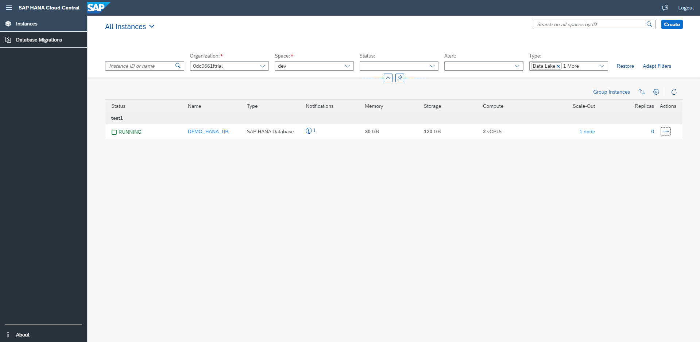

# Exercise 1: Overview of SAP HANA Cloud Central

Management tasks such as creating new instances, checking status, reviewing any notifications and alerts, examining memory and storage consumption, and start/stop/edit/delete instances can be performed with this tool. 

To begin, ensure you have logged in to the SAP BTP Cockpit and you have navigated to the "SAP HANA Cloud" page.

1. Open SAP BTP Cockpit -> Go to the SAP HANA database instance "DEMO_HANA_DB" you created earlier as part of the requirements -> Click the “Actions” button from an instance tile -> Click on "Open in SAP HANA Cloud Central"
    <kbd>
    
    </kbd>

2. SAP HANA Cloud Central is launched in a new tab. **Note:** You may see a banner displaying "Multi-Environment SAP HANA Cloud Tools Now Available". We will not be using multi-environment in this workshop, so you can ignore and/or close the banner.
    <kbd>
    
    </kbd>
    
The SAP HANA Cloud Central tool is divided into several sections:

 * The left panel allows navigation between your SAP HANA Cloud instances and the Migrations application used to migrate SAP HANA Service databases to SAP HANA Cloud
 * The top panel offers different views and filters you can use to customize how your instances list is displayed, as well as providing search capability
 * The bottom panel displays all your instances, with the option to group the list by instances and personalize the view

As an SAP HANA Cloud administrator, you will likely spend a lot of time monitoring all your instances in SAP HANA Cloud Central.  From the instances list, you'll be able to see computing details of your databases, whether they are running or stopped, review their notifications, and perform actions on them.

Continue to - [Exercise 2 - Create Instances](../ex2/README.md)
