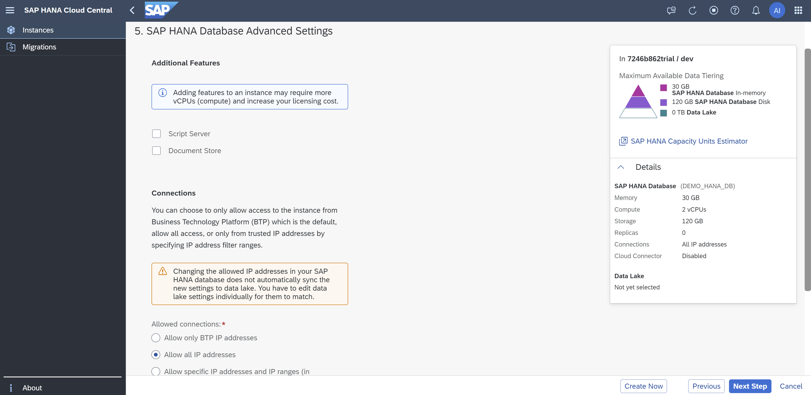
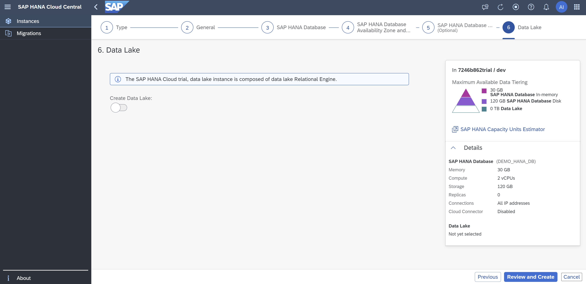
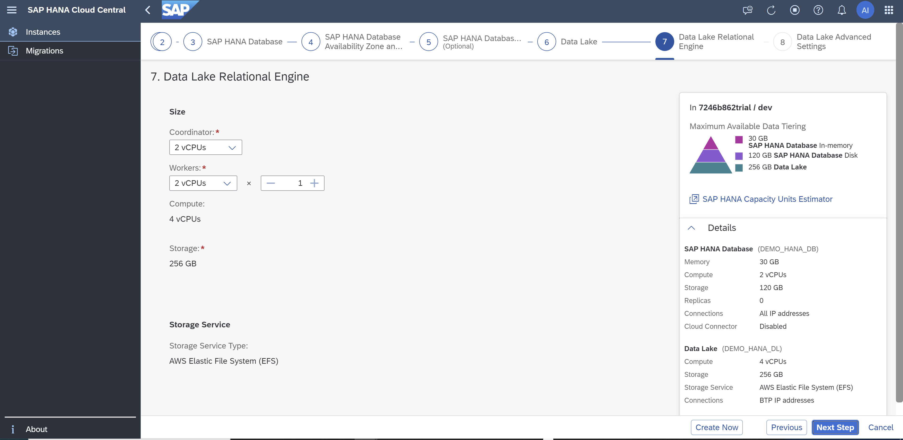
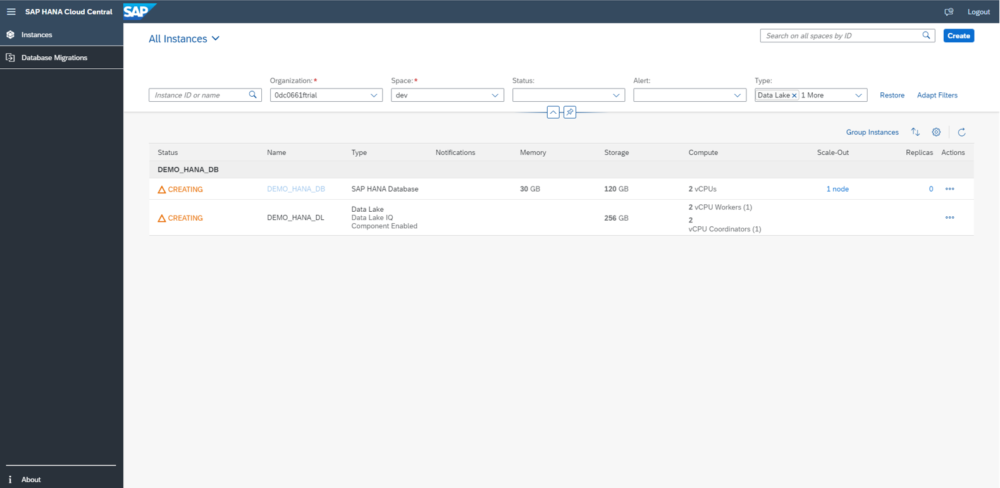

# Exercise 2 - Creating Instances

As a prerequisite, we have already created an SAP HANA Cloud, SAP HANA Database instance: "DEMO_HANA_DB". Your trial account allows creation of only one database instance. If you've already created "DEMO_HANA_DB", you may not be able to create another database instance in this exercise; however, please continue to follow the steps to learn the process. If you are a non-trial user, you'll be able to create another instance, but be sure you provide a different instance name as SAP HANA Cloud does not allow creation of instances with same names. 

TO-DO - Should we include the Data Lake instance in the appendix?
[@Abbey: What do you mean, moving it out of this section and into the appendix?]

Let's see how to create SAP HANA Cloud, SAP HANA Database and SAP HANA Cloud, Data Lake instances directly from the SAP HANA Cloud Central Overview page. 

1. Click the Create button in the top right. This will navigate you to the create instance page.
    <kbd>
    
    </kbd>
    
    In this page, you can see options to create SAP HANA Cloud, SAP HANA Database and SAP HANA Cloud, Data Lake instances. You can choose the type of instance you would like to create and click on 'Next Step'. In this exercise, let us focus on creating an SAP HANA Cloud, SAP HANA Database instance. Select that option and click on Next Step.
    <kbd>
    
    </kbd>
    @Abbey: Please change this screenshot: use the same screen but click on SAP HANA Database, so that you see the description in the right panel.
2. Below are the field details that you see on this Create Instance screen, the values they take and the steps to successfully create an SAP HANA Cloud instance.

    * Organization - The Cloud Foundry organization in which the instance is created.  
    * Space - The Cloud Foundry space in which the instance is created.  
    * Instance Name - The name of the instance. The name must start and end with an alphanumeric character. The name can include the underscore character _.  
    * Description - A description of the instance.
    * Administrator Password - The password of the database 'superuser' DBADMIN. The password must have at least 8 characters and comprise at least one uppercase letter, two lowercase letters, and at least one number. The password must not include the user name, the characters ' " ` \ ; [ ], or control characters, such as newline, backspace, tab.
    * Version - The new instance you create can be of a specific supported version. By default, the latest version is used when creating a new SAP HANA Cloud instance

    Notice that certain field controls display helpful tips on what constitutes a valid entry (e.g. instance name, administrator password). You can also open the Help dialog by clicking its button on the toolbar in the top right. The contents of the Help are dynamic, meaning that they change depending on the dialog you're working on. In this case, you see additional information on the different fields of this page.

    Click on Next Step once you complete all the fields. 
    <kbd>
    
    </kbd>
    
3. Details of the fields that you see on this screen:  

    * Memory - The size of your (compressed) in-memory data in your SAP HANA database.
    * Storage - The disk storage space of your SAP HANA database.
    The disk storage space is allocated according to the memory size of your SAP HANA database.
    * Compute - The number of vCPUs of your SAP HANA database.
    The number of vCPUs is allocated according to the size of memory of your instance.

    <kbd></kbd>
    <kbd></kbd>

    [JOSE: I'm going to remove this last screenshot (capacity Unit Estimator) because navigating out of HCC will confuse users]

    Optional: You can also use the SAP HANA Cloud Capacity Unit Estimator on the right side to estimate the number of Capacity Units (CU) required for your particular use case.

4. Click on the Next Step button once the memory and storage configurations are completed. In this step, you have an option to choose availability zones. Basically, it specifies where the database instances are placed. You can also deploy replicas of your SAP HANA database instance. Important notes:
    * Availability zones and replicas are not available in  SAP HANA Cloud trial instances.
    * You cannot change the availability zone of an instance once it is created. If you want to change the availability zone for an instance, delete the instance and re-create it with the preferred availability zone.

    <kbd></kbd>
    
5. Click on Next Step button. There is an Additional Features section to make configurations on Script Server (to execute application function libraries) and Document Store (for native operations on JSON documents) capabilities. Then you have an option to make configurations related to allowed connections like IP address settings. Select Allow all IP addresses.
    <kbd>
    
    </kbd>
    
6. Click on Next Step to proceed to Data Lake related settings. In this step, you have the option to create an SAP HANA Cloud, data lake instance along with creating an SAP HANA Database instance. To do so, you must enable the Create Data Lake toggle button and fill in the related details.
    <kbd>
    
    </kbd>
    
7. After clicking on Create Data Lake toggle button, enter the Data Lake instance name, make configurations to the required Storage services. Click on Next Step.
    <kbd>
    
    </kbd>
    
8. Adjust the size if necessary and click on Next Step.
    <kbd>
    
    </kbd>
    
    Here you have the liberty to make configurations on the IP address settings as per your requirements. You can choose to only allow access to the instance from SAP Business Technology Platform (default) or only from trusted IP addresses by specifying IP address filter ranges. Up to 45 entries can be specified. Click on Review and Create button.
    <kbd>
    
    </kbd>
    
9. You can now review the instance details in this page.
    <kbd>
    
    </kbd>
    
TO-DO - Update all remaining images (I have a free trial so I cannot create an instance) [JOSE: What other images do you need?]

[@Abbey: please add a step here for the "Copy Configuration" button]

10. If you are using the SAP HANA Cloud trial and already have a database instance, click the Cancel button and then the Leave button to return to the All Instances view in SAP HANA Cloud Central (recall that you can only have 1 database instance in SAP HANA Cloud trial, so you cannot create second one). Otherwise, click on Create Instance button and you will be redirected to the SAP Cloud Central overview page to see the instance you have just created.
    <kbd>
    
    </kbd>
    <kbd>
    
    </kbd>
    
11. If using a non-trial account, on the Cloud Central overview page, you'll see a status CREATING next to the instance you just provisioned.
    <kbd>
    
    </kbd>
    
12. If using a non-trial account, by clicking on this status (hyperlink) we get details on when the instance creation was initiated. Once the instance is created, the status will be changed to Running.
    <kbd>
    
    </kbd>
    <kbd>
    
    </kbd>
    
Continue to - [Exercise 3 - Edit Instances](../ex3/README.md)
