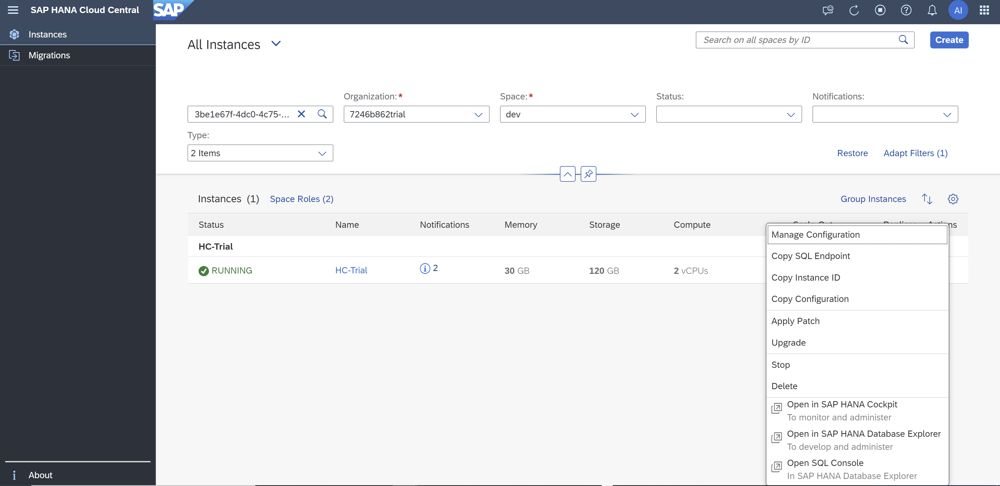
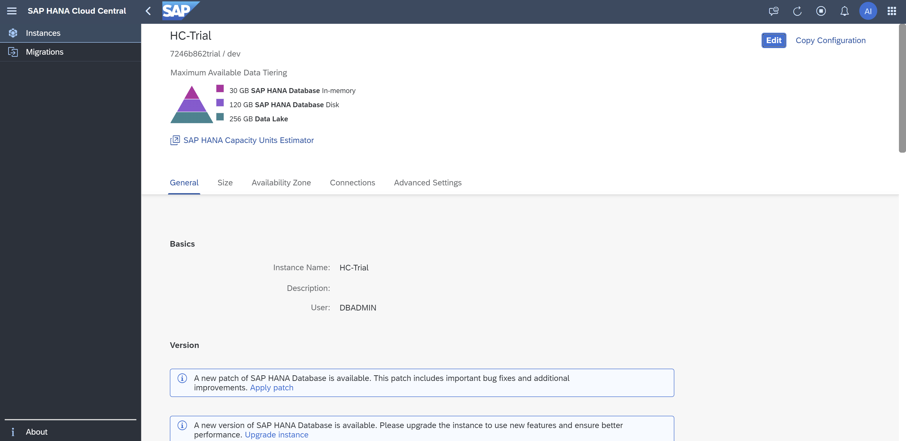
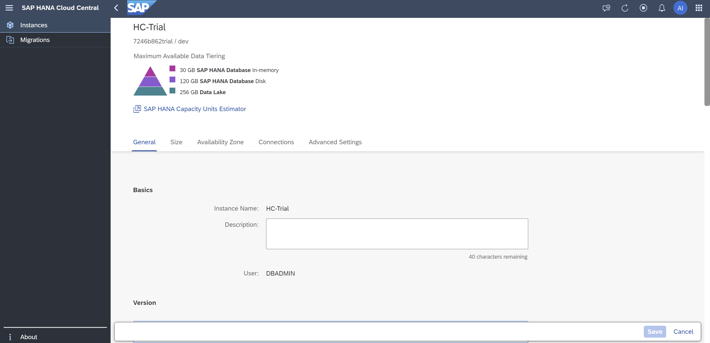
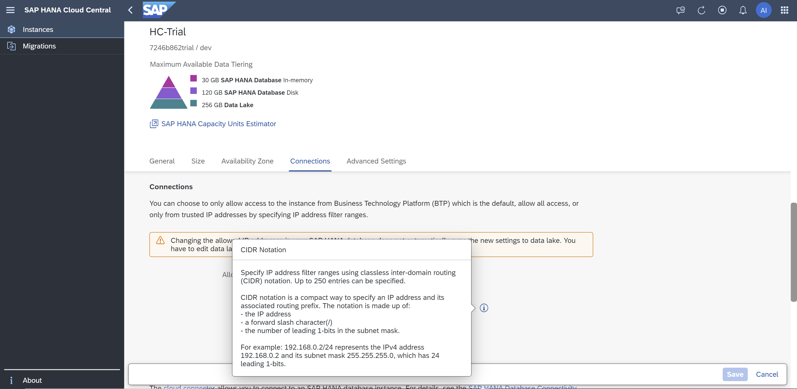
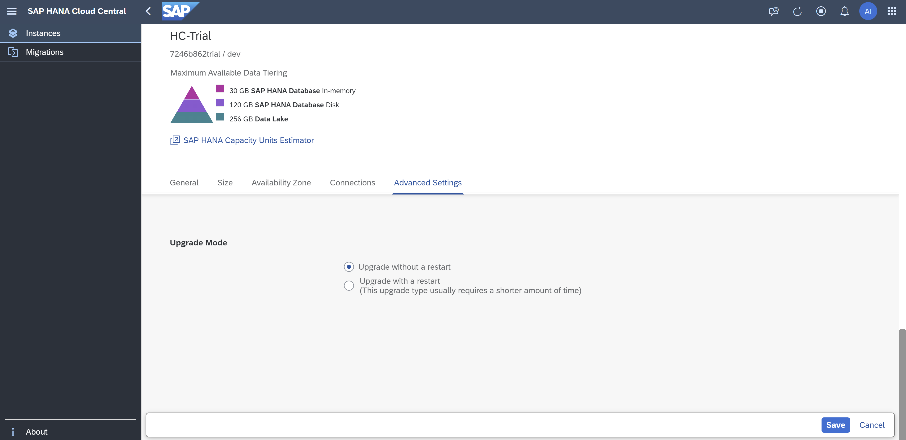
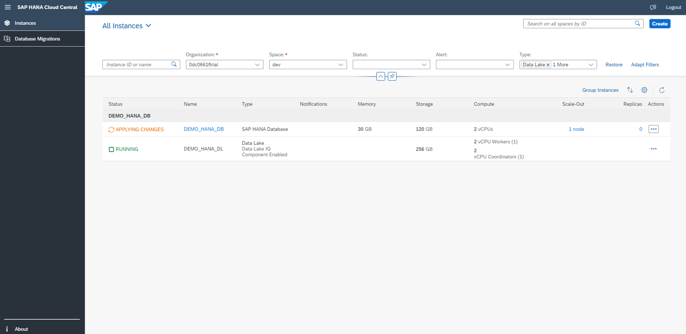
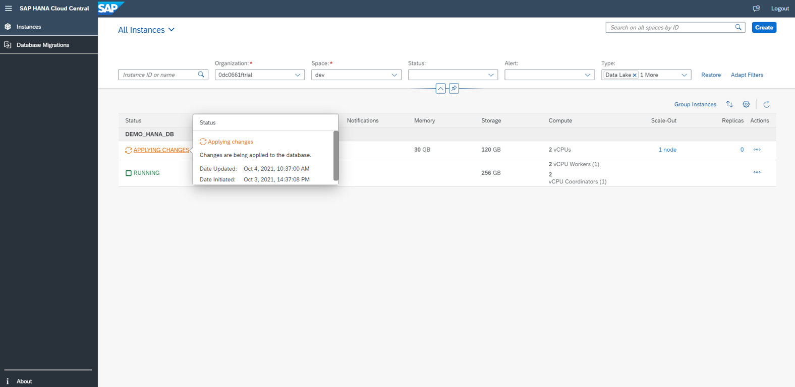

# Exercise 3 - Edit Instances

In this chapter, we will discuss the Edit functionality across all the instance types. An existing instance can be modified after creation as per requirement through the Edit functionality. Let's edit DEMO_HANA_DB instance.

1. Click on the '...' icon (under the Actions menu in the instances list) to see the operations that can be performed on the DEMO_HANA_DB database. Click on Manage Configuration.
    <kbd>
    
    </kbd>
    
2. Click the Edit button at the top right.
    <kbd>
    
    </kbd>
An Edit instance dialog opens and you can see all the relevant fields that can be modified.
    <kbd>
    
    </kbd>
    
3. As we scroll down the dialog, we see other fields that we can edit such as connections and upgrade mode. Also, notice that there are information icons that provide more details like what values the fields can take, what settings are preferable, etc.
    <kbd>
    
    </kbd>
    
4. Let's make a change: in the Connections section, select 'Allow all IP addresses' (or use a different option if that's already selected). The Save button will only be enabled when you make a valid change. Click on Save button at the bottom right.
    <kbd>
    
    </kbd>
    @Abbey: please update this screenshot to reflect the change in the connections - i.e. show the new connection setting.

5. Go back to the SAP HANA Cloud Central instances page by clicking the Back arrow to the left of the SAP logo at the top. You'll see that the status of the recently edited instance will change from 'Applying Changes' to 'Starting' to 'Running' (use the Refresh or Auto-Refresh button in the toolbar to update the screen). The edited instance restarts to adapt itself to the recently made changes.
    <kbd>
    
    </kbd>
    <kbd>
    
    </kbd>

Continue to - [Exercise 4 - Start, Stop, Upgrade Instances, and Other Actions](../ex4/README.md)
