# Exercise 4 - Start, Stop, Upgrade Instances, and Other Actions

In this section, we will discuss about how to start, stop, and upgrade instances from the SAP HANA Cloud Central application.

1. Click the "..." button under Actions column for the DEMO_HANA_DB database.
    <kbd>
    
    </kbd>
    
2. Click the Stop menu item. A pop up shows up, confirming that you want to continue with stopping the instance. Click the Stop button.
    <kbd>
    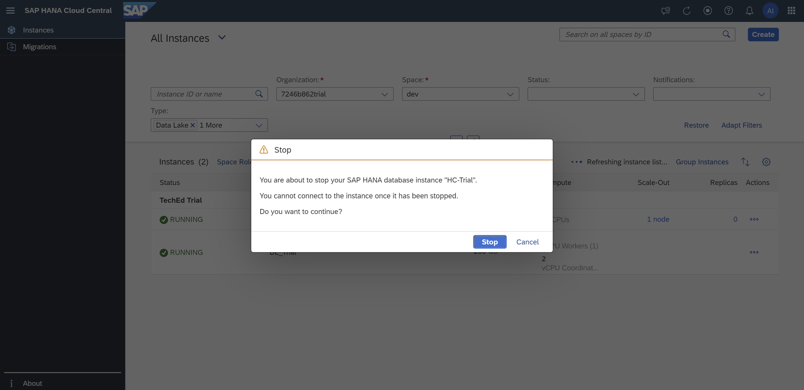
    </kbd>
      
3. You'll see the instance's status changing to 'Stopping' and you can see more details by clicking on that word (it's a hyperlink). Stopping the instance will take a few minutes. Use Refresh or Auto Refresh to update the screen during this process.
    <kbd>
    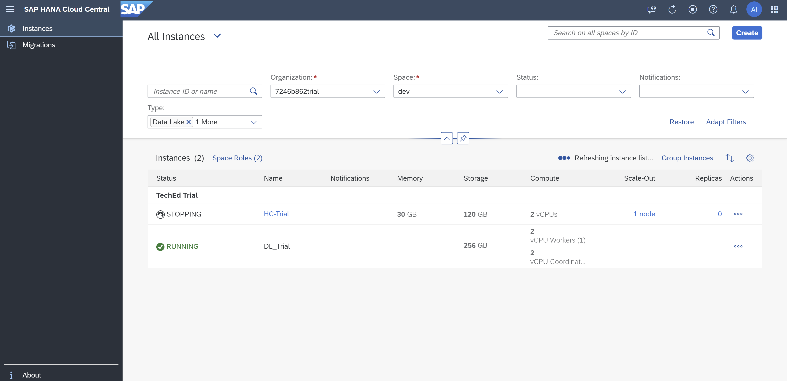
    </kbd>
    <kbd>
    
    </kbd>
    
4. After the instance stops, let's start it again. Click the "..." button under the Actions column.
    <kbd>
    
    </kbd>
      
5. Click on Start. We can see that the instance has moved to status 'Starting'. On clicking the 'Starting' hyperlink we see details on the date and time when the instance was initiated and updated.
    <kbd>
    
    </kbd>
    <kbd>
    
    </kbd>
    <kbd>
    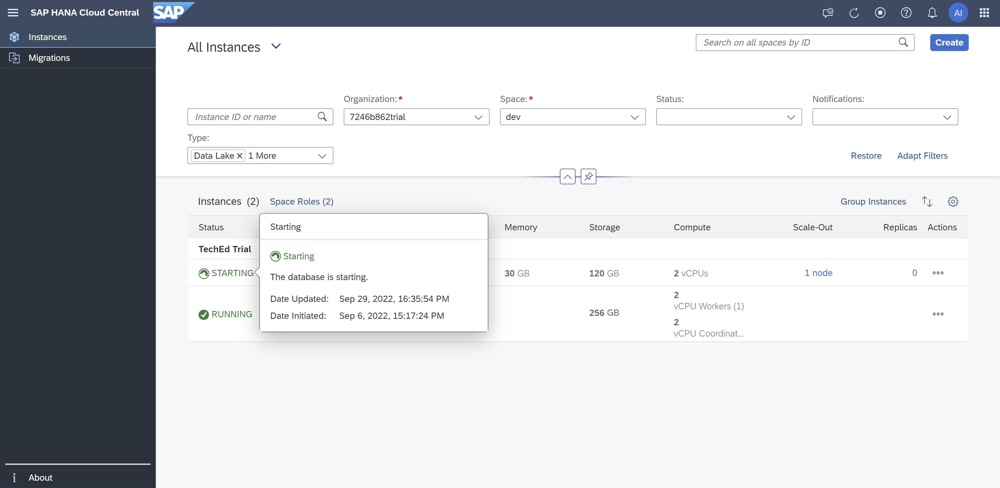
    </kbd>

   Starting the instance will take a few minutes.

6. We also have another option that allows us to Upgrade the SAP HANA Cloud instance. Once the instance is running again, click the "..." button under the Actions column to see if there is any upgrade available. If an upgrade is not available, that menu item will be disabled.
    <kbd>
    
    </kbd>
      
7. Clicking on the Upgrade menu item opens the Upgrade dialog. If you choose to upgrade, a pop up appears saying that a new revision for the instance is available and if we want to continue with the Upgrade process. For this workshop, we will not perform an upgrade, so click the Cancel button.
    <kbd>
    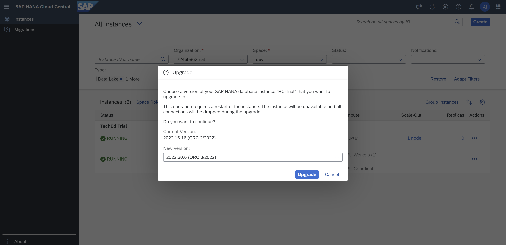
    </kbd>

    Note that a similar procedure is available if you want to apply a patch to your SAP HANA Cloud instance.
     
8. Now let us talk about the other Actions available for each of the instances. Click on the "..." button under the Actions column for the DEMO_HANA_DB instance. Click on Open in SAP HANA Cockpit menu item in the Actions list. We can directly open the SAP HANA Cockpit to administer the SAP HANA instance from the SAP HANA Cloud Central page.
    <kbd>
    
    </kbd>
      
9. SAP HANA Cockpit opens in an adjacent new tab. Once the credentials are validated (username is DBADMIN, password is what you provided when creating the instance), **you are now on the SAP HANA cockpit's Database Overview page**. Here, you can perform various monitoring and administrating operations on our SAP HANA Cloud instance. You will learn more about the SAP HANA cockpit in future exercises.
    <kbd>
    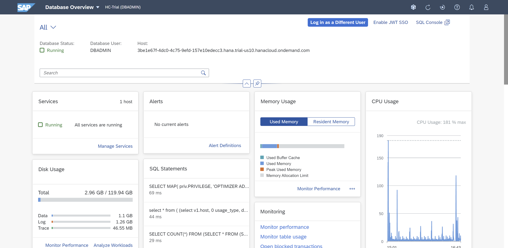
    </kbd>
      
10. We can also open the SAP HANA Database Explorer to create SQL scripts, run them and also administer the SAP HANA Cloud instance directly from the SAP HANA Cloud Central page. Switch to tab with SAP HANA Cloud Central and click on Open in SAP HANA Database Explorer menu item in the Actions column for the SAP HANA database. SAP HANA Database Explorer opens in an adjacent new tab.
    <kbd>
    
    </kbd>
    <kbd>
    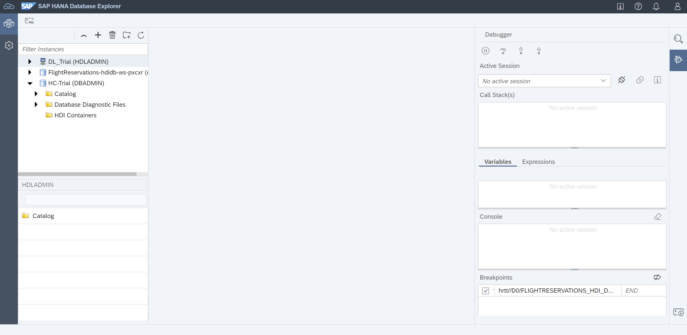
    </kbd>
    
11. Return to SAP HANA Cloud Central and click the "..." under the Actions column for the DEMO_HANA_DB instance again. Now click on Open SQL Console menu item. SAP HANA Database Explorer opens up in a new tab, but this time with a SQL Console already opened.
    <kbd>
    
    </kbd>
    <kbd>
    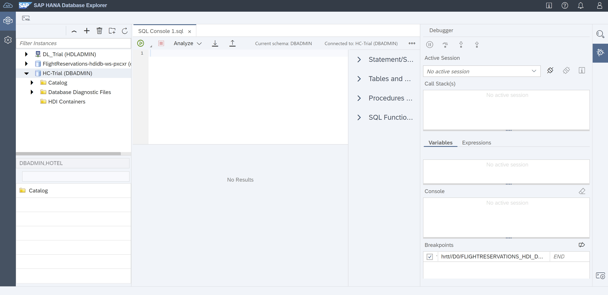
    </kbd>

12. Return to SAP HANA Cloud Central. Let us now explore the actions for a data lake instance. Click the "..." button under the Actions column corresponding to the **DEMO_HANA_HDL** data lake instance. First is the Manage Configurations. Click on it. Similarly to an SAP HANA database instance, you can edit the configuration.
    <kbd>
    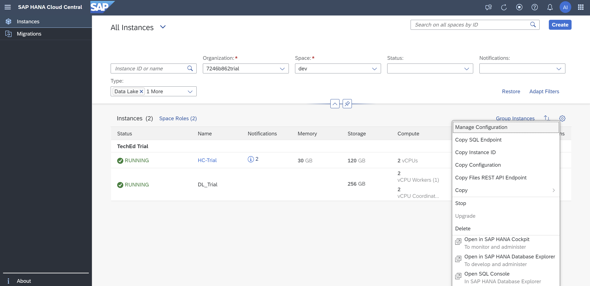
    </kbd>
    <kbd>
    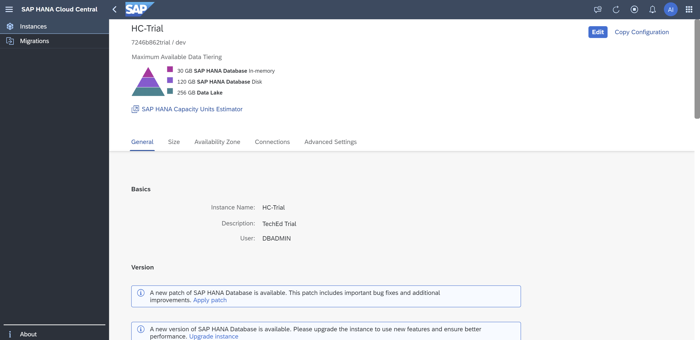
    </kbd>
    <kbd>
    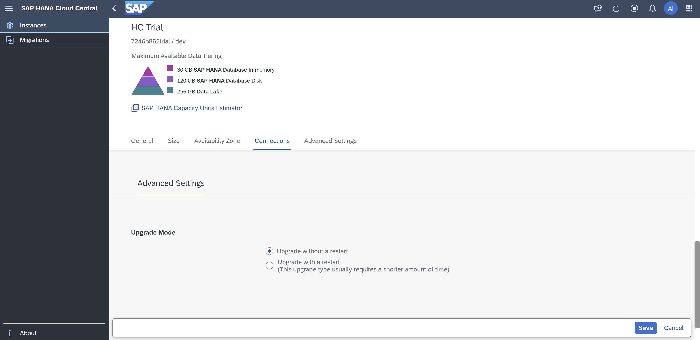
    </kbd>
    Click the Back button beside the SAP log at the top to return to the instances view of SAP HANA Cloud Central.

13. Next in the Actions column is Copy SQL Endpoint functionality. Upon clicking this, the SQL endpoint is copied to the clipboard. We get a success message saying that the SQL endpoint is copied to the clipboard.

    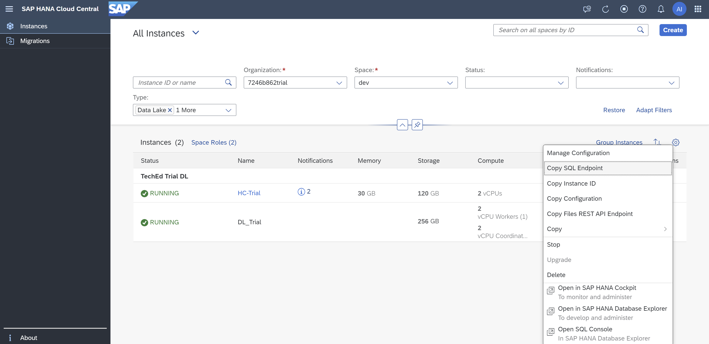

    SQL Endpoints are useful when you want to connect to your SAP HANA Cloud instance from other applications or if you want to access it from the command line.
14. Next is the Copy Instance ID option. This will help us copy the instance ID to the clipboard. This function is similar to the previous copy option we discussed. On clicking Copy Instance ID option, we get a success message.
    <kbd>
    
    </kbd>
    <kbd>
    
    </kbd>
    The instance ID is required when connecting to data lake Relational Engine using Interactive SQL.
15. Click on Copy Configuration. A popup opens with options to copy configuration to clipboard or download it as a JSON file. Depending on how often you will use your instance configuration, either copy or save the JSON-compliant string.
    <kbd>
    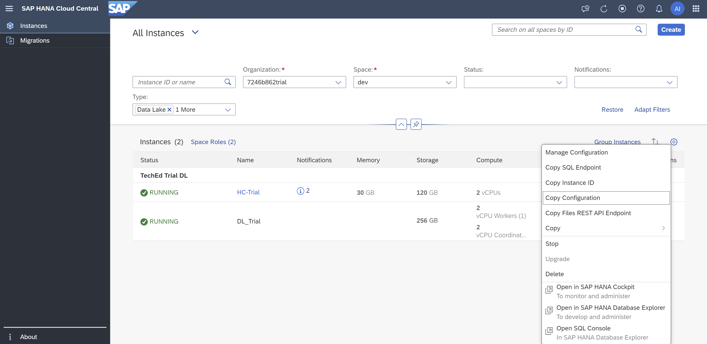
    </kbd>
    <kbd>
    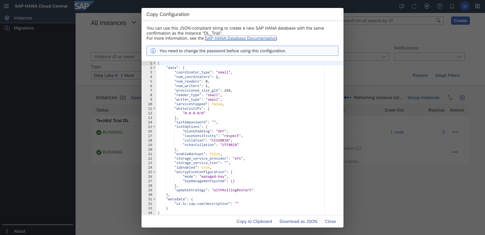
    </kbd>

16. Copy Files Rest API Endpoint copies it to the clipboard. A success message will appear.
    <kbd>
    
    </kbd>
    <kbd>
    
    </kbd>
    Use this endpoint to connect to data lake files using a REST client, the hdlfscli utility, or SAP HANA database explorer.
17. Other Copy options help with directly copying the Landscape ID, Port ID, Coordinator Endpoint and Worker. You can find these options in the Actions column for a data lake instance. All the IDs are directly copied to the clipboard.
    <kbd>
    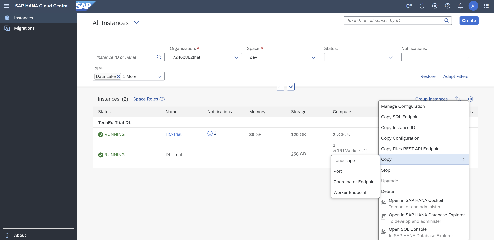
    </kbd>

This concludes the exercises for SAP HANA Cloud Central. If you haven't done so already, you may close the browser tabs for the SAP HANA cockpit and the SAP HANA database explorer. Those tools are discussed in the next sections.

Continue to - [SAP HANA Cockpit - Exercise 1](../../hana_cockpit/ex1/README.md)
