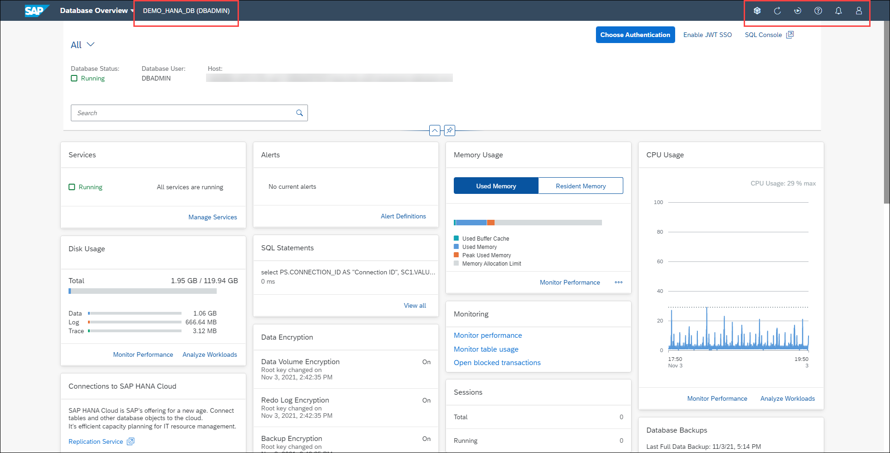
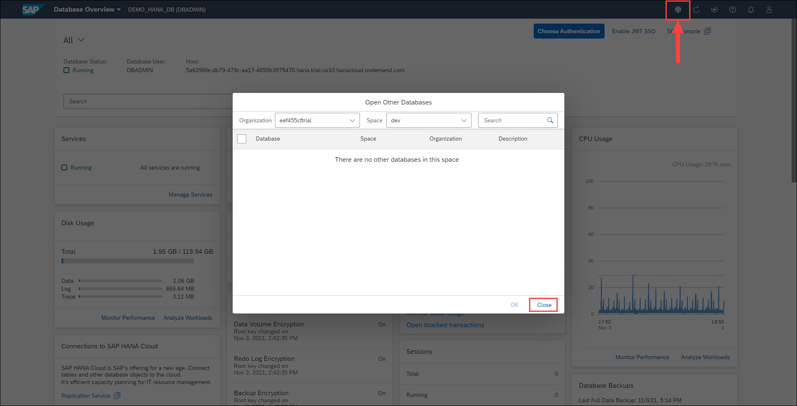
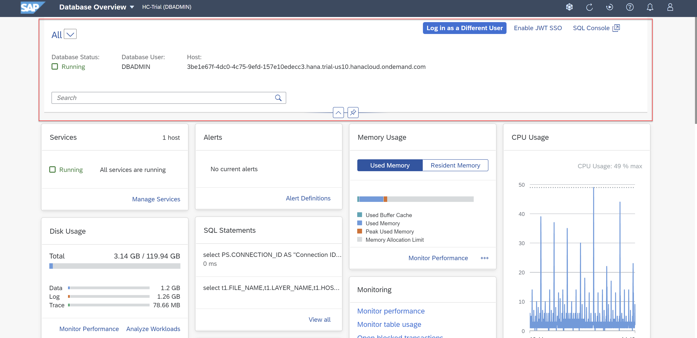
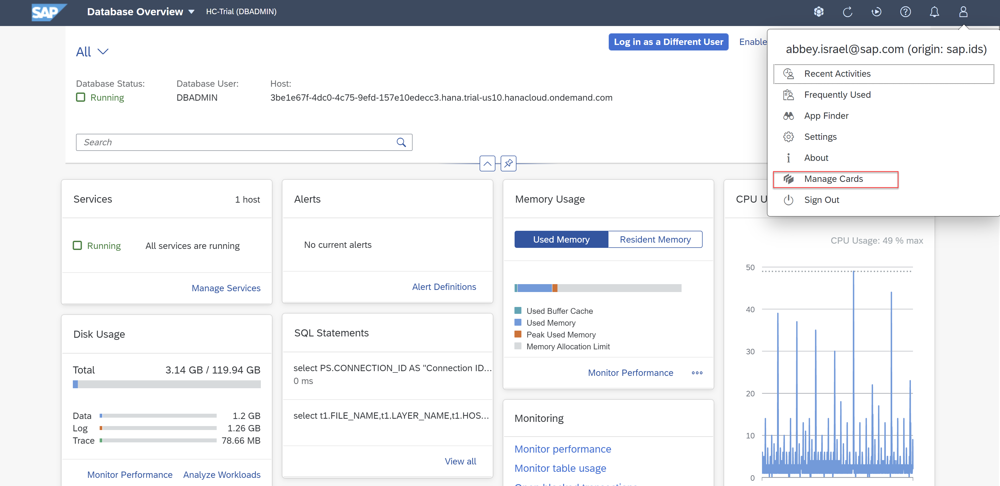
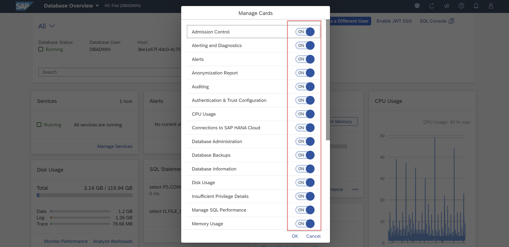

# Exercise 1: The Database Overview Page

The Database Overview page displays health metrics for an individual SAP HANA Cloud database.

Through the Database Overview page, you can view key health indicators for this specific database, such as database status, alerts, and resource utilization. You also have access to tools that allow you to perform database administrations tasks, such as performance analysis, and executing SQL statements. Different parts of a single card can link to different views or applications. This way, you can see various components in a single view and make the decision whether to further examine issues by drilling down.

This exercise will teach you the basics of navigating the Database Overview page and how to find the information you need as a database administrator.

1. Navigate to your SAP HANA Cloud Trial instance from the SAP BTP Cockpit ("trial" subaccount and "dev" space). Open the SAP HANA cockpit by clicking item **Open in SAP HANA Cockpit** from the **Actions** menu.

    **Note:** *If this is the first time you launch the SAP HANA cockpit or SAP HANA database explorer, you will be asked to enter your credentials. The default username is DBADMIN and the password is what you entered when creating the instance.*

    

2. At the top of the Database Overview page, you'll find the toolbar. The top left displays the name of the currently managed database "DEMO_HANA_DB" and the database username (DBADMIN) you're connecting as to that database. The top right contains the user button (for user-specific settings and options), the notifications button, the help button (for content-specific online help), the auto-refresh interval button (can be every 10/20/30 seconds or 1/5/10 minutes), the manual refresh button, and the switch databases button.

    

3. You can switch between multiple databases or navigate to multiple databases by clicking on the button **Open Other Databases**. Click on it to see a pop up, where you can select one or multiple databases that you want to navigate to. Once the databases that we need to be opened is selected from this pop up, if we click on OK, all the selected databases are opened simultaneously on new browser tabs.

    

    Click on **Close** to dismiss the pop up.

4. Below the toolbar you see the cockpit's collapsible header, where you'll find the status of the database, the database user you're connecting as, the host name, and a search bar. From the header, you can also change the database user (via the Choose Authentication button), enable single sign-on (via the Enable JWT SSO button) and open the SQL Console. You also change or filter the cards that appear on this page and save that as a new view.

    

    By default, when you first access the Database Overview page you see a quick synopsis of the database status and its alerts, as well as the utilization of memory, CPU and disk.
    
    As you scroll down, you see high-level performance metrics in the form of the number of threads, sessions and long-running statements. You also see general information about your SAP HANA database.
    
    Down further, you see security settings, such as data volume encryption, auditing status, authentication status, as well as security-related hyperlinks. There are also a number of hyperlinks to launch additional administration and Smart Data Integration applications.

5. The organization of the cards in the Database Overview page is completely customizable. Click and hold any card and drag it across the screen to change its location.

6. Another personalization feature is the ability to hide cards that you do not wish to see on your Database Overview page. Click the **User** button in the top right and select **Manage Cards** from the popup menu.

    

7. Click the on/off switches to turn some cards off and then click **Cancel** to dismiss the dialog.

    

Continue to [Exercise 2: Configuring Database Properties](../ex2)