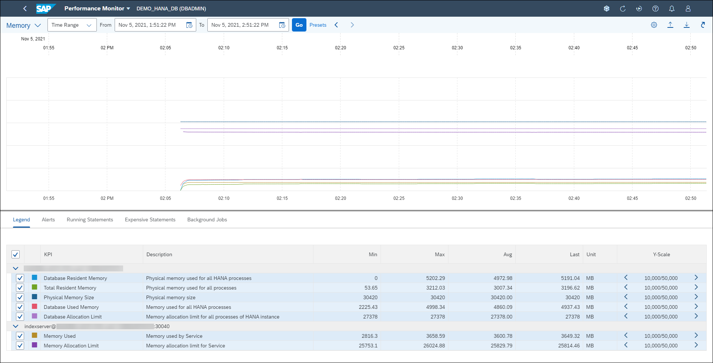
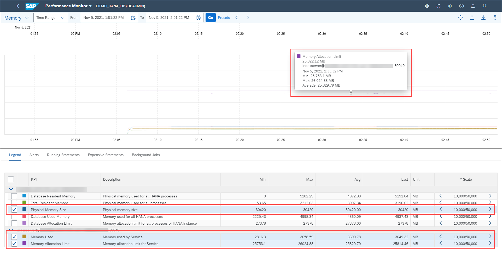

# Exercise 5: Monitoring Memory Usage

SAP HANA administrators must carefully monitor system computing resources to ensure optimal operation of the database. There are many metrics available to monitor in the SAP HANA cockpit, including memory, CPU and disk usage. You can view precise consumption details for those resources, as well as historical utilization information.

In this exercise, you'll examine the memory utilization of an SAP HANA database and observe the behavior of a few KPIs. You'll also learn to customize the utilization charts to display the information most relevant to your situation.

1. Locate the *Memory Usage* card. It displays how much memory the host has consumed for the past 2 hours. There are also CPU Usage and Disk Usage cards, showing those metrics for the same time period. Let's investigate the memory utilization for this database. Click **Monitor Performance**.

    

2. The Performance Monitor appears, allowing you to see KPIs for memory usage. You can change the time range to display. You can export a complete snapshot of the performance monitor data into a ZIP file that you can download and send to SAP Support to analyze and diagnose problems with the SAP HANA database. Similarly, you can import performance monitor data from a ZIP file into the SAP HANA cockpit.

    

3. Let's examine a few KPIs in more detail. Ensure the following KPIs are checked: **Physical Memory Size**, **Memory Used** and **Memory Allocation Limit**.

    The colored lines representing the selected KPIs are highlighted and you can now make a few observations: this host has 32 GB of RAM and the Memory Allocation Limit for this service (indexserver) is slightly below, so there's a bit of memory left in reserve for other processes. The Memory Used for this service is much lower so there's plenty of room to allocate more memory.

    What you're looking for are situations that may trigger out of memory events and negatively affect performance. For example, when the memory consumption stays constant near the limits for a prolonged period of time and sudden spike of memory usage happens.

    You can obtain details for a specific point in time by simply hovering the mouse cursor over the line. Mouse over any point along the **Memory Allocation Limit** line (in Purple).

    

4. Click the **Back** button at the top left to return to the Database Overview page.

Continue to [Exercise 5: Security Basics](../ex5)