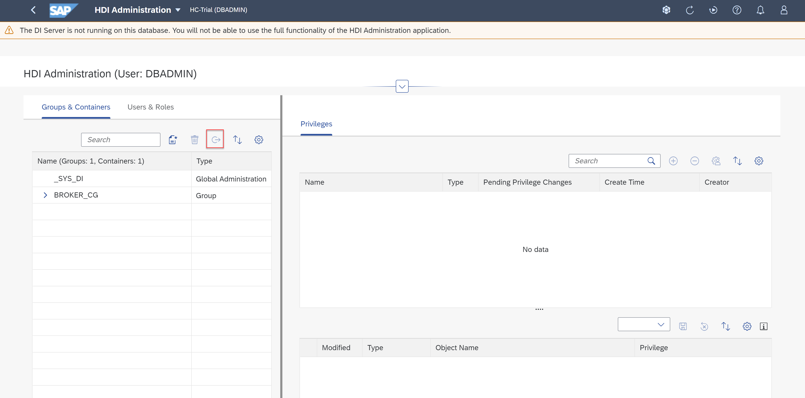

# Exercise 6: HDI Administration

An HDI (SAP HANA Deployment Infrastrcture) administrator is responsible for configuring general SAP HDI parameters, creating and dropping HDI container groups, moving HDI containers between groups, and managing the privileges of HDI container-group administrators. This exercise will introduce you to the HDI Administration tool and some of the main tasks an HDI administrator can perform. 

## HDI Administration Overview

1. Locate the **Database Administration** card on the Database Overview page and click **HDI Administration**.

    

2. The HDI Administration tool includes a window on the left side that displays the _Groups & Containers_ tab and the _Users & Roles_ tab. The window on the right displays the _Privileges_ of the selected user. The _Groups & Containers_ tab is selected by default. You should see the Group and Container that you previously created associated with the [SAP Business Application Studio - Exercise 2](../../business_app_studio/ex2/README.md). 
    

Click the **Users & Roles** tab. You should see the two users that have already been created. 

3. Click on the **Groups & Containers** tab. Select **_SYS_DI**. 

    

4. In the _Privileges_ tab, you can select the name of the user to whom you want to grant HDI Administration. Click **DBADMIN**.

    

5. In the _Privileges of Selected User_ section, all selected privileges will be displayed.

    

The selected privileges can be modified by clicking the checkbox to select a privilege. Changes can be saved using the *Save* button in the top right corner of the table. *(NOTE: Do not save privilege changes. The purpose of the following actions are for you to gain familiarity with the HDI Administration tool.)*
    

## Maintaining the SAP HDI 

To perform actions as an HDI administrator, the user must have HDI administrator privileges. In the case that a current user does not have such privileges, they must be assigned prior to performing HDI administration tasks. This can be acheived, as follows:
- From the Database Overview page, open SAP HANA cockpit's *User Management* tool.
- In the *Users* list, choose *Add* (plus sign in the header bar of the table). In the pop-up list, choose *Create User*, provide the information required, and choose *Save*. 

Adding the user to HDI automatically assigns the new user a default set of common HDI privileges. To add the new user to SAP HDI:
- From the Database Overview page, open the *HDI Administration* tool.
- In the *Users & Roles* tab, click the plus sign in the header bar of the table.
- In the *Add Users & Roles* window, select the new user and choose *OK*.
- In the *Groups & Containers* tab, select *_SYS_DI*.
- In the *Privileges* tab, select the name of the user to whom you want ot grant HDI administrator privileges (the user you just created). If the user is not in the list, click the plus sign to add an HDI user.
- In the *Privileges of Selected User* pane, choose *DI Admin Privileges* from the drop-down list. Grant user privileges according to the current selection. Choose *Save* to grant user privileges.

In SAP HANA Deployment Infrastructure (HDI), an HDI container group is used for administrating a set of HDI containers. The HDI administrator can create an HDI container group, as follows: 

- In the _Groups & Containers_ tab, choose the indicated icon to create a container group or container. 
    

- In the *Create* Wizard, choose *Container Group* and specify a name for the new container group. You can also define details of the trace tool in the *Optional Parameters* pane.

    

An HDI container group can also be dropped by selecting the container group and choosing the trash can icon, as indicated.

An HDI Container group can be moved to another container group, as follows:

- In the *Groups & Containers* tab, locate and select the HDI container that you want to move.
- Choose the indicated icon (Move container to another group)
    
- Select the target container. In the *Move Container* window, use the drop-down list to specify the container group to which you want to move the selected HDI container. 
    

You should now be familiar with common SAP HDI Administration activities within the SAP HANA cockpit. 

Continue to [Exercise 7: Performance Management](../ex7/README.md)