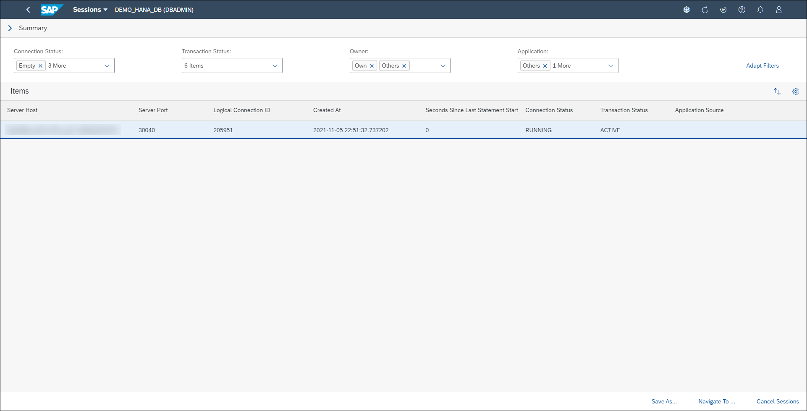
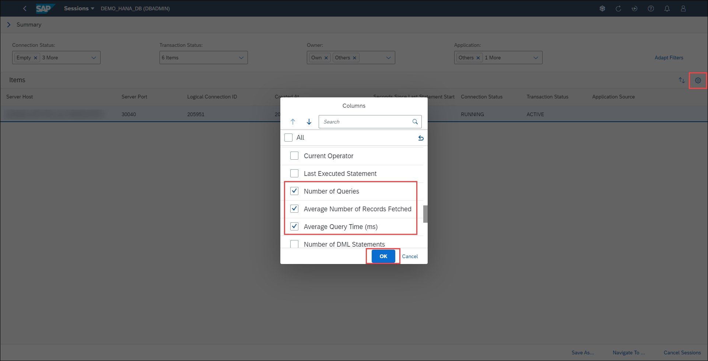
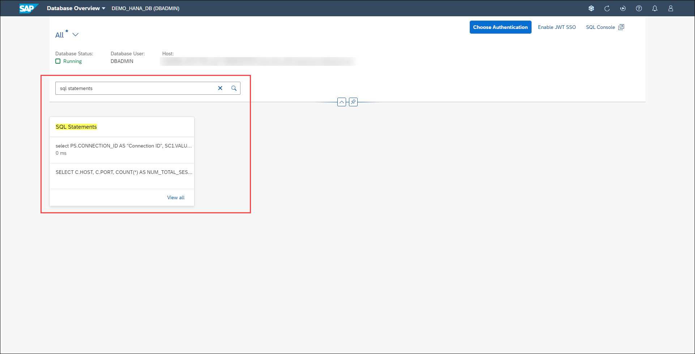
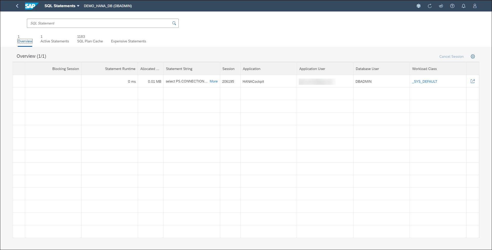
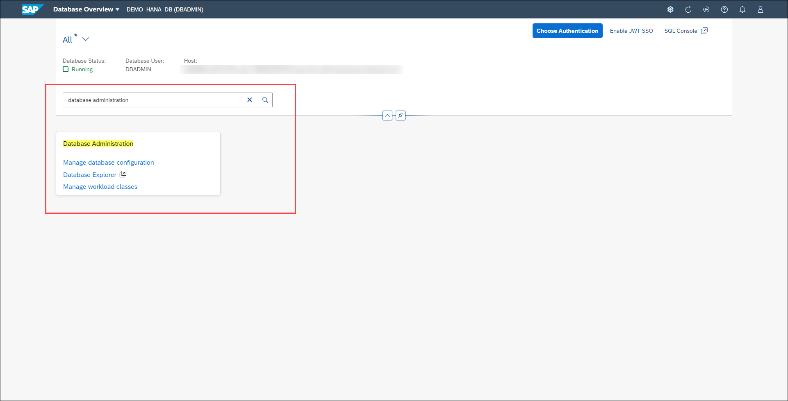

# Exercise 7: Performance Management

Managing and monitoring past and current information about the performance of the SAP HANA database is important for root-cause analysis and the prevention of future performance issues. In this exercise, you'll explore the additional performance management tools available in the SAP HANA cockpit. For more informaiton on applications to visualize and analyze current and historical performance data, please see Performance Monitor and Memory Analysis exercises in the Appendix.

TO DO - link the two exercise pages

1. Locate the *Threads* card. This card shows the number of active and blocked threads in the database. Clicking on it takes you to the *Threads* app, which is used to monitor the longest-running threads active in your system. It may be useful to see, for example, how long a thread is running, or if a thread is blocked for an inexplicable length of time.

    

2. Click on the **Threads** card to launch the *Threads* application. When you launch this app, you'll see detailed information for approximately the 1,000 longest-running threads currently active in the database.

    For each statement, you can see the duration, as well as the name of the service that is executing the thread. You can identify the host, the port, and the thread type, whether the statement is related to a blocking transaction, and much more. Clicking on a thread gives the option to navigate to the sessions or blocked transactions associated with that connection ID. If a thread is involved in a blocked transaction or using an excessive amount of memory, you can cancel the operation executing the thread. You can view the call stack for this thread, although that is typically only useful to SAP Support when analyzing incidents. The threads can be grouped or sorted using the Group and Sort icon. You can view more details on the threads by adding columns to the table via the Settings button.

    

3. Click the **Summary arrow** above the table. In addition to the thread details, you can see a summary of the top 5 application and database users, and information about the total number of threads by status and type.

    

4. Click the **Back** button at the top left to return to the Database Overview page.

5. Locate the **Sessions** card. This card shows the currently running and total number of sessions in the database. Analyzing the sessions connected to your SAP HANA database can help you identify which applications or which users are currently connected to your system, as well as what they are doing in terms of SQL execution.

    

6. Click on the **Sessions** card to launch the *Sessions* application. This app allows you to monitor all sessions in the database. It can be used to see whether a session is blocked and, if so, which session is blocking it. Similar to the Threads app, you can see a summary of the top users, applications and sessions. When a session row is selected, you can navigate to threads and blocked transactions with a specific connection ID. You can cancel a session. You can save the data sets as a text, CSV or HTML file. These options are displayed at the bottom of the app.

    

7. Let's add a few columns to the table. Click the **Settings** (gear) button above and to the right of the table and check the following columns:

    - Database User
    - Number of Queries
    - Average Number Of Records Fetched
    - Average Query Time (ms)

    

    Click **OK**. You added columns to see the database user, the number of queries in this session, along with its average number of records fetched and query time. By examining these metrics, you can determine whether the queries in this session are returning the expected number of rows and are executing in the expected amount of time.

8. Click the **Back** button at the top left to return to the Database Overview page.

9. Locate the **SQL Statements** card. This card displays the number of long-running statements and the long-running blocking situations currently active in the database. They are ranked based on a combination of the following criteria: (1) Runtime of the current statement execution, (2) Lock wait time of the current statement execution, and (3) Cursor duration of the current statement execution.

    

10. Click on the **SQL Statements** card to launch the *SQL Statements* application, where you can have a look at an overview of the statements, active statements, SQL plan cache and expensive statements.

    This app shows the 100 most critical statements currently active in the database. For each statement, you can see the full statement string, as well as the ID of the session in which the statement is running. You can identify the application, the application user and the database user running the statement, and whether the statement is related to a blocking transaction. You can see the entire SQL statement by clicking the "More" link. You can view the session the statement is running in. If a statement is involved in a blocked transaction or using an excessive amount of memory, you can cancel the session the statement is running in (or the blocking session).

    

11. Click the **Back** button at the top left to return to the Database Overview page.

12. Locate the **Monitoring** card, containing links to the following apps:

    - *Performance Monitor*: allows you to visually analyze historical performance in the database across a range of related performance indicators
    - *Table Usage*: monitoring table usage can help you optimize resource utilization and improve query performance. In this app, you can visualize tables by size, explore the usage history of tables, and move tables to warm storage
    - *Blocked Transactions*: in this application you can see important details about the currently blocked transactions such as host, service, connection ID, duration, thread details, and more

    

13. Locate the **Database Administration** card. You'll see the link to launch the *Workload Classes* application. Use it to create workload classes and workload class mappings. Workload classes allow SAP HANA to influence dynamic resource consumption on the session or statement level. Workload management allows you to determine how much concurrent work takes place on an SAP HANA database and how that work is prioritized. The goal is to maximize the overall database performance by balancing the demand for resources between the various workloads.

    

Continue to [SAP Business Application Studio Exercise - Exercise 1](../../business_app_studio/ex1/README.md)