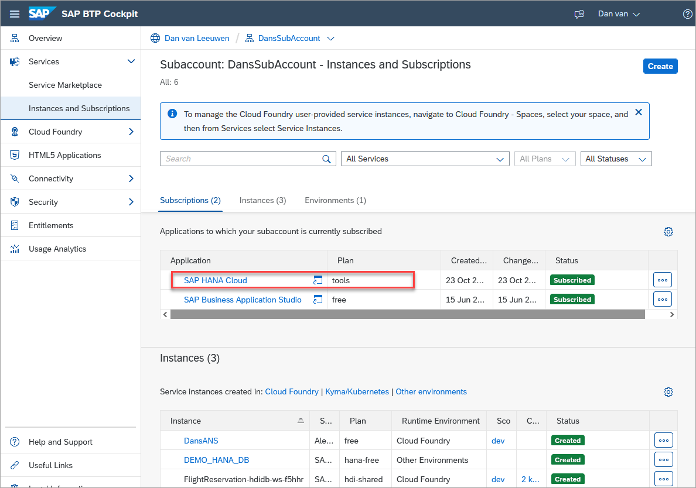

# Appendix 1 - Multi-Environment SAP HANA Cloud Tools

This appendix will introduce the multi-environment tools which are available as of QRC 3 in the SAP BTP free tier and production environments but not in trial.  Until now, the tooling (SAP HANA cockpit, SAP HANA database explorer, and SAP HANA Cloud Central) have been accessing SAP HANA Cloud through Cloud Foundry.  The SAP BTP provides support for multiple environments such as Cloud Foundry and Kyma.  With the multi-environment tooling, it is no longer necessary to have a Cloud Foundry environment.  This is explained in more detail at [SAP HANA Cloud goes "multi-environment": Part 1- feature overview](https://blogs.sap.com/2022/09/21/sap-hana-cloud-goes-multi-environment-part-1-feature-overview/).

## Exercise 1.1 Introducing and Setting up the Multi-Environment Tooling

1. Open SAP HANA Cloud Central.  Notice that if you open the previous tooling, a banner appears mentioning that the new tools are available.

     

2. To use the new tools, follow the instructions at [Subscribing to the SAP HANA Cloud Service and Accessing the Administration Tools](https://help.sap.com/docs/HANA_CLOUD/9ae9104a46f74a6583ce5182e7fb20cb/784a1dbb421a4da29fb1e3bdf5f198ec.html).  A few screenshots are shown below that illustrate the requirements and steps.

    

    *The SAP HANA Cloud tools (Application) entitlement is required.* 

    

    *A subscription to the service is required using the tooling plan.*

    

    *Select the tools plan and press create.*

    

    *Assign a user to the role collection.*

    
    
    *Open the tools by clicking on the created subscription.*

    Notice a few of the differences by comparing the two below screenshots.

    

    *Multi-Environment SAP HANA Cloud Central.*

    

    *Cloud Foundry SAP HANA Cloud Central.*

    Some of the differences include:

    * The Cloud Foundry tooling is accessed from the Cloud Foundry space level under the SAP HANA Cloud tab
    * The multi-environment tooling is accessed from the SAP BTP sub-account page, under the SAP HANA Cloud subscription
    * The URL used to access the tools is different
    * The multi-environment version does not have the Cloud Foundry organization and space drop downs
    * The multi-environment tooling does not list SAP HANA Cloud instances created with the Cloud Foundry Tooling
    * The Cloud Foundry tooling does not list the SAP HANA Cloud instances created with the multi-environment tooling
    * The instance mapping in the multi-environment version provides instance mapping via the action menu item Manage Configuration.  This is demonstrated in the exercise below.

## Exercise 1.2 Instance Mapping

If you are using the SAP Business Application Studio to deploy native SAP HANA artifacts into an HDI container and have created the SAP HANA instance using the multi-environment tooling, a mapping will need to be created to map the SAP HANA Cloud instance into an existing Cloud Foundry organization and space.

1. Determine the Cloud Foundry Organization ID.

    

    *The Cloud Foundry organization ID can be copied from the subaccount page.*

2. The Cloud Foundry space value can be found in the URL.  The organization ID is also in the URL.

    

    *Notice that the URL contains `org/<cloud foundry organization id>/space/<space id>`

3. Create an instance mapping.  In SAP HANA Cloud Central, select the SAP HANA Cloud instance and choose **Manage Configuration**.

4. Choose **Edit** and provide the previously collected Cloud Foundry organization ID and space.

    

## Summary

You now have an overview of the new multi-environment tooling and how it differs from the Cloud Foundry tooling.

Back to - [DA261 - SAP HANA Cloud Database Administration and Development](../../../README.md)

