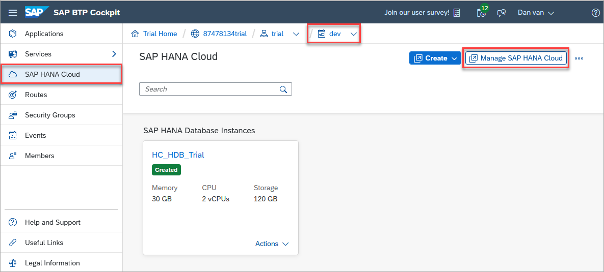
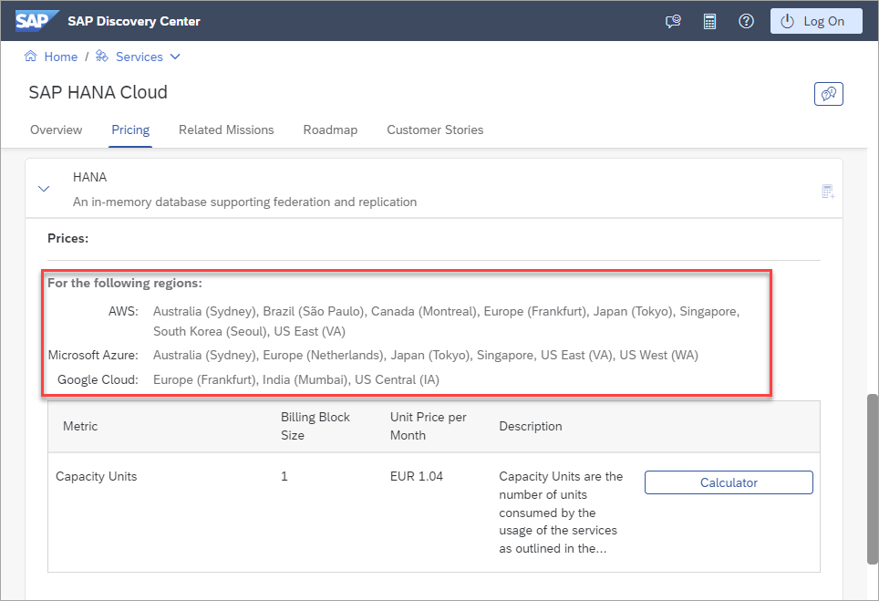

# Exercise 1 - Overview of the SAP Business Technology Platform (SAP BTP)

This exercise will provide a brief overview of the SAP BTP and demonstrate how to access the SAP HANA Cloud service.  

1. The SAP BTP offers four functionality areas as shown below.  We will be focusing on SAP HANA Cloud and the SAP Business Application Studio from the data and analytics and app dev areas.

    

2. The SAP BTP platform is organized by a global account, one or more subaccounts, if Cloud Foundry is enabled, a Cloud Foundry organization, and one or more spaces.  

    

    Subaccounts are created in a specific data center such as the one shown below (AWS, US East).

    

    Subaccounts can enable different environments such as Cloud Foundry or Kyma.
    
    

    In the subaccount above, note that there is an API endpoint which will be used in a subsequent exercises.

    Environments constitute the actual platform-as-a-service offering of SAP BTP that allows for the development and administration of business applications.  We will be working within the Cloud Foundry environment in this workshop.  Additional details on environments can be found at [Environments](https://help.sap.com/docs/BTP/65de2977205c403bbc107264b8eccf4b/15547f7e7ecd47ee9fa052b0e18c7b0a.html).

    Once you have navigated to a space, details about any SAP HANA Cloud databases or data lake instances can be seen and a link (Manage SAP HANA Cloud) is provided to open SAP HANA Cloud Central which is used to create and manage database instances.

    

3. The SAP BTP platform provides a set of services that can be used to build SAP business applications.  One of the services is the SAP HANA Cloud database and another is the SAP Business Application Studio.

    

4. The SAP BTP platform and the services running within it are available on multiple platforms in multiple regions.  The available options can be seen within the service catalog of the [SAP Discovery Center](https://discovery-center.cloud.sap/serviceCatalog/sap-hana-cloud?region=all&tab=service_plan&commercialModel=payg).

     

    Notice above that the HANA serice is available on Amazon AWS, Microsoft Azure, and Google Cloud in multiple data centers.

5. Additional details on the available free tier, trial, and paid service plans such as Cloud Platform Enterprise Agreement (CPEA), Pay-As-You-Go, or Subscription can be found at [Trial Accounts and Free Tier](https://help.sap.com/docs/BTP/65de2977205c403bbc107264b8eccf4b/046f127f2a614438b616ccfc575fdb16.html) and [Commercial Models](https://help.sap.com/docs/BTP/65de2977205c403bbc107264b8eccf4b/263d40009a5a4237a62e8f5c05ee641e.html).

    

6. A space within the SAP BTP platform has a set of users and roles that provides access to the platform.  

    

    Details of the currently logged in user can be seen via the drop-down menu shown below.
  
    

    This user is separate from the database user such as DBADMIN that is used to make a database connection to an SAP HANA database.  Additional details can be found at [User Roles](https://docs.cloudfoundry.org/concepts/roles.html#roles).

## Summary

You now have an overview of the SAP BTP and are ready to start using it with the SAP HANA Cloud database.  Further details can be found in the learning journey [Discover SAP Business Technology Platform](https://learning.sap.com/learning-journey/discover-sap-business-technology-platform).

Continue to - [Exercise 1 - Overview of SAP HANA Cloud Central](../../hana_cloud_central/ex1/README.md)

